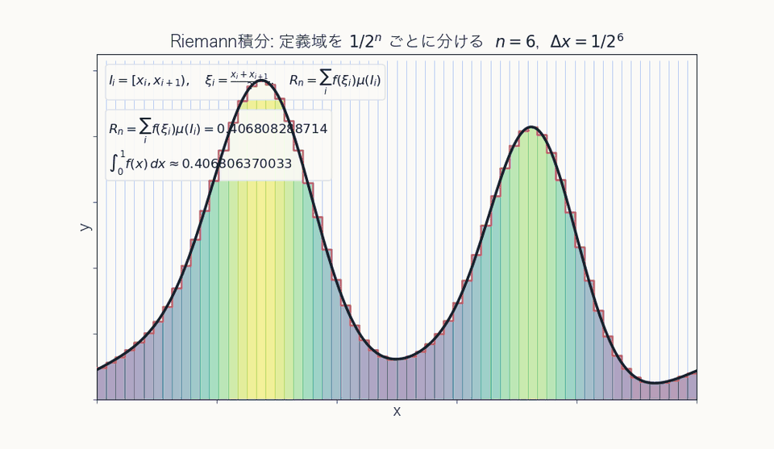
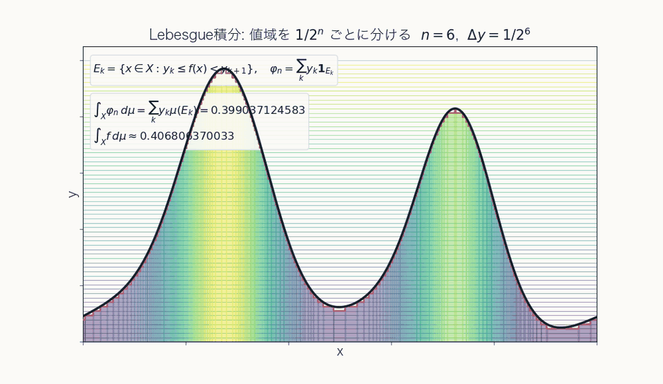

# 測度論・ルベーグ積分勉強会資料

`lambda-b/self_seminar` の Slidev 構成を踏襲して作る, 測度論・ルベーグ積分勉強会用の資料です.

メイン資料は `slides.md` にまとめます.PDF 出力を前提に, 1 ページごとに読める構成を基本にします.

## 公開資料

- [スライド](https://teruyuki-yamasaki.github.io/self-seminar-measure-theory/)
- [章別 HTML](https://teruyuki-yamasaki.github.io/self-seminar-measure-theory/chapters/)

## 資料の見取り図

本資料では, Riemann 積分の限界を出発点に, 集合に"大きさ"を与える測度論を整え, その上で Lebesgue 積分と収束定理へ進みます.

$$
\text{集合の"大きさ"}
\quad\longrightarrow\quad
\text{函数の積分}
\quad\longrightarrow\quad
\text{極限操作との整合性}
$$

Riemann 積分と Lebesgue 積分の基本的な視点の違いは次の通りです.

| 観点 | Riemann 積分 | Lebesgue 積分 |
| --- | --- | --- |
| 分割するもの | 定義域の分割 $\Delta: a=x_0<\cdots<x_n=b$ | 値域の分割 $\Theta: \alpha=y_1<\cdots<y_{m+1}=\beta$ |
| 各項 | $f(\xi_i)\lvert\Delta_i\rvert$ | $y_k\mu(E_k)$ |
| 集める情報 | 各小区間 $\Delta_i$ での代表値 $f(\xi_i)$ | 各値域区間 $\Theta_k$ に入る点の集合 $E_k$ の"大きさ" $\mu(E_k)$ |
| 極限 | $\lVert\Delta\rVert\to0$ | $\lVert\Theta\rVert\to0$ |
| イメージ |  |  |

## 前提条件

- Node.js
- pnpm

Dev Container を使う場合は, このディレクトリを VS Code で開いて `Dev Containers: Reopen in Container` を実行してください.

## セットアップ

```bash
pnpm install
```

## プレビュー

```bash
pnpm dev
```

章別 HTML のプレビュー:

```bash
pnpm docs:dev
```

## PDF 出力

```bash
pnpm export
```

出力先:

```text
dist/measure-theory-seminar.pdf
```

## GitHub Pages

`main` に push されると GitHub Actions で Slidev をビルドし, GitHub Pages に公開する想定です.

初回の Pages 設定手順は `docs/github_pages.md` を参照してください.

章別 HTML は `docs/chapters/` の Markdown を VitePress で変換します.数式は MathJax で描画されるため, GitHub 上の Markdown プレビューで崩れる式も HTML では安定して読めます.

## 構成メモ

- `slides.md`: 本文
- `components/`: MDC / Comark から呼ぶ小コンポーネント
- `setup/main.ts`: GitHub Pages 配信用の hash 補正
- `style.css`: 全体スタイル
- `docs/`: 方針メモ
- `docs/chapters/.vitepress/`: 章別 HTML 生成設定
