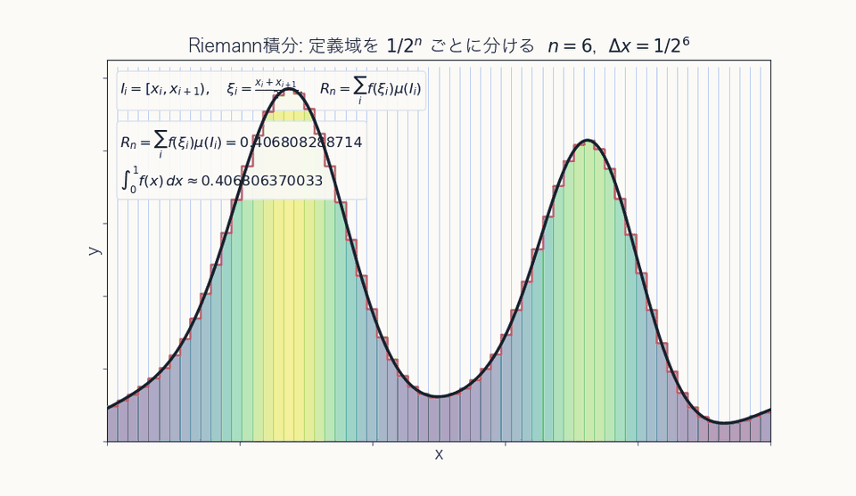
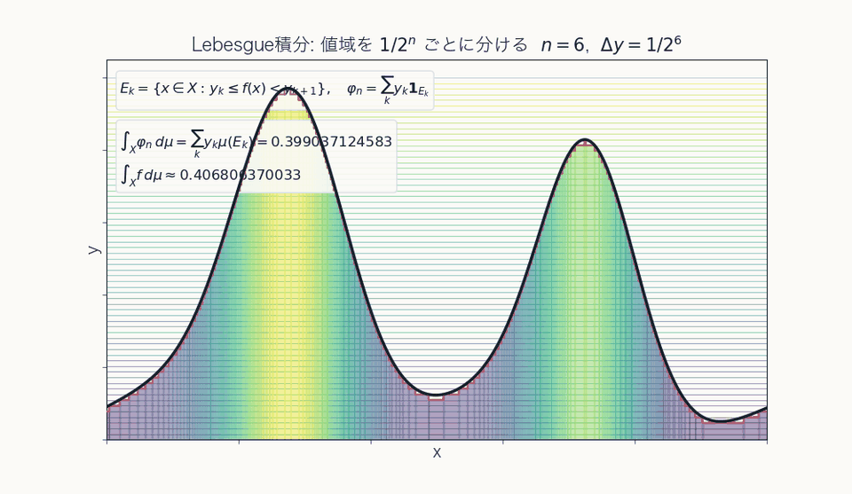
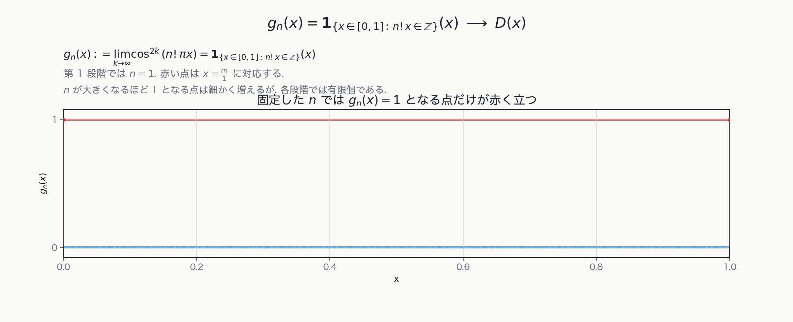

# 第0章 導入：Riemann 積分から Lebesgue 積分へ

## 目的

この章の目的は, Riemann 積分ではどこに限界があるのかを具体的に確認し, Lebesgue 積分と測度論が必要になる問題意識を明確にすることである.

本発表の流れは, 単に新しい積分公式を与えることではない. まず集合に"大きさ"を与える理論を整え, そのうえで函数を積分し, 最後に極限操作との整合性を扱う. したがって全体の見取り図は

$$
\text{集合の"大きさ"}
\quad\longrightarrow\quad
\text{函数の積分}
\quad\longrightarrow\quad
\text{極限操作との整合性}
$$

である. 導入では, この流れがなぜ必要になるのかを Riemann 積分の立場から見る.

## Riemann 積分と Lebesgue 積分の考え方

Riemann 積分と Lebesgue 積分の違いは, 何を分割して足し合わせるかにある.

**Riemann 積分**では, **定義域** $[a,b]$ を分割

$$
\Delta : a=x_0<x_1<\cdots<x_n=b
$$

によって分割し, 各区間 $\Delta_i:=[x_{i-1},x_i] \ (\ i=1,\ldots,n\ )$ の幅

$$
|\Delta_i|:=x_i-x_{i-1}
$$

に, その区間での函数値の代表値 $f(\xi_i) \ (\xi_i \in \Delta_i)$ をかけて

$$
R(f,\Delta) := \sum_{i=1}^n f(\xi_i) |\Delta_i|
$$

を作り, その極限として積分を考える.

すなわち,

$$
\int_a^b f(x)\,dx = \lim_{\|\Delta\|\to0} R(f,\Delta)
$$

ここで $\|\Delta\|:=\max_i |\Delta_i|$ とすれば, 分割を細かくするとは $\|\Delta\|\to0$ とみなせる.

これに対して **Lebesgue 積分**では, まず**値域** $[\alpha,\beta]$ を分割

$$
\Theta : \alpha=y_1<y_2<\cdots<y_m<y_{m+1}=\beta
$$

のように分割する. 最後の区間だけ右端を含めて

$$
\Theta_k:=[y_k,y_{k+1})\quad (k=1,\ldots,m-1),
\qquad
\Theta_m:=[y_m,y_{m+1}]
$$

とおき, 各区間の幅を

$$
|\Theta_k|:=y_{k+1}-y_k
$$

とおく.

各値域区間に対して, その**逆像** ( $y_k \le f(x) < y_{k+1}$ なる点 $x \in [a,b]$ の集合) 

$$
E_k:=f^{-1}(\Theta_k)=\{x\in[a,b]\mid f(x)\in \Theta_k\}
$$

を考える. そして, 各値域区間 $\Theta_k$ の下限 $y_k$ と, その区間の値を与える点全体の集合 $E_k$ の"大きさ" $\mu(E_k)$ を用いて

$$
L(f,\Theta) := \sum_k y_k\mu(E_k)
$$

のような和を作り, 値域分割を細かくした極限として積分を考える.

すなわち,

$$
\int_a^b f(x)\,dx = \lim_{\|\Theta\|\to0} L(f,\Theta)
$$

ここで $\|\Theta\|:=\max_k |\Theta_k|$ とすれば, 値域分割を細かくするとは $\|\Theta\|\to0$ とみなせる.

ただし, これは Lebesgue 積分の考え方を示すための直観的な説明である. 実際の定義は, 可測単函数による下からの近似を用いて後に与える.

この違いをまとめると次のようになる.

| 観点 | Riemann 積分 | Lebesgue 積分 |
| --- | --- | --- |
| 分割するもの | 定義域の分割 $\Delta: a=x_0<\cdots<x_n=b$ | 値域の分割 $\Theta: \alpha=y_1<\cdots<y_{m+1}=\beta$ |
| 各項 | $f(\xi_i)\|\Delta_i\|$ | $y_k\mu(E_k)$ |
| 集める情報 | 各小区間 $\Delta_i$ での代表値 $f(\xi_i)$ | 各値域区間 $\Theta_k$ に入る点の集合 $E_k$ の"大きさ" $\mu(E_k)$ |
| 極限 | $\|\Delta\|\to0$ | $\|\Theta\|\to0$ |
| イメージ |  |  |

重要なのは, Riemann 積分では各小区間の中での振動が直接問題になるのに対し, Lebesgue 積分では函数値ごとに現れる集合の"大きさ"が本質的な役割を担う, という視点の違いである. 以下では, まず Riemann 積分の立場からどこに限界が現れるかを見て, そのあとで測度論が必要になる理由へ進む.

## Riemann 積分可能性

まず Riemann 積分可能性がどのように記述されるかを確認する.

Riemann 積分可能性は, 上 Darboux 和と下 Darboux 和で記述できる.

分割 $\Delta$ に対して

$$
M_i=\sup\{f(x)\mid x\in[x_{i-1},x_i]\},
$$

$$
m_i=\inf\{f(x)\mid x\in[x_{i-1},x_i]\}
$$

とおく.

上 Darboux 和と下 Darboux 和を

$$
S^*(f,\Delta)=\sum_{i=1}^{n}M_i(x_i-x_{i-1}),
$$

$$
S_*(f,\Delta)=\sum_{i=1}^{n}m_i(x_i-x_{i-1})
$$

で定める.

$f$ が Riemann 積分可能であるとは, 任意の $\varepsilon>0$ に対して, ある分割 $\Delta$ が存在して

$$
S^*(f,\Delta)-S_*(f,\Delta)<\varepsilon
$$

となることである.

このとき, Riemann 積分は
$$
\int_a^b f(x)\,dx=\lim_{\|\Delta\|\to 0}\sum_{i=1}^{n}f(\xi_i)(x_i-x_{i-1})=\lim_{\|\Delta\|\to 0}S^*(f,\Delta)=\lim_{\|\Delta\|\to 0}S_*(f,\Delta)
$$
で与えられる.

つまり Riemann 積分では, **小区間ごとの振動が積分に影響しない程度に抑えられる**ことが必要になる.

## Dirichlet 函数が示す限界

### Riemann 積分の立場で何が起こるか

$[0,1]$ 上の函数

$$
D(x):=\mathbf{1}_{\mathbb{Q}\cap[0,1]}(x) = \begin{cases}
1 & (x\in\mathbb{Q}\cap[0,1]), \\
0 & (x\notin\mathbb{Q}\cap[0,1])
\end{cases}
$$

を考える.

任意の小区間には有理数も無理数も含まれるので, どの小区間でも

$$
\sup D=1,\qquad \inf D=0
$$

である.

したがって, どの分割を取っても

$$
S^*(D,\Delta)=1,\qquad
S_*(D,\Delta)=0
$$

となり, 上和と下和の差は限りなく小さくはならず, 振動は抑えられない. よって $D$ は Riemann 積分可能ではない.

### 「ほとんど至る所」0 という見方

Dirichlet 函数は Riemann 積分可能ではないが, 値 1 を取るのは有理点の集合 $\mathbb{Q}\cap[0,1]$ の上だけであり, それ以外のほとんどの領域 $\mathbb{Q}^c\cap[0,1]$ では 0 を取る函数である. 後で導入する言葉を少し先取りすれば, この直観は

$$
D(x)=0 \quad (\text{ほとんど至る所で})
$$

という形で表したいものである. すなわち, 0 と異なる値を取る点の集合の"大きさ"が 0 である, という意味である.

したがって, 直観的には値ごとにその値を取る部分の"大きさ"を掛けて足せばよいと考えれば, この函数の積分値は

$$
\int_0^1 D(x)\,dx
\;=\;
1\cdot(\text{値 }1\text{ を取る部分の"大きさ"})
\;+\;
0\cdot(\text{値 }0\text{ を取る部分の"大きさ"})
\;=\;0
$$

と考えたくなる.

ここで問題になるのは, このように古典的な図形では表せないような集合の"大きさ"をどう厳密に扱うかである.

## 測度論はなぜ必要か

このためには, 区間の長さ, 平面図形の面積, 立体の体積といった古典的な図形の"大きさ"の概念を, より複雑な集合にも拡張しなければならない.

このように, 一般の集合に対して"大きさ"を割り当てる概念を**測度 (measure)** という. Lebesgue 積分では, 値域ごとの逆像としてそのような集合が自然に現れるため, それらにも破綻なく"大きさ"を与える必要がある. このような「集合の"大きさ"」を扱う理論が測度論であり, Lebesgue 積分はその上に構成される.

## 極限と積分の交換

ただし, Lebesgue 積分を導入しても, 極限と積分が自動に交換できるわけではない. 積分を定義できることと, 極限操作と積分が整合的に振る舞うことは別の問題である.

このあとで問題になるのは, たとえば函数列 $f_n$ に対して

$$
\lim_{n\to\infty}\int f_n\,d\mu
\overset{?}{=}
\int \lim_{n\to\infty}f_n\,d\mu
$$

のような交換がいつ正当化できるのか, という問いである. つまり, 個々の函数だけでなく, **函数列の極限を安定に扱う枠組み**が必要になる.

この問題は, 先ほどの Dirichlet 函数を函数列の極限として見直すと具体的に現れる.

### 函数列の極限として見る

同じ Dirichlet 函数を, 今度は次の函数列の極限として見る.
各 $n\in\mathbb{N}$ に対して

$$
G_n
:=
\left\{\frac{j}{n!}\mid j=0,1,\ldots,n!\right\}
\subset[0,1]
$$

とおき, 函数列 $g_n$ を集合 $G_n$ の定義函数として

$$
g_n(x):=\mathbf{1}_{G_n}(x) = \begin{cases}
1 & (x\in G_n), \\
0 & (x\notin G_n)
\end{cases}
$$

と定める. 各 $G_n$ は有限集合であるから, $g_n$ が値 1 を取る点は離散的な有限個の点だけである.

したがって, $g_n$ は有限個の点を除いて 0 であり, 不連続点も有限個である. 特に $g_n$ は Riemann 積分可能であり,

$$
\int_0^1 g_n(x)\,dx=0
$$

である.

さらに $G_n\subset G_{n+1}$ であるから,

$$
0\leq g_1\leq g_2\leq\cdots
$$

が成り立つ. つまり, $g_n$ は有限集合の定義函数からなる単調増加列である.

一方, $x\in\mathbb{Q}\cap[0,1]$ ならば十分大きい $n$ で $n!x\in\mathbb{Z}$ となるから $g_n(x)\to1$ であり, $x\notin\mathbb{Q}$ ならばどの $n$ についても $n!x\notin\mathbb{Z}$ なので $g_n(x)=0$ である. したがって, **各点 $x\in[0,1]$ について $g_n(x)$ の極限は Dirichlet 函数 $D(x)$ に収束する**:

$$
g_n(x)\to D(x)
\qquad (x\in[0,1])
$$

なお, 同じ函数は

$$
g_n(x)=\lim_{k\to\infty}\cos^{2k}(n!\pi x)
$$

とも表せる.

この例で重要なのは, 各 $g_n$ は Riemann 積分可能であり, しかも単調に増加しているにもかかわらず, その各点極限として Riemann 積分可能でない Dirichlet 函数 $D$ が現れることである. つまり, Riemann 可積分函数全体は各点収束や単調増加極限に対して閉じていない.

この見方に立つと, 先ほどの単調増加列 $g_n\nearrow D$ も自然に扱える. 後で見る単調収束定理は, Lebesgue 積分のもとで

$$
\int_0^1 D(x)\,d\mu(x)
=
\int_0^1 \lim_{n\to\infty} g_n(x)\,d\mu(x)
=
\lim_{n\to\infty}\int_0^1 g_n(x)\,d\mu(x)
=0
$$

を保証する. 

### Fourier 解析への接続

この問題意識は Fourier 解析にも自然に現れる. たとえば $f\in L^1(\mathbb{R})$, すなわち

$$
\int_{\mathbb{R}}|f(x)|\,dx<\infty
$$

であるとき, Fourier 変換は

$$
\widehat{f}(\xi)
=
\int_{\mathbb{R}} f(x)e^{-2\pi i x\xi}\,dx
$$

という Lebesgue 積分によって定義される.

したがって Fourier 解析では, まず積分そのものを十分広い函数に対して定義できることが必要になる. さらに, たとえば $L^1$ 函数の Fourier 変換が連続であることは, 後で見る優収束定理によって示される. その先では, 極限操作, 収束, $L^2$ 空間での近似といった問題が現れる.

つまり, Dirichlet 函数の例と Fourier 解析は直接同じ現象ではない. しかしどちらも, 函数を点ごとに見るだけではなく, 測度・積分・極限を組み合わせて扱う枠組みが必要になる, という同じ問題意識につながっている.

## この章の中心メッセージ

この章で見た Riemann 積分の限界は, 次の点にある.

- Riemann 可積分性は, 零集合上の変更に対して安定ではない.
- Riemann 可積分函数全体は, 各点収束や単調増加極限に対して閉じていない.
- Lebesgue 積分論は, 零集合を無視する枠組みと, 極限と積分の関係を保証する収束定理を与える.

Lebesgue 積分へ進むには, まず集合に"大きさ"を与える測度論を整え, そのうえで函数の積分と収束定理を構成する必要がある.
