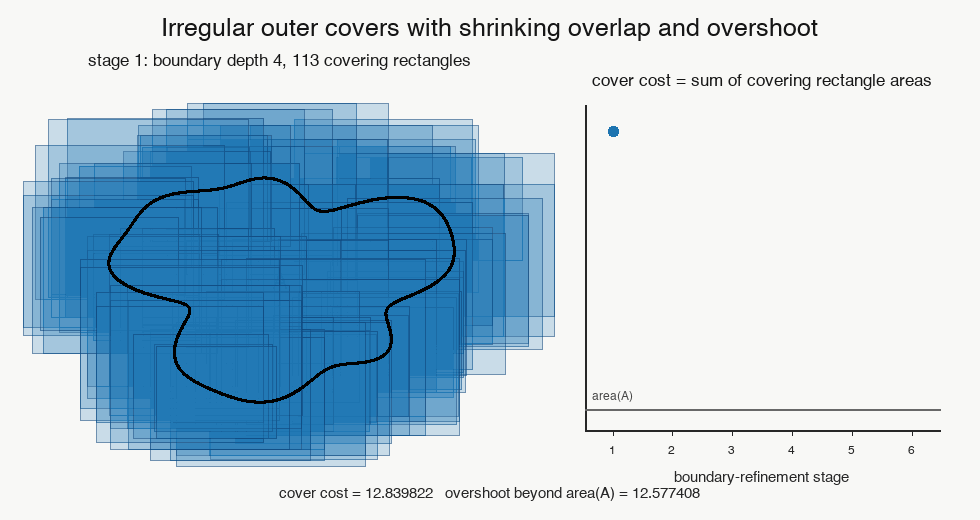
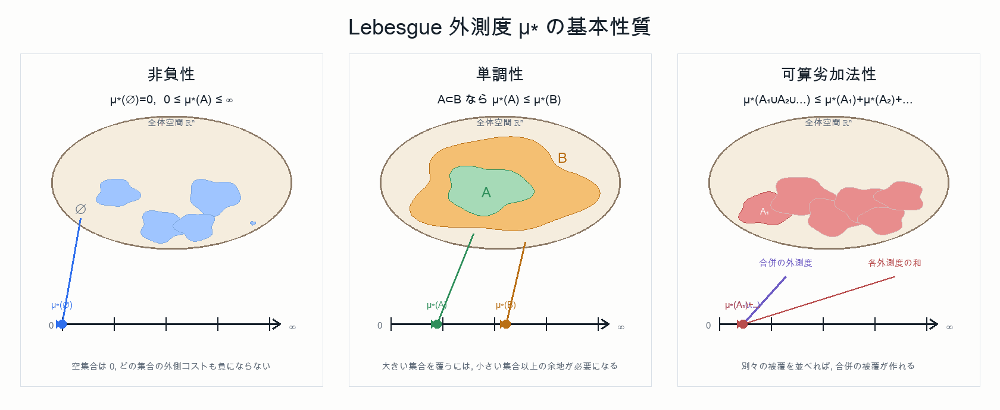
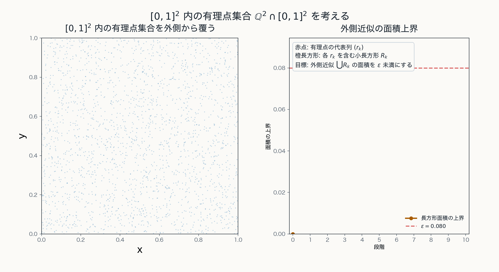

# 第2章 可算操作への移行：Lebesgue 外測度

## 目的

この章の目的は, Jordan 測度の限界を踏まえ, 可算個の $N$ 次元区間による被覆を用いて $\mathbb{R}^N$ 上の Lebesgue 外測度を導入することである.

この章で扱う Lebesgue 外測度は, $\mathbb{R}^N$ の任意の部分集合に対して定義される. しかし, それはそのまま測度ではない. 一般に外測度が満たす基本性質は可算劣加法性であり, 可算加法性ではない.

## 可算被覆

集合 $A\subset\mathbb{R}^N$ を区間列 $I_1, I_2, \ldots \in \mathfrak{I}_N$ によって覆うとは,

$$
A\subset \bigcup_{k=1}^{\infty}I_k
$$

が成り立つことをいう.

Jordan 的外側近似では, 集合を有限個の区間塊で覆った. Lebesgue 外測度では, 最初から可算個の $N$ 次元区間による被覆を許す.

この違いにより, Jordan 測度では扱いにくかった集合にも自然に大きさを割り当てられるようになる. とくに, 後に見るように, 可算集合は全体積を任意に小さくした区間列で覆うことができる.

被覆を細かくしていくにつれて, 最初は大きかった外側へのはみ出しや長方形どうしの重なりが減り, 被覆の総コストも次第に小さくなる. Lebesgue 外測度は, このような可算被覆全体の中で実現される最小限の外側コストをとらえる考え方である.

## Lebesgue 外測度 $\mu^*$ の定義

集合 $A\subset\mathbb{R}^N$ に対して, 

$$
\mu^*(A)
:=
\inf\left\{
\sum_{k=1}^{\infty}m(I_k)
\ \middle|\
A\subset\bigcup_{k=1}^{\infty}I_k, \ I_k \in\mathfrak{I}_N
\right\}
$$

と定める. この集合函数

$$
\mu^*: 2^{\mathbb{R}^N}\to[0,\infty]
$$

を $\mathbb{R}^N$ 上の **Lebesgue 外測度** という.

ここで $m(I_k)$ は区間 $I_k$ の体積である. 

空集合 $\emptyset \subset \mathbb{R}^N$ に対しては

$$
\mu^*(\emptyset)=0
$$

となる.

## Lebesgue 外測度の基本性質

Lebesgue 外測度 $\mu^*$ は, $\mathbb{R}^N$ の部分集合 $A, B, A_1, A_2, \ldots$ に対して次の性質を満たす.

1. **非負性**：

$$
0\leq \mu^*(A)\leq \infty, \qquad
\mu^*(\emptyset)=0
$$

2. **単調性**：

$$
A\subset B
\quad\Longrightarrow\quad
\mu^*(A)\leq \mu^*(B)
$$

3. **可算劣加法性**：

$$
\mu^*\left(\bigcup_{n=1}^{\infty}A_n\right)
\leq
\sum_{n=1}^{\infty}\mu^*(A_n)
$$

この三つの性質を持つため, $\mu^*$ は「外測度」と呼ばれる. ただしこの章では, 一般の空間上の外測度論にはまだ進まず, $\mathbb{R}^N$ 上で区間被覆から定まる Lebesgue 外測度だけを扱う. 外測度の公理的な扱いは第4章で行う.

また,

$$
\mu^*(N)=0
$$

を満たす集合 $N\subset\mathbb{R}^N$ を, Lebesgue 外測度に関する **零集合** という. 空集合は零集合であるが, 空集合だけが零集合なのではない. 後で見るように, 1点集合や可算集合も Lebesgue 外測度 $0$ の集合になる.

Lebesgue 外測度は任意集合に対して定義され, 単調性と可算劣加法性を満たす. 一方で, この段階では可算加法性は得られていない.

## Jordan 測度 $J$ との違い

前章で用いた Jordan 測度 $J$ と, この章で導入した Lebesgue 外測度 $\mu^*$ は, まず定義域が異なる.

前章の $m$ は区間や区間塊の体積を表す記号であった. 一方, Jordan 可測な有界集合 $A \in \mathcal{J}_N$ に対しては

$$
J:\mathcal{J}_N\to[0, \infty)
$$

によって Jordan 測度 $J$ が定まる.

これに対して, この章の Lebesgue 外測度は

$$
\mu^*:2^{\mathbb{R}^N}\to[0, \infty]
$$
 
であり, $\mathbb{R}^N$ の任意の部分集合に対して定義される.

両者の違いを表にすると, 次のようになる.

| 対象 | Jordan 測度 $J$ | Lebesgue 外測度 $\mu^*$ |
| --- | --- | --- |
| 定義域 | Jordan 可測な有界集合 $\mathcal{J}_N$ | 任意の部分集合 $2^{\mathbb{R}^N}$ |
| 値域 | $[0,\infty)$ | $[0,\infty]$ |
| 段階 | すでに測度である | この段階では外測度である |
| 加法性 | 加法的な面積概念を与える | 一般には可算加法性を持たず, 可算劣加法性にとどまる |

したがって, Jordan 測度 $J$ は定義域を $\mathcal{J}_N$ に制限する代わりに加法的な面積概念になっており, $\mu^*$ は定義域を $2^{\mathbb{R}^N}$ まで広げる代わりに, この段階ではまだ外測度にとどまっている.

## 有限加法族から可算操作へ

前章で扱った区間塊の全体 $\mathfrak{F}_N$ は, 有限回の集合演算に対して閉じている.
一般に, 空間 $X$ の部分集合族 $\mathfrak{F}$ が次の性質を満たすとき, $\mathfrak{F}$ を **有限加法族** という.

1. （空集合に対する閉性）$\emptyset\in\mathfrak{F}$.
2. （補集合に対する閉性）$E\in\mathfrak{F}$ ならば $E^c\in\mathfrak{F}$.
3. （有限和に対する閉性）$E,F\in\mathfrak{F}$ ならば $E\cup F\in\mathfrak{F}$.

この三つの性質から,

$$
X\in\mathfrak{F},\qquad
E\cap F\in\mathfrak{F},\qquad
E\setminus F\in\mathfrak{F}
$$

が従う. さらに, 同じ操作を有限回くり返せば,

$$
E_1,\ldots,E_n\in\mathfrak{F}
\quad\Longrightarrow\quad
\bigcup_{k=1}^{n}E_k\in\mathfrak{F},
\quad
\bigcap_{k=1}^{n}E_k\in\mathfrak{F}
$$

も成り立つ.

したがって, 有限加法族 $\mathfrak{F}$ の上に集合函数 $\nu$ が定義されているとき, 互いに素な有限個の集合

$$
E_1,\ldots,E_n\in\mathfrak{F}
$$

に対しては, その有限和

$$
\bigcup_{k=1}^{n}E_k
$$

も再び $\mathfrak{F}$ に属するので, $\nu\!\left(\bigcup_{k=1}^{n}E_k\right)$ を考えることができる.

前章で導入した体積 $m$ は, 区間塊の全体 $\mathfrak{F}_N$ 上で定義された集合函数であった. したがって, 互いに素な有限個の区間塊 $E_1,\ldots,E_n\in\mathfrak{F}_N$ に対して

$$
m\left(\bigcup_{k=1}^{n}E_k\right)
=
\sum_{k=1}^{n}m(E_k)
$$

という有限加法性が成り立つ.

しかし, 有限加法族で保証されるのはあくまで有限回の演算である. 可算集合列

$$
E_1,E_2,E_3,\ldots\in\mathfrak{F}
$$

が与えられても, その可算和が成り立つとは限らない. 

$$
\bigcup_{k=1}^{\infty}E_k
\overset{?}{\in}
\mathfrak{F}
$$

したがって, 可算集合や極限操作を扱うには, 有限加法族だけでは足りない.

第3章で現れる Lebesgue 可測集合族は, この有限加法族の三つ目の条件を「有限和」から「可算和」へ強めた集合族になる. その上に $\mu^*$ を制限することで, 可算加法的な Lebesgue 測度が得られる.

## 補足: 有限和と可算和の違い

有限加法族から可算加法族への移行は, 「有限回では保たれていた性質が, 可算回にすると自動では保たれない」という点で, 数列の和の振る舞いとよく似ている.

実際, 有理数 $q_1, \ldots, q_n\in\mathbb{Q}$ の有限和は常に再び有理数である:

$$
q_1+\cdots+q_n \in\mathbb{Q}
$$

つまり, $\mathbb{Q}$ は有限和に関して閉じている.

しかし, 有理数列 $q_1, q_2, q_3, \ldots$ の可算和の所属は, 級数が収束したとしても成り立つとは限らない.

$$
\sum_{n=1}^{\infty} q_n
\overset{?}{\in}
\mathbb{Q}
$$

もちろん, 有理数の可算和の収束が有理数になる場合もある. 例えば, 
$$
\sum_{n=1}^{\infty}\frac{1}{2^n}=1
$$

しかし, 例えば, $e^x$ の Taylor 展開

$$
e^x=\sum_{n=0}^{\infty}\frac{x^n}{n!}
$$

に $x=1$ を代入すると

$$
e=\sum_{n=0}^{\infty}\frac{1}{n!}
$$

を得る. 各項 $\frac{1}{n!}$ は有理数であり, 部分和

$$
\sum_{n=0}^{N}\frac{1}{n!}
$$

もすべて有理数である. しかし, 極限の値 $e$ は無理数である.

同様に,

$$
\sum_{n=1}^{\infty}\frac{1}{n^2}
=
\frac{\pi^2}{6}
$$

であり, 各項 $\frac{1}{n^2}$ も各部分和も有理数だが, 極限値 $\frac{\pi^2}{6}$ は無理数である.

このことは, **有限回の演算で保たれる性質は, 可算回の極限操作に対しては自動には保たれない** ことを示している. 集合論でも同様に, 有限加法族は有限和には閉じていても, 可算和には閉じているとは限らない. したがって, 可算個の集合や極限操作を安定に扱うには, 最初から可算和に対する閉性を仮定した可算加法族が必要になる.

## 補足: 可算劣加法性の意味

以下は, 可算劣加法性がなぜ自然に現れるかを直観的に補うための補足である.

有限加法性は, 互いに素な有限個の集合を足し合わせるときの性質であった. これに対して, Lebesgue 外測度では可算個の集合を扱うため, まず可算合併

$$
A_1\cup A_2\cup A_3\cup\cdots
$$

に対する評価が必要になる.

各 $A_n$ を区間列で覆う. そのすべての区間を一つの列に並べ直せば, それは

$$
\bigcup_{n=1}^{\infty}A_n
$$

を覆う可算個の区間列になる. したがって, **合併全体の外測度は, 各 $A_n$ を別々に覆うために使った体積の総和を超えない**. これが可算劣加法性

$$
\mu^*\left(\bigcup_{n=1}^{\infty}A_n\right)
\leq
\sum_{n=1}^{\infty}\mu^*(A_n)
$$

である.

ここで「劣」とは, 等号ではなく不等号であることを表している. すなわち, $\mathbb{R}^N$ 上の Lebesgue 外測度 $\mu^*$ は, 互いに素な集合列に対しても一般には

$$
\mu^*\left(\bigcup_{n=1}^{\infty}A_n\right)
\overset{?}{=}
\sum_{n=1}^{\infty}\mu^*(A_n)
$$

を満たすとは限らない.

この点が, 一般の外測度と測度の違いであり, Lebesgue 外測度 $\mu^*$ もこの段階ではまだ外測度にとどまっている.

## 例：可算集合の外測度

集合

$$
A=\{x_1, x_2, x_3, \ldots\}\subset\mathbb{R}^N
$$

が可算集合であるとする.

任意の $\epsilon>0$ に対して, 各点 $x_k$ を含む区間 $I_k\in\mathfrak{I}_N$ を

$$
m(I_k)<\frac{\epsilon}{2^k}
$$

となるように取る. すると

$$
A\subset \bigcup_{k=1}^{\infty}I_k
$$

かつ

$$
\sum_{k=1}^{\infty}m(I_k)
<
\sum_{k=1}^{\infty}\frac{\epsilon}{2^k}
=
\epsilon
$$

である.

したがって

$$
\mu^*(A)\leq \epsilon
$$

が任意の $\epsilon>0$ について成り立つ. よって

$$
\mu^*(A)=0
$$

である.

したがって, 任意の可算集合 $A$ は Lebesgue 外測度 $\mu^*$ に関する零集合である.

特に, 1次元では

$$
\mu^*(\mathbb{Q}\cap[0, 1])=0
$$

である.

この例は, Lebesgue 外測度が次元によらず可算集合を自然に測度 $0$ として扱えることを示している.
すなわち, 可算集合は Lebesgue 外測度に関する零集合である.

可算集合は, 各点に割り当てる区間の体積を十分速く小さくすることで, 全体積が任意に小さい可算被覆を持つ.

$\mathbb{R}^2$ でも, 可算個の点は面積を任意に小さくする可算被覆によって覆える.

## この章の中心メッセージ

Lebesgue 外測度 $\mu^*$ は, $\mathbb{R}^N$ の任意の部分集合に対して可算被覆により大きさを与える集合函数である. これによって Jordan 的有限近似では扱いにくかった集合にも自然に大きさを割り当てられる.

一方で, この段階で得られるのはまだ外測度であり, 可算加法的な測度ではない. 次章では, 外側からの大きさと内側からの大きさが整合する集合を Lebesgue 可測集合として取り出し, Lebesgue 測度へ進む.
