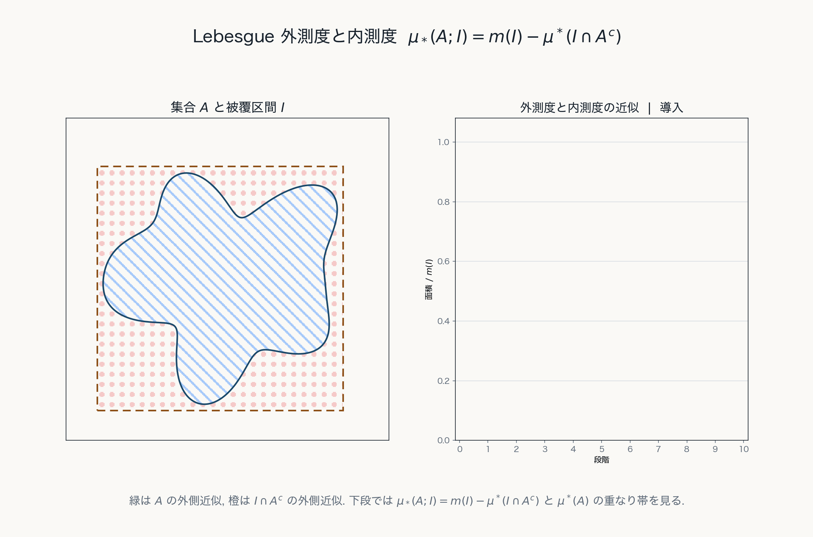

# 第2章 可算操作への移行：Lebesgue 外測度

## 目的

この章の目的は, Jordan 測度の限界を踏まえ, 可算個の $N$ 次元区間による被覆を用いて $\mathbb{R}^N$ 上の Lebesgue 外測度を導入することである.

この章で扱う Lebesgue 外測度は, $\mathbb{R}^N$ の任意の部分集合に対して定義される. しかし, それはそのまま測度ではない. 一般に外測度が満たす基本性質は可算劣加法性であり, 可算加法性ではない.

## 可算被覆

集合 $A\subset\mathbb{R}^N$ を区間列 $I_1, I_2, \ldots \in \mathfrak{I}_N$ によって覆うとは,

$$
A\subset \bigcup_{k=1}^{\infty}I_k
$$

が成り立つことをいう.

Jordan 的外側近似では, 集合を有限個の区間塊で覆った. Lebesgue 外測度では, 最初から可算個の $N$ 次元区間による被覆を許す.

この違いにより, 可算集合を非常に小さい全体積の区間列で覆うことができる.

## Lebesgue 外測度 $\mu^*$ の定義

集合 $A\subset\mathbb{R}^N$ に対して, 

$$
\mu^*(A)
=
\inf\left\{
\sum_{k=1}^{\infty}m(I_k)
\ \middle|\
A\subset\bigcup_{k=1}^{\infty}I_k, \ I_k \in\mathfrak{I}_N
\right\}
$$

と定める. この集合函数 $\mu^*$ を $\mathbb{R}^N$ 上の Lebesgue 外測度という.

ここで $m(I_k)$ は区間 $I_k$ の体積である. 

空集合に対しては

$$
\mu^*(\emptyset)=0
$$

となる.

## 外測度としての性質

Lebesgue 外測度 $\mu^*$ は, $\mathbb{R}^N$ の部分集合 $A, B, A_1, A_2, \ldots$ に対して次の性質を満たす.

1. **非負性**：

$$
0\leq \mu^*(A)\leq \infty
$$

2. **単調性**：

$$
A\subset B
\quad\Longrightarrow\quad
\mu^*(A)\leq \mu^*(B)
$$

3. **可算劣加法性**：

$$
\mu^*\left(\bigcup_{n=1}^{\infty}A_n\right)
\leq
\sum_{n=1}^{\infty}\mu^*(A_n)
$$

一般の集合 $X$ に対して, 冪集合 $\mathcal{P}(X)$ 上の集合函数

$$
\Gamma:\mathcal{P}(X)\to[0, \infty]
$$

が, 空集合で $0$ をとり, 単調性と可算劣加法性を満たすとき, $\Gamma$ を $X$ 上の**外測度**という.

この章では, 一般論としての外測度を述べるときには $X$ 上の外測度 $\Gamma$ と書き, $\mathbb{R}^N$ 上で区間被覆から定まる外測度は Lebesgue 外測度 $\mu^*$ と書く.

外測度一般では, 任意集合に対する単調性と可算劣加法性が基本になる. 可算加法性はこの段階では要求されない.

## Jordan 測度 $J$ との違い

前章で用いた Jordan 測度 $J$ と, この章で導入した Lebesgue 外測度 $\mu^*$ は, まず定義域が異なる.

前章の $m$ は区間や区間塊の体積を表す記号であった. 一方, Jordan 可測な有界集合 $A \in \mathcal{J}_N$ に対しては

$$
J:\mathcal{J}_N\to[0, \infty)
$$

によって Jordan 測度 $J$ が定まる.

これに対して, この章の Lebesgue 外測度は

$$
\mu^*:\mathcal{P}(\mathbb{R}^N)\to[0, \infty]
$$
 
であり, $\mathbb{R}^N$ の任意の部分集合に対して定義される.

したがって, Jordan 測度 $J$ は定義域を $\mathcal{J}_N$ に制限する代わりに加法的な面積概念になっており, $\mu^*$ は定義域を $\mathcal{P}(\mathbb{R}^N)$ まで広げる代わりに, この段階では可算加法性を持たない.

## 有限加法族から可算操作へ

前章で扱った区間塊の全体 $\mathfrak{F}_N$ は, 有限回の集合演算に対して閉じている.
一般に, 空間 $X$ の部分集合族 $\mathfrak{F}$ が次の性質を満たすとき, $\mathfrak{F}$ を **有限加法族** という.

1. $\emptyset\in\mathfrak{F}$.
2. $E\in\mathfrak{F}$ ならば $E^c\in\mathfrak{F}$.
3. $E,F\in\mathfrak{F}$ ならば $E\cup F\in\mathfrak{F}$.

この三つの性質から,

$$
X\in\mathfrak{F},\qquad
E\cap F\in\mathfrak{F},\qquad
E\setminus F\in\mathfrak{F}
$$

が従う. さらに, 同じ操作を有限回くり返せば,

$$
E_1,\ldots,E_n\in\mathfrak{F}
\quad\Longrightarrow\quad
\bigcup_{k=1}^{n}E_k\in\mathfrak{F},
\quad
\bigcap_{k=1}^{n}E_k\in\mathfrak{F}
$$

も成り立つ.

有限加法族上では, 互いに素な有限個の集合に対して

$$
m\left(\bigcup_{k=1}^{n}E_k\right)
=
\sum_{k=1}^{n}m(E_k)
$$

という有限加法性を考えることができる.

しかし, 有限加法族で保証されるのはあくまで有限回の演算である. 集合列

$$
E_1,E_2,E_3,\ldots\in\mathfrak{F}
$$

が与えられても,

$$
\bigcup_{k=1}^{\infty}E_k
$$

が再び $\mathfrak{F}$ に属するとは限らない. したがって, 可算集合や極限操作を扱うには, 有限加法族だけでは足りない.

第3章で現れる可算加法族は, この有限加法族の三つ目の条件を「有限和」から「可算和」へ強めたものである.
Carathéodory 可測集合の定理は, 外測度から取り出した可測集合全体が, まさにこの可算加法族になることを主張する.

## 可算劣加法性の意味

有限加法性は, 互いに素な有限個の集合を足し合わせるときの性質であった. これに対して, Lebesgue 外測度では可算個の集合を扱うため, まず可算合併

$$
A_1\cup A_2\cup A_3\cup\cdots
$$

に対する評価が必要になる.

各 $A_n$ を区間列で覆う. そのすべての区間を一つの列に並べ直せば, それは

$$
\bigcup_{n=1}^{\infty}A_n
$$

を覆う可算個の区間列になる. したがって, 合併全体の外測度は, 各 $A_n$ を別々に覆うために使った体積の総和を超えない. これが

$$
\mu^*\left(\bigcup_{n=1}^{\infty}A_n\right)
\leq
\sum_{n=1}^{\infty}\mu^*(A_n)
$$

である.

ここで「劣」とは, 等号ではなく不等号であることを表している. すなわち, $\mathbb{R}^N$ 上の Lebesgue 外測度 $\mu^*$ は, 互いに素な集合列に対しても一般には

$$
\mu^*\left(\bigcup_{n=1}^{\infty}A_n\right)
=
\sum_{n=1}^{\infty}\mu^*(A_n)
$$

を満たすとは限らない.

この点が, 一般の外測度と測度の違いであり, Lebesgue 外測度 $\mu^*$ もこの段階ではまだ外測度にとどまっている.

## 例：可算集合の外測度

集合

$$
A=\{x_1, x_2, x_3, \ldots\}\subset\mathbb{R}^N
$$

が可算集合であるとする.

任意の $\epsilon>0$ に対して, 各点 $x_k$ を含む区間 $I_k\in\mathfrak{I}_N$ を

$$
m(I_k)<\frac{\epsilon}{2^k}
$$

となるように取る. すると

$$
A\subset \bigcup_{k=1}^{\infty}I_k
$$

かつ

$$
\sum_{k=1}^{\infty}m(I_k)
<
\sum_{k=1}^{\infty}\frac{\epsilon}{2^k}
=
\epsilon
$$

である.

したがって

$$
\mu^*(A)\leq \epsilon
$$

が任意の $\epsilon>0$ について成り立つ. よって

$$
\mu^*(A)=0
$$

である.

したがって, 任意の可算集合は Lebesgue 外測度 $0$ を持つ.
このように外測度が $0$ になる集合を, 外測度 $\mu^*$ に関する **零集合** という.

特に, 1次元では

$$
\mu^*(\mathbb{Q}\cap[0, 1])=0
$$

である.

この例は, Lebesgue 外測度が次元によらず可算集合を自然に測度 $0$ として扱えることを示している.
すなわち, 可算集合は Lebesgue 外測度に関する零集合である.

可算集合は, 各点に割り当てる区間の体積を十分速く小さくすることで, 全体積が任意に小さい可算被覆を持つ.

$\mathbb{R}^2$ でも, 可算個の点は面積を任意に小さくする可算被覆によって覆える.

## Lebesgue 内測度と可測性への動機

有界集合 $A\subset \mathbb{R}^N$ をとり, $A\subset I$ を満たす有界区間 $I\in\mathfrak{I}_N$ を一つ固定する.

外側からは区間による可算被覆をそのまま考えればよいが, 内側から一般の集合を区間で埋め尽くすことは難しい. そのため, 内側の大きさは補集合の外測度を用いて間接に定める.

このとき

$$
\mu_*(A; I):=m(I)-\mu^*(I\cap A^c)
$$

を $I$ に関する $A$ の **Lebesgue 内測度** と呼ぶ.

これは, 外側の箱 $I$ の体積から, その中で $A$ の外に残る部分 $I\cap A^c$ の Lebesgue 外測度を引いた量である. したがって, $\mu_*(A; I)$ は $A$ を内側から見た大きさを表している.

実際, 可算劣加法性より

$$
I=(I\cap A)\cup(I\cap A^c)
$$

であるから

$$
m(I)=\mu^*(I)\leq \mu^*(I\cap A)+\mu^*(I\cap A^c)\leq \mu^*(A)+\mu^*(I\cap A^c)
$$

となる. よって

$$
\mu_*(A; I)=m(I)-\mu^*(I\cap A^c)\leq \mu^*(A)
$$

である.

ここで $A\subset I$ であるから $\mu^*(A)=\mu^*(I\cap A)$ であり, 外測度 $\mu^*(A)$ と内測度 $\mu_*(A; I)$ の差は

$$
\mu^*(A)-\mu_*(A; I) = \mu^*(I \cap A)+\mu^*(I\cap A^c)-m(I)
$$

と書ける. これは, 区間 $I$ を $A$ と $A^c$ で切ったときに生じる外測度のずれを表している.

したがって, もし $A\subset I$ を満たす区間 $I$ に対して

$$
m(I)=\mu^*(I\cap A)+\mu^*(I\cap A^c)
$$

が成り立つなら, $A$ は区間 $I$ による切断に関して外測度を壊さない集合であるとみなせる.

次章では, この考えを区間 $I$ に限らず任意の集合 $B\subset \mathbb{R}^N$ に対して要求する. すなわち

$$
\mu^*(B)=\mu^*(B\cap A)+\mu^*(B\cap A^c)
$$

がすべての $B\subset \mathbb{R}^N$ について成り立つとき, $A$ を Lebesgue 可測と呼ぶ.

Lebesgue 外測度は外側からの被覆で定まり, Lebesgue 内測度は補集合の外測度を通して内側からの大きさを与える. 可測性は, これら二つの見方が整合する集合を取り出す条件として現れる.

## この章の中心メッセージ

Lebesgue 外測度 $\mu^*$ は, $\mathbb{R}^N$ の任意の部分集合に対し, 可算被覆によって大きさを与える集合函数である. 可算集合を測度 $0$ として扱える一方, 有界集合に対しては内側からの量 $\mu_*(A; I)$ も考えることができる. 次章では, これらが整合する集合を Carathéodory 可測集合として取り出し, Lebesgue 測度へ進む.
