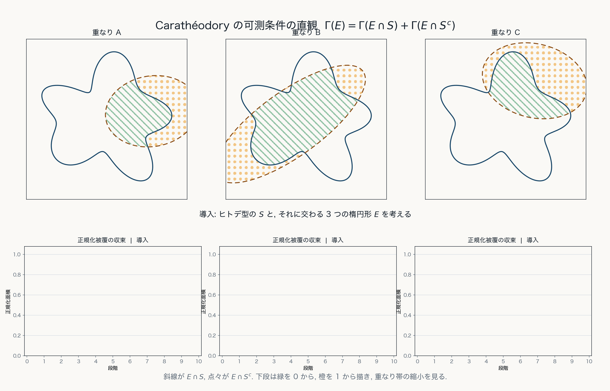

# 第3章 Carathéodory 可測性と Lebesgue 測度

## 目的

この章の目的は, 外測度から測度を得るために, Carathéodory 可測性を導入することである.

外測度 $\Gamma$ は任意の集合に対して定義されるが, 一般には可算加法性を満たさない. そこで, 外測度が加法的に振る舞う集合を可測集合として選び出す.

## Carathéodory 可測性

空間 $X$ 上に外測度 $\Gamma$ が定義されているとする.

集合 $E\subset X$ が, 任意の集合 $A\subset X$ に対して

$$
\Gamma(A)
=
\Gamma(A\cap E)+\Gamma(A\cap E^c)
$$

を満たすとき, $E$ は **Carathéodory 可測** である, または $\Gamma$-**可測**であるという.

$\Gamma$-可測集合全体を

$$
\mathfrak{M}_\Gamma := \{E\subset X \mid \forall A\subset X, \ \Gamma(A) = \Gamma(A\cap E) + \Gamma(A\cap E^c)\}
$$

と書く.

Lebesgue 外測度 $\mu^*$ に関する Carathéodory 可測集合を **Lebesgue 可測集合**という.

可測集合 $E \in \mathfrak{M}_\Gamma$ は, 任意の集合 $A$ を $A\cap E$ と $A\cap E^c$ に分けたとき, 外測度 $\Gamma$ を加法的に分解する集合である.

## 定義の意味

外測度の可算劣加法性から, 任意の $A, E\subset X$ について

$$
\Gamma(A)
\leq
\Gamma(A\cap E)+\Gamma(A\cap E^c)
$$

が成り立つ. 実際,

$$
\Gamma(A)
=
\Gamma((A\cap E)\cup(A\cap E^c))
\leq
\Gamma(A\cap E)+\Gamma(A\cap E^c)
$$

という形で, 右辺が左辺以上になることは自然に期待される.

Carathéodory 可測性は, 逆向きの不等式も含めて等号が成り立つことを要求する.

## 零集合は可測である

前章では, Lebesgue 外測度が $0$ になる集合を零集合と呼んだ.
一般の外測度 $\Gamma$ についても,

$$
\Gamma(N)=0
$$

である集合 $N$ を $\Gamma$ に関する零集合という.

零集合 $N$ は $\Gamma$-可測である. 実際, 任意の $A\subset X$ に対して

$$
\Gamma(A\cap N)\leq \Gamma(N)=0
$$

であるから

$$
\Gamma(A\cap N)=0
$$

である. また $A\cap N^c\subset A$ より

$$
\Gamma(A\cap N^c)\leq \Gamma(A)
$$

である. 一方, 可算劣加法性より

$$
\Gamma(A)
\leq
\Gamma(A\cap N)+\Gamma(A\cap N^c)
=
\Gamma(A\cap N^c)
$$

となる. したがって等号が成り立ち,

$$
\Gamma(A)
=
\Gamma(A\cap N)+\Gamma(A\cap N^c)
$$

である.

よって $N\in\mathfrak{M}_\Gamma$ である.

## Carathéodory の定理

前章で見た有限加法族では, 空集合, 補集合, 有限和に対する閉性が基本であった.
可算加法族では, このうち和集合に関する条件を可算個の和集合まで強める.

Carathéodory の定理は, 外測度から取り出した可測集合全体が, 可算操作に対して安定な集合族になることを主張する.
すなわち, **$\Gamma$-可測集合全体 $\mathfrak{M}_\Gamma$ は可算加法族** であり, 次が成り立つ.

1. （空集合に対する閉性）$\emptyset\in\mathfrak{M}_\Gamma$.
2. （補集合に対する閉性）$E\in\mathfrak{M}_\Gamma$ ならば $E^c\in\mathfrak{M}_\Gamma$.
3. （可算和に対する閉性）$E_1, E_2, \ldots\in\mathfrak{M}_\Gamma$ ならば

$$
\bigcup_{n=1}^{\infty}E_n\in\mathfrak{M}_\Gamma.
$$

さらに, 外測度 $\Gamma$ を可測集合族 $\mathfrak{M}_\Gamma$ 上に制限すると,

$$
\Gamma:\mathfrak{M}_\Gamma\to\mathbb{R}\cup\{\infty\}
$$

は可算加法的になる.

すなわち, 互いに素な可測集合列

$$
E_1, E_2, \ldots\in\mathfrak{M}_\Gamma
$$

に対して

$$
\Gamma\left(\bigcup_{n=1}^{\infty}E_n\right)
=
\sum_{n=1}^{\infty}\Gamma(E_n)
$$

が成り立つ. したがって, 外測度を可測集合に制限することで測度が得られる.

この可算加法性は, 外測度を任意集合上で見るだけでは得られない. 可測集合に制限することで初めて得られる.

## Lebesgue 測度

Euclid 空間 $\mathbb{R}^N$ 上の Lebesgue 外測度を $\mu^*$ とする.

$\mu^*$ に関する Carathéodory 可測集合を Lebesgue 可測集合と呼び, その全体を

$$
\mathfrak{M}_{\mu^*} := \{E\subset \mathbb{R}^N \mid \forall A\subset \mathbb{R}^N, \ \mu^*(A) = \mu^*(A\cap E) + \mu^*(A\cap E^c)\}
$$

と書く.

$\mu^*$ を $\mathfrak{M}_{\mu^*}$ に制限したもの

$$
\mu^*|_{\mathfrak{M}_{\mu^*}}:\mathfrak{M}_{\mu^*}\to\mathbb{R}\cup\{\infty\}
$$

を **Lebesgue 測度** と呼び,

$$
\mu :=\mu^*|_{\mathfrak{M}_{\mu^*}}
$$

と書く. Carathéodory の定理により, **Lebesgue外側度 $\mu^*$ に関する可測集合全体 $\mathfrak{M}_{\mu^*}$ は可算加法族** であり, **$\mu$ はその上の可算加法的な測度である**.
特に, 互いに素な Lebesgue 可測集合列 $E_1, E_2, \ldots \in \mathfrak{M}_{\mu^*}$ に対して, 可算加法性が成り立つ:

$$
\mu\left(\bigcup_{n=1}^{\infty}E_n\right)
=
\sum_{n=1}^{\infty}\mu(E_n)
$$

## この章の中心メッセージ

可測集合とは, 外測度が加法的に振る舞う集合である. Carathéodory の定理により, 可測集合全体は可算加法族になり, 外測度をそこに制限すると測度になる. Lebesgue 測度は, Lebesgue 外測度を Lebesgue 可測集合上に制限して得られる.
