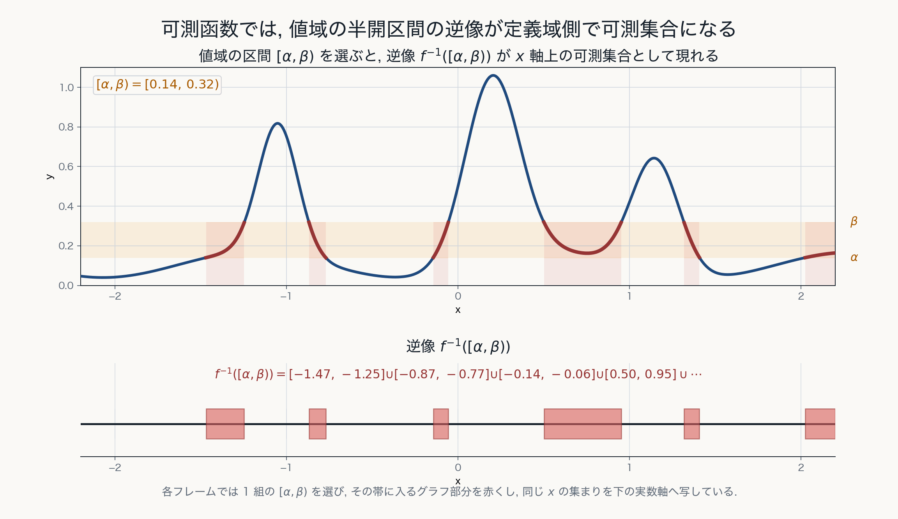
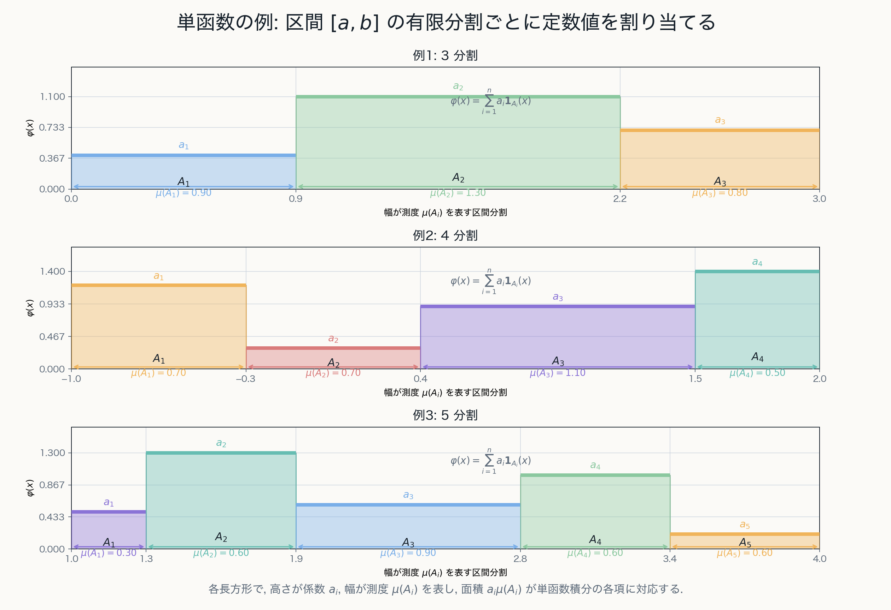

# 第5章 可測函数と単函数

## 目的

この章の目的は, Lebesgue 積分の対象となる可測函数を定義し, 積分の基本単位である定義函数と単函数を導入することである.

第4章までで, 可測集合に測度を与える枠組みを整えた.次に必要なのは, その測度を用いて函数の積分を定義することである.

測度は可測集合に対して定義される.したがって, 函数を積分するためには, その函数の値によって定まる集合が可測でなければならない. この条件を満たす函数が可測函数であり, Lebesgue 積分は可測集合の定義函数から始めて単函数へ進み, 一般の可測函数へ拡張される.

## 可測函数

測度空間 $(X, \mathfrak{B}, \mu)$ を固定する.

函数

$$
f:X\to\mathbb{R}
$$

が可測であるとは, 任意の $\alpha,\beta\in\mathbb{R}$, $\alpha<\beta$ に対して

$$
f^{-1}([\alpha,\beta))
=
\{x\in X\mid \alpha\leq f(x)<\beta\}
\in\mathfrak{B}
$$

が成り立つことをいう. 可測な函数を**可測函数**という.

この条件は, 値域側の半開区間 $[\alpha,\beta)$ で切り出した逆像が, 定義域側で可測集合になることを要求している. このとき

$$
\mu(f^{-1}([\alpha,\beta)))
$$

が定義できる. 

図では, 値域側の半開区間 $[\alpha,\beta)$ を動かし, その逆像 $f^{-1}([\alpha,\beta))$ が定義域側の可測集合として現れる様子を表している.

定義域が平面領域の場合も同じである. 曲面 $z=f(x,y)$ に値域側の帯 $[\alpha,\beta)$ を当てると, その帯に入る点の集合

$$
\{(x,y)\in X\mid \alpha\leq f(x,y)<\beta\}
=
f^{-1}([\alpha,\beta))
$$

が定義域側の可測集合として現れる.

可測函数の定義には同値な言い換えがいくつかある.たとえば, 任意の Borel 集合 $A\in\mathfrak{B}(\mathbb{R})$ に対して $f^{-1}(A)\in\mathfrak{B}$ と要求してもよい.

ここで重要なのは, 値域側で切り出した集合が定義域側の可測集合として戻ってくることである. この性質により, 次に扱う定義函数や単函数の積分を, 可測集合の測度を用いて定義できる.

## 可測函数の安定性

Lebesgue 積分を一般の函数へ拡張するためには, 可測函数が基本的な演算と極限操作で閉じていることが必要である.

$f, g$ が可測函数であり, $c\in\mathbb{R}$ とする. このとき

$$
f+g, \qquad cf, \qquad fg, \qquad |f|
$$

も可測函数である. また, 可測函数列 $f_n$ に対して

$$
\sup_n f_n, \qquad \inf_n f_n, \qquad
\limsup_{n\to\infty}f_n, \qquad
\liminf_{n\to\infty}f_n
$$

も可測である.

特に, 可測函数列 $f_n$ が各 $x\in X$ で極限を持ち

$$
f(x)=\lim_{n\to\infty}f_n(x)
$$

と定まるならば, $f$ も可測である.

この性質により, 可測函数の範囲は, 正部分・負部分への分解や単函数近似の極限を扱っても保たれる.

## 定義函数

集合 $E\subset X$ の**定義函数**を

$$
\mathbf{1}_E(x)
:=
\begin{cases}
1 & (x\in E), \\
0 & (x\notin E)
\end{cases}
$$

と定める.

$E\in\mathfrak{B}$ であるとき, **定義函数 $\mathbf{1}_E$ は可測函数である**.

実際, $a\in\mathbb{R}$ の値によって

$$
\{x\mid \mathbf{1}_E(x)>a\}
$$

は $\emptyset, E, X$ のいずれかになる. これらはすべて可測集合族 $\mathfrak{B}$ に属する.

逆に $\mathbf{1}_E$ が可測ならば, $E=\{x\in X\mid \mathbf{1}_E(x)>1/2\}$ であるから $E\in\mathfrak{B}$ である. 
したがって, 集合 $E$ が可測であることと, その定義函数 $\mathbf{1}_E$ が可測であることは同値である.

## 単函数

可測函数 $\varphi:X\to\mathbb{R}$ が有限個の値しか取らないとき, $\varphi$ を**単函数**という.

単函数は, 適当な実数 $a_1, \ldots, a_n \in \mathbb{R}$ と可測集合 $E_1, \ldots, E_n \in \mathfrak{B}$ によって

$$
\varphi (x) =\sum_{k=1}^{n}a_k\mathbf{1}_{E_k}(x) = a_1 \mathbf{1}_{E_1}(x) + \cdots + a_n \mathbf{1}_{E_n}(x), \quad (x\in X)
$$

と表される.

ここで可測集合 $E_1, \ldots, E_n \in \mathfrak{B}$ は互いに素 ($E_i \cap E_j = \emptyset$ for $i \neq j$) であり,

$$
X=E_1+\cdots+E_n
$$

となるように取ってよい.

実際, 単函数 $\varphi$ の異なる値を $a_1, \ldots, a_n \in \mathbb{R}$ とし,

$$
E_k:=\{x\in X\mid \varphi(x)=a_k\}
$$

とおけばよい. $\varphi$ が可測であれば, 各 $E_k$ は可測である.

1次元では, 区間を有限個の可測集合 $A_i$ に分け, 各部分で一定値 $a_i$ を取る階段状の函数として単函数を理解できる.

2次元でも考え方は同じであり, 定義域を有限個の可測集合に分け, 各集合上で定数値を与える. 単函数は有限個の可測集合上で定数値を取る函数であるため, 各値に対応する集合の測度を用いて積分を有限和で定義できる.

## 非負単函数

Lebesgue 積分の構成では, まず非負単函数を扱う.

**非負単函数**とは, 各 $x\in X$ に対して

$$
\varphi(x)\geq0
$$

を満たす単函数である. したがって

$$
\varphi (x) =\sum_{k=1}^{n}a_k\mathbf{1}_{E_k}(x),
\qquad
a_k\geq0
$$

と表される.

非負単函数の積分は, 次章で

$$
\int_X \varphi (x)\, d\mu(x)
:=
\sum_{k=1}^{n}a_k\mu(E_k)
$$

として定義する.

## 非負可測函数の単函数近似

**非負可測函数** $f$ に対して, $0\leq\varphi_n\leq f$ を満たす**非負単函数増加列** $\varphi_n$ で

$$
\varphi_n(x)\nearrow f(x)
$$

となるものを構成できる. すなわち, 各 $x\in X$ に対して

$$
0 \leq \varphi_1(x)\leq \varphi_2(x)\leq \cdots \leq \varphi_n(x) \leq \cdots \leq f(x)
$$

なる単函数列 $\varphi_n$ が存在し, その極限が $f$ に一致する.

これは Lebesgue 積分の構成において重要である. 非負可測函数の積分は, 下から近似する単函数の積分の上限として定義される.

非負可測函数は, 非負単函数列によって下から単調に近似できる. この事実が Lebesgue 積分の定義を支えている.

## この章の中心メッセージ

可測函数とは, 値によって定まる集合が測度で扱える函数である. 単函数は可測集合の定義函数の有限線形結合であり, Lebesgue 積分を構成する基本単位である.
