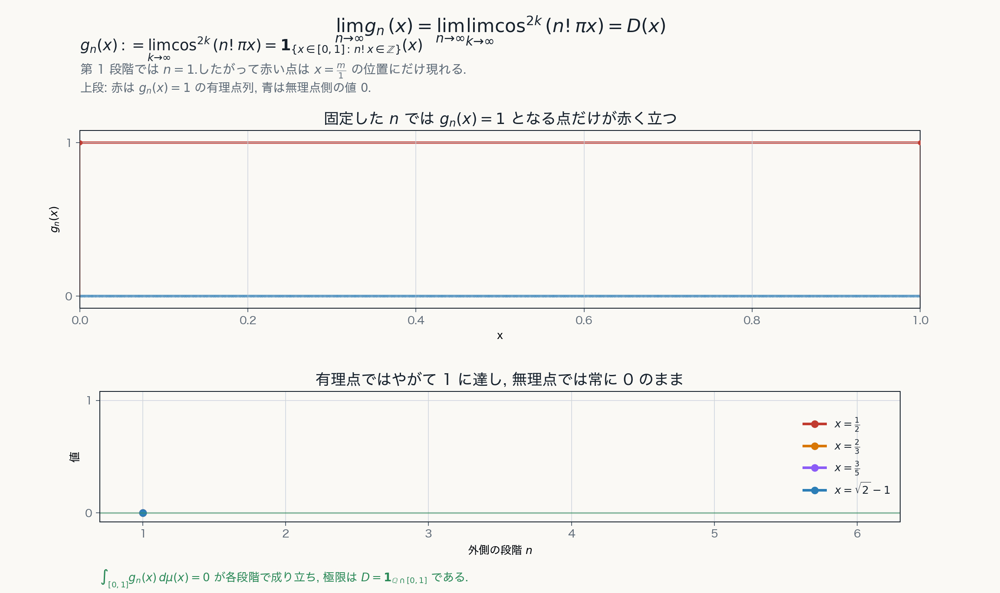

# 第5章 Riemann 積分から Lebesgue 積分へ

## 目的

この章の目的は, Riemann 積分と Lebesgue 積分の考え方の違いを明確にし, 可測函数および単函数を導入する必然性を与えることである.

Riemann 積分は定義域を有限個の小区間に分割して函数を近似する.一方, Lebesgue 積分は, 函数の値と, その値を取る集合の測度を基礎にする.

ただし,

```text
Riemann 積分は定義域を切る.
Lebesgue 積分は値域を切る.
```

という説明は直観的な補助にすぎない. 厳密には, Lebesgue 積分は可測集合の定義函数からなる単函数の積分を出発点として構成される.

## Riemann 積分の考え方

有界閉区間 $[a, b]$ 上の有界函数 $f$ を考える.

分割 (partition)

$$
\Delta:\quad a=x_0<x_1<\cdots<x_n=b
$$

を取り, 各小区間 $[x_{i-1}, x_i]$ から代表点 $\xi_i$ を選ぶ. このとき Riemann 和は

$$
\sum_{i=1}^{n} f(\xi_i)(x_i-x_{i-1})
$$

で与えられる.

これは, 定義域を有限個の小区間に分け, それぞれの小区間上で函数をほぼ定数と見なして面積を近似する方法である.


Riemann 積分では, 定義域の分割を細かくし, 小区間ごとに函数を定数で近似する.

## Darboux 和

Riemann 積分可能性は, Darboux 和を用いて次のように述べられる.

分割 $\Delta$ に対して

$$
M_i=\sup\{f(x)\mid x\in[x_{i-1}, x_i]\},
$$

$$
m_i=\inf\{f(x)\mid x\in[x_{i-1}, x_i]\}
$$

とおく.

**上 (upper) Darboux 和** と **下 (lower) Darboux 和** を

$$
\overline{\mathcal{S}}(f, \Delta)=\sum_{i=1}^{n}M_i(x_i-x_{i-1}),
$$

$$
\underline{\mathcal{S}}(f, \Delta)=\sum_{i=1}^{n}m_i(x_i-x_{i-1})
$$

で定める.

$f$ が Riemann 積分可能であるとは, 分割を細かくすることで, 任意の $\varepsilon>0$ に対して, 十分に細かい分割 $P$ が存在して

$$
(0 <)\ \overline{\mathcal{S}}(f, \Delta)-\underline{\mathcal{S}}(f, \Delta)<\varepsilon
$$

となることをいう.

つまり Riemann 積分は, 小区間内の函数の振動が積分に影響しない程度に制御できる場合に定義される.


上和と下和の差が $0$ に近づくとき, Riemann 積分が定まる.

## Dirichlet 函数

$[0, 1]$ 上の**Dirichlet 関数**

$$
D(x):=\mathbf{1}_{\mathbb{Q}\cap[0, 1]}(x) = \begin{cases}
1 & (x\in\mathbb{Q}\cap[0, 1]), \\
0 & (x\in\mathbb{Q}^c\cap[0, 1])
\end{cases}
$$

を考える.

任意の小区間には有理数も無理数も含まれる. したがって, 任意の分割 $\Delta$ と任意の小区間について

$$
\sup D=1, \qquad \inf D=0
$$

である.

よって

$$
\overline{\mathcal{S}}(D, \Delta)=1, \qquad \underline{\mathcal{S}}(D, \Delta)=0
$$

となり,

$$
\overline{\mathcal{S}}(D, \Delta)-\underline{\mathcal{S}}(D, \Delta)=1
$$

はどのような分割 $\Delta$ を取っても小さくならない.

したがって $D$ は Riemann 積分可能ではない.

一方, $\mathbb{Q}\cap[0, 1]$ は可算集合であるから Lebesgue 測度 $0$ を持つ. 

したがって

$$
D(x)=0
\quad
\mu\text{-a.e. }x\in[0, 1]
$$

である.

Lebesgue 積分では

$$
\int_{[0, 1]}D(x) \, d\mu(x) = \int_{\mathbb{Q}\cap [0, 1]}1 \, d\mu(x) + \int_{\mathbb{Q}^c \cap [0, 1]}0 \, d\mu(x) = 1 \cdot \mu(\mathbb{Q}\cap [0, 1]) + 0 \cdot \mu(\mathbb{Q}^c \cap [0, 1]) = 0
$$

となる.

この例は, Lebesgue 積分が測度 $0$ の集合上の振る舞いを自然に無視することを示している.

次の図では, Dirichlet 函数を有限集合の定義函数の極限として見る. 各 $n\in\mathbb{N}$ に対して

$$
g_n(x)
:=
\lim_{k\to\infty} \cos^{2k}(n!\pi x)
=
\mathbf{1}_{\{x\in[0, 1]\mid n!x\in\mathbb{Z}\}}(x)
=
\mathbf{1}_{\{0,1/n!,2/n!,\ldots,1\}}(x)
$$

と定める. この集合は有限集合なので, 各 $n$ について

$$
\int_{[0, 1]} g_n(x)\,d\mu(x)= 1 \cdot \mu(\{0,1/n!,2/n!,\ldots,1\}) + 0 \cdot \mu([0, 1] \setminus \{0,1/n!,2/n!,\ldots,1\}) =0
$$

である.

一方, $x\in\mathbb{Q}\cap[0, 1]$ ならば十分大きい $n$ について $n!x\in\mathbb{Z}$ となるから $g_n(x)\to1$ である. また, $x\notin\mathbb{Q}$ ならば任意の $n$ について $n!x\notin\mathbb{Z}$ であるから $g_n(x)=0$ である. したがって

$$
\lim_{n\to\infty}g_n(x)
= \lim_{n\to\infty}\mathbf{1}_{\{x\in[0, 1]\mid n!x\in\mathbb{Z}\}}(x)
=
\mathbf{1}_{\mathbb{Q}\cap[0, 1]}(x)
=D(x)
$$

が各 $x\in[0, 1]$ で成り立つ.



有理点上で値 $1$ を取る函数は Riemann 積分可能ではないが, Lebesgue 測度では有理点全体が零集合であるため積分値は $0$ になる.

## Lebesgue 積分の出発点

Lebesgue 積分では, まず空間$X$上の可測集合 $E\in\mathfrak{B}$ の定義函数を考える.

$$
\mathbf{1}_E(x)
=
\begin{cases}
1 & (x\in E), \\
0 & (x\notin E)
\end{cases}
$$

この函数に対しては

$$
\int_X \mathbf{1}_E (x) \, d\mu(x)=\mu(E)
$$

と定めるのが自然である.

さらに, 互いに素な可測集合 $E_1, \ldots, E_n$ と実数 $a_1, \ldots, a_n$ によって

$$
\varphi (x) =\sum_{k=1}^{n}a_k\mathbf{1}_{E_k}(x)
$$

と表される函数を考える. このような函数を単函数という.

単函数に対しては

$$
\int_X \varphi (x) \, d\mu (x)
=
\sum_{k=1}^{n}a_k\mu(E_k)
$$

と定める.

この定義は, 函数の値 $a_k$ と, その値を取る集合 $E_k$ の測度 $\mu(E_k)$ を掛け合わせて足すものである.


Lebesgue 積分では, 値の範囲を分け, その値を取る集合の測度を用いて単函数近似を作る.

## 点 wise 収束だけでは不十分である

Lebesgue 積分の強みは, 極限操作と積分の関係を扱いやすいことにある.しかし, 単なる点 wise 収束だけでは, 積分との交換は保証されない.

$[0, 1]$ 上で

$$
f_n(x):=n\mathbf{1}_{(0, 1/n)}(x)
$$

と定める.

$x>0$ ならば十分大きい $n$ について $x\notin(0, 1/n)$ であり, $x=0$ でも $0\notin(0, 1/n)$ である.

したがって, 各 $x\in[0, 1]$ について

$$
\lim_{n\to\infty}f_n(x)=0
$$

である (点 wise 収束).

一方, 各 $n \in \mathbb{N}$ について

$$
\int_0^1 f_n(x)\, d\mu(x)
=
n \cdot \mu((0, 1/n))
=
n \cdot \frac{1}{n}
=
1
$$

である.

$$
1=\lim_{n\to\infty}\int_0^1 f_n(x)\, d\mu(x)\neq
\int_0^1\lim_{n\to\infty}f_n(x)\, d\mu(x)
= \int_{x \in [0, 1]} 0 \, d\mu(x) = 0
$$

である.

この例は, 点 wise 収束だけでは極限と積分の交換ができないことを示す. 後で扱う優収束定理では, 可積分な支配函数の存在がこの失敗を防ぐ.

## この章の中心メッセージ

Riemann 積分は定義域の有限分割に基づき, 小区間内の振動に敏感である. Lebesgue 積分は, 可測集合の定義函数と単函数を基礎にし, 測度 $0$ の集合を自然に無視する. この違いが, 可測函数, 単函数, 収束定理へ進む動機になる.
