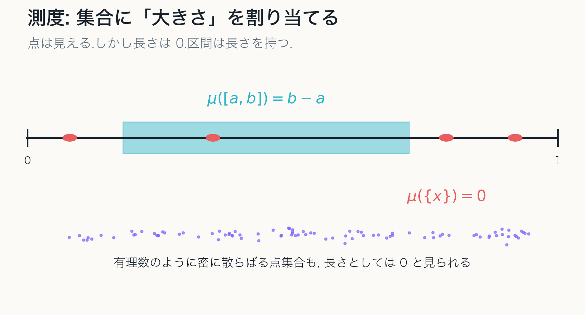
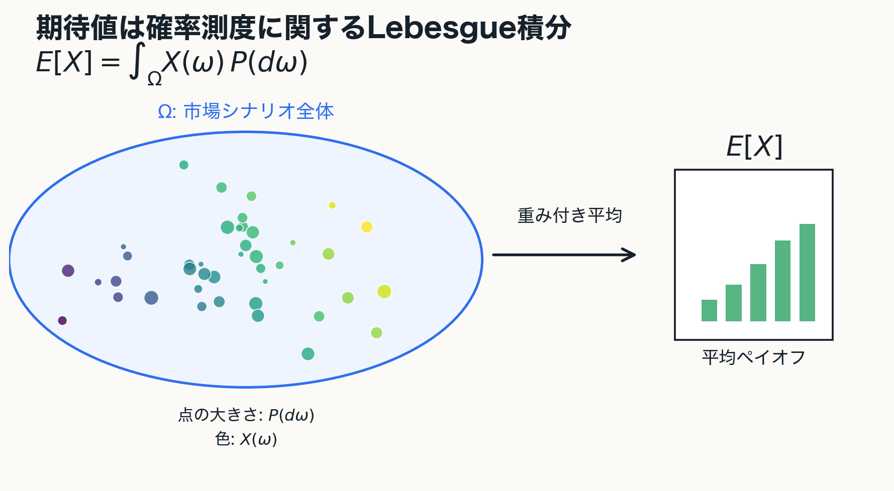
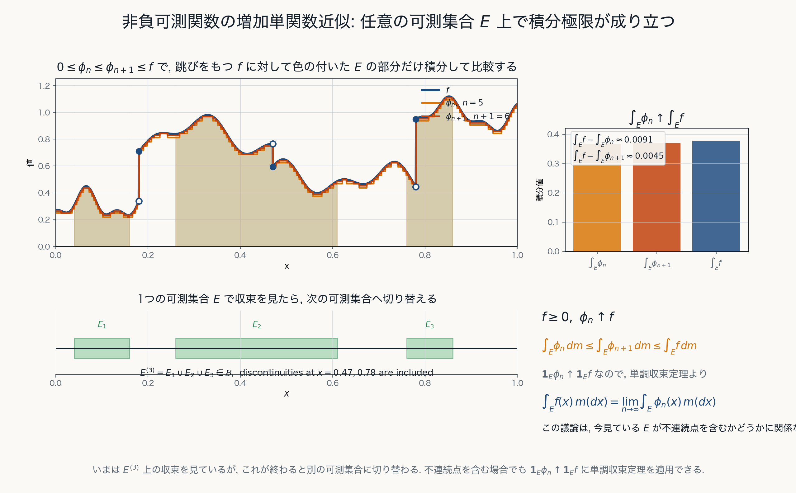

# 測度論・ルベーグ積分

古典的な長さ・面積から, 可測性と極限交換へ

[60-80分想定 / 章別原稿ベース]{class="deck-meta"}

---
layout: two-cols-header
---

# 今日の見取り図

::left::

::flow
- 集合の大きさ
- 可算操作
- 可測性
- 測度空間
- 函数の積分
- 極限交換
::

::right::

::note
本編の到達点は優収束定理である.

測度論を公理の暗記としてではなく, 面積・積分・極限操作を同時に安定化する理論として読む.
::

---

# 本編で追う一本の線

::diagram
集合の大きさ
$\longrightarrow$
可測集合
$\longrightarrow$
単函数
$\longrightarrow$
Lebesgue 積分
$\longrightarrow$
優収束定理
::

::example-box{title="中心メッセージ"}
本質的な移行点は「極限を使うかどうか」ではなく, 有限個の操作から可算個の操作へ移るところにある.
::

---
layout: section
---

# 0. 導入

測度論は何を拡張するのか

---
layout: two-cols
---

# 測度論の役割

- 集合に大きさを与える
- 可算個の集合操作と整合させる
- 測度 0 の例外を安定に扱う
- 函数列の極限と積分の交換を扱う

::note
測度論では集合函数によって集合に大きさを割り当て, Lebesgue 積分ではその大きさに基づいて点函数を積分する.
::

::right::

---

# 古典的面積概念との違い

古典的な長さ・面積・体積も, 円板や球の面積を内外からの近似の極限で定める.

::example-box{title="誤解しやすい対比"}
古典的面積概念は極限を使わない.

Lebesgue 測度だけが極限を使う.
::

これは正確ではない.

::note
本質的な移行点は, 有限個の基本図形による近似から, 可算個の集合操作を理論の内部に取り込むことにある.
::

---
layout: two-cols
---

# 積分への接続

可測集合 $E$ の定義函数に対しては

$$
\int \mathbf{1}_E\,d\mu=\mu(E)
$$

と定めたい.

さらに

$$
\varphi=\sum_{k=1}^{n}a_k\mathbf{1}_{E_k}
$$

ならば

$$
\int\varphi\,d\mu=\sum_{k=1}^{n}a_k\mu(E_k)
$$

が自然である.

::right::

---

# 到達点: 優収束定理

可測函数列 $f_n$ が

$$
f_n\to f\quad \mu\text{-a.e.}
$$

を満たし, ある $g\in L^1(\mu)$ によって

$$
|f_n|\le g\quad \mu\text{-a.e.}
$$

と支配されるならば,

$$
\int f_n\,d\mu\to\int f\,d\mu
$$

が成り立つ.

::note
この定理が, Lebesgue 積分が極限操作と相性のよい積分であることを示す中心的な到達点になる.
::

---
layout: section
---

# 1. Jordan 測度

古典的面積概念を測度論へつなぐ

---

# 基本図形: 半開区間

Euclid 空間 $\mathbb{R}^N$ で半開区間

$$
I=[a_1,b_1)\times\cdots\times[a_N,b_N)
$$

を基本図形とし, 有界な区間の体積を

$$
m(I)=\prod_{k=1}^{N}(b_k-a_k)
$$

と定める.

::example-box{title="区間塊"}
区間の有限個の直和 $E=I_1+\cdots+I_n$ として表される集合を区間塊と呼ぶ.
::

---

# 有限加法性

互いに素な区間塊 $E_1,\ldots,E_n$ に対して

$$
m\left(\bigcup_{k=1}^{n}E_k\right)
=
\sum_{k=1}^{n}m(E_k)
$$

が成り立つ.

::note
ここで扱っているのは有限加法性である. Lebesgue 測度では, この有限加法性を可算加法性へ拡張することが重要になる.
::

---

# Jordan 内測度と外測度

有界集合 $A\subset\mathbb{R}^N$ を区間塊で内外から近似する.

$$
J_*(A)=
\sup\{m(E)\mid E\subset A,\ E\in\mathfrak{F}_N\}
$$

$$
J^*(A)=
\inf\{m(F)\mid A\subset F,\ F\in\mathfrak{F}_N\}
$$

$J_*(A)=J^*(A)$ のとき, $A$ は Jordan 可測である.
この共通値を $J(A)$ と書く.

---
layout: two-cols
---

# Jordan 可測性の意味

任意の $\varepsilon>0$ に対して区間塊 $E,F$ が存在し

$$
E\subset A\subset F,
\qquad
m(F)-m(E)<\varepsilon
$$

となるとき, $A$ は Jordan 可測である.

::note
曲がった境界そのものが問題なのではない. 有限長方形近似で内外の差を任意に小さくできるかが問題である.
::

::right::

---
layout: two-cols
---

# 境界は問題ではない

円板や穴を持つ有界集合は, 有限個の直方体で正確には表せない.

それでも境界付近を細分すれば, 内側近似と外側近似の差を小さくできる.

::example-box{title="見方"}
Jordan 測度は「有限個の長方形で正確に表される集合だけ」の理論ではない.
::

::right::

---
layout: two-cols
---

# Jordan 可測でない例

平面上の有理点集合

$$
A=\mathbb{Q}^2\cap[0,1]^2
$$

を考える.

- $A$ も $A^c$ も正の面積を持つ長方形を含まない
- 内側近似では $J_*(A)=0$
- 外側近似では $J^*(A)=1$

::right::

---

# 第1章の結論

::example-box{title="中心メッセージ"}
Jordan 測度は, 有限個の基本図形による内外近似の極限として自然な面積概念である.

しかし, 可算集合や稠密集合を安定に扱うには不十分である.
::

次に必要なのは, 有限近似から可算被覆へ移ることである.

---
layout: section
---

# 2. Lebesgue 外測度

有限操作から可算操作へ

---

# 可算被覆

集合 $A\subset\mathbb{R}^N$ を区間列 $I_1,I_2,\ldots$ によって覆うとは,

$$
A\subset\bigcup_{k=1}^{\infty}I_k
$$

が成り立つことをいう.

::example-box{title="Jordan からの移行"}
Jordan 的外側近似では有限個の区間塊を使った.

Lebesgue 外測度では, 最初から可算個の区間被覆を許す.
::

---

# Lebesgue 外測度

集合 $A\subset\mathbb{R}^N$ に対して

$$
\mu^*(A)
=
\inf\left\{
\sum_{k=1}^{\infty}m(I_k)
\ \middle|\
A\subset\bigcup_{k=1}^{\infty}I_k,\ I_k\in\mathfrak{I}_N
\right\}
$$

と定める.

::note
$\mu^*$ は $\mathbb{R}^N$ の任意の部分集合に対して定義される. その代わり, この段階では測度ではなく外測度である.
::

---
layout: two-cols
---

# 外測度としての性質

Lebesgue 外測度は次を満たす.

- 非負性
- 単調性
- 可算劣加法性

$$
\mu^*\left(\bigcup_{n=1}^{\infty}A_n\right)
\le
\sum_{n=1}^{\infty}\mu^*(A_n)
$$

::note
ここで得られるのは等号ではなく不等号である. 可算加法性は次章で可測集合へ制限してから回復する.
::

::right::

---

# Jordan 測度との違い

::example-box{title="定義域と代償"}
Jordan 測度 $J$ は定義域を Jordan 可測集合に制限する代わりに加法的な面積概念になる.

Lebesgue 外測度 $\mu^*$ は任意の部分集合に定義される代わりに, この段階では可算加法性を持たない.
::

$$
J:\mathcal{J}_N\to[0,\infty),
\qquad
\mu^*:\mathcal{P}(\mathbb{R}^N)\to[0,\infty]
$$

---

# 有限加法族から可算加法族へ

有限加法族では, 有限回の和・積・差に閉じる.

しかし集合列

$$
E_1,E_2,E_3,\ldots
$$

に対して

$$
\bigcup_{k=1}^{\infty}E_k
$$

が再び同じ集合族に属するとは限らない.

::note
可算集合や極限操作を扱うには, 有限加法族だけでは足りない.
::

---
layout: two-cols
---

# 可算集合の外測度

可算集合

$$
A=\{x_1,x_2,x_3,\ldots\}
$$

に対し, 各点 $x_k$ を体積 $\varepsilon/2^k$ 未満の区間で覆う.

すると

$$
\sum_{k=1}^{\infty}m(I_k)<\varepsilon
$$

となり, 任意の $\varepsilon>0$ で $\mu^*(A)\le\varepsilon$.
したがって $\mu^*(A)=0$.

::right::

---
layout: two-cols
---

# 可測性への動機

Lebesgue 外測度 $\mu^*$ は任意集合に定義されるが, 一般には可算加法性を満たさない.

::example-box{title="次の問い"}
どの集合に制限すれば, 外測度は加法的に振る舞うのか.
::

この問いへの答えが Carathéodory 可測性である.

::right::

---
layout: section
---

# 3. Carathéodory 可測性

外測度から測度を取り出す

---

# Carathéodory 可測性

空間 $X$ 上に外測度 $\Gamma$ が定義されているとする.

集合 $E\subset X$ が任意の集合 $A\subset X$ に対して

$$
\Gamma(A)=\Gamma(A\cap E)+\Gamma(A\cap E^c)
$$

を満たすとき, $E$ は Carathéodory 可測であるという.

可測集合全体を $\mathfrak{M}_\Gamma$ と書く.

---
layout: two-cols
---

# 定義の意味

可測集合 $E$ は, 任意の集合 $A$ を

$$
A\cap E,\qquad A\cap E^c
$$

に切断したとき, 外測度を加法的に分解できる集合である.

::note
$E$ 自身の大きさだけではなく, $E$ が任意集合をうまく切れることを要求している.
::

::right::

---

# 零集合は可測である

外測度 $\Gamma$ について

$$
\Gamma(E)=0
$$

である集合 $E$ は $\Gamma$-可測である.

実際, 任意の $A\subset X$ に対して

$$
\Gamma(A\cap E)\le \Gamma(E)=0
$$

なので, $E$ 側に切り出された部分は外測度 0 である.

::note
可算集合は Lebesgue 外測度に関する零集合なので, Lebesgue 可測である.
::

---

# Carathéodory の定理

Carathéodory の定理により,

$$
\mathfrak{M}_\Gamma
$$

は可算加法族である.

- $\emptyset\in\mathfrak{M}_\Gamma$
- $E\in\mathfrak{M}_\Gamma$ なら $E^c\in\mathfrak{M}_\Gamma$
- $E_n\in\mathfrak{M}_\Gamma$ なら $\bigcup_{n=1}^\infty E_n\in\mathfrak{M}_\Gamma$

さらに, $\Gamma$ を $\mathfrak{M}_\Gamma$ に制限すると可算加法的になる.

---

# Lebesgue 測度

Lebesgue 外測度 $\mu^*$ に関する可測集合を Lebesgue 可測集合という.

その全体を

$$
\mathfrak{M}_{\mu^*}
$$

と書く.

Lebesgue 測度は

$$
\mu:=\mu^*|_{\mathfrak{M}_{\mu^*}}
$$

である.

::note
外測度を任意集合上で見るだけでは測度にならない. 可測集合に制限することで初めて測度になる.
::

---

# 第3章の結論

::example-box{title="中心メッセージ"}
可測集合とは, 外測度が加法的に振る舞う集合である.

Carathéodory の定理により, 可測集合全体は可算加法族になり, 外測度をそこに制限すると測度になる.
::

---
layout: section
---

# 4. 測度空間

Lebesgue 測度から抽象的な定義へ

---

# 可算加法族

集合 $X$ の部分集合族 $\mathfrak{B}$ が可算加法族であるとは,

- $\emptyset\in\mathfrak{B}$
- $A\in\mathfrak{B}$ なら $A^c\in\mathfrak{B}$
- $A_n\in\mathfrak{B}$ なら $\bigcup_{n=1}^{\infty}A_n\in\mathfrak{B}$

を満たすことである.

::note
有限回の集合演算だけでなく, 可算回の和に閉じていることが測度論の基本言語になる.
::

---

# 測度

可算加法族 $\mathfrak{B}$ 上の函数

$$
\mu:\mathfrak{B}\to[0,\infty]
$$

が測度であるとは, 互いに素な集合列 $A_1,A_2,\ldots$ に対して

$$
\mu\left(\bigcup_{n=1}^{\infty}A_n\right)
=
\sum_{n=1}^{\infty}\mu(A_n)
$$

を満たすことである.

---

# 測度空間

測度空間とは, 次の三つの組である.

::diagram
$$
(X,\mathfrak{B},\mu)
$$
::

::example-box{title="記号の読み方"}
$X$ は空間.

$\mathfrak{B}$ は測れる集合の族.

$\mu$ はその集合に大きさを与える測度.
::

---

# 測度空間の例

::example-box{title="Lebesgue 測度空間"}
$$
(\mathbb{R}^N,\mathfrak{M}_{\mu^*},\mu)
$$
::

::example-box{title="Borel 測度空間"}
$$
(\mathbb{R}^N,\mathfrak{B}(\mathbb{R}^N),\mu|_{\mathfrak{B}(\mathbb{R}^N)})
$$
::

::example-box{title="確率空間"}
$$
(\Omega,\mathfrak{B},P),
\qquad
P(\Omega)=1
$$
::

---

# 測度の基本性質

可算加法性から次が従う.

$$
A\subset B\Longrightarrow \mu(A)\le\mu(B)
$$

$$
\mu\left(\bigcup_{n=1}^{\infty}A_n\right)
\le
\sum_{n=1}^{\infty}\mu(A_n)
$$

$$
A_1\subset A_2\subset\cdots
\Longrightarrow
\mu\left(\bigcup_{n=1}^{\infty}A_n\right)
=
\lim_{n\to\infty}\mu(A_n)
$$

---

# 零集合と a.e.

集合 $N\in\mathfrak{B}$ が

$$
\mu(N)=0
$$

を満たすとき, $N$ を零集合という.

命題 $P(x)$ が零集合を除いて成り立つとき,

$$
P(x)\quad \mu\text{-a.e. }x\in E
$$

と書く.

::note
測度論では, 例外が全くないことよりも, 例外の測度が 0 であることが本質的になる.
::

---
layout: section
---

# 5. Riemann から Lebesgue へ

定義域を切る積分から, 値を取る集合を見る積分へ

---
layout: two-cols
---

# Riemann 積分の発想

定義域 $[a,b]$ を細かく分割し, 小区間ごとに函数をほぼ定数と見なす.

$$
\sum_i f(\xi_i)\Delta x_i
$$

Darboux 和では小区間ごとの上限・下限を用いて

$$
L(f,P),\qquad U(f,P)
$$

で挟む.

::right::

---
layout: two-cols
---

# Darboux 和の意味

Riemann 積分は, 小区間内の函数の振動が積分に影響しない程度に制御できる場合に定義される.

::example-box{title="見る対象"}
Riemann 積分は定義域を有限個の小区間に切り, 各区間内の振動を見る.
::

::right::

---
layout: two-cols
---

# Dirichlet 函数

$$
f(x)=\mathbf{1}_{\mathbb{Q}\cap[0,1]}(x)
$$

任意の小区間で

$$
\sup f=1,\qquad \inf f=0
$$

である.

したがって Riemann 積分では上和と下和が一致しない.

::right::

---

# Lebesgue 積分の出発点

Lebesgue 積分では, まず可測集合 $E$ の定義函数を考える.

$$
\int \mathbf{1}_E\,d\mu=\mu(E)
$$

次に単函数

$$
\varphi=\sum_{k=1}^{n}a_k\mathbf{1}_{E_k}
$$

に対して

$$
\int \varphi\,d\mu
=
\sum_{k=1}^{n}a_k\mu(E_k)
$$

と定める.

---
layout: two-cols
---

# 値を取る集合を見る

Riemann 積分は定義域を切る.

Lebesgue 積分は値を取る集合を測る.

::note
これは直観的な説明であり, 厳密には可測集合の定義函数からなる単函数の積分を出発点として構成される.
::

::right::

---

# 第5章の結論

::example-box{title="中心メッセージ"}
Riemann 積分は定義域の有限分割に基づき, 小区間内の振動に敏感である.

Lebesgue 積分は可測集合の定義函数と単函数を基礎にし, 測度 0 の集合を自然に無視する.
::

この違いが, 可測函数, 単函数, 収束定理へ進む動機になる.

---
layout: section
---

# 6. 可測函数と単函数

Lebesgue 積分の対象と基本単位

---

# 可測函数

測度空間 $(X,\mathfrak{B},\mu)$ 上の函数 $f:X\to\mathbb{R}$ が可測であるとは, 任意の実数 $a$ に対して

$$
\{x\in X\mid f(x)>a\}\in\mathfrak{B}
$$

が成り立つこと.

::note
函数の値によって定まる集合が測度で扱えることを要求している.
::

---
layout: two-cols
---

# 逆像として見る

値域側の区間を切り出したとき, その逆像が定義域側で可測集合になる.

$$
f^{-1}([\alpha,\beta))\in\mathfrak{B}
$$

この条件により

$$
\mu\left(\{x\mid \alpha\le f(x)<\beta\}\right)
$$

が定義できる.

::right::

---

# 定義函数

集合 $E\subset X$ の定義函数は

$$
\mathbf{1}_E(x)=
\begin{cases}
1 & (x\in E),\\
0 & (x\notin E)
\end{cases}
$$

である.

$E\in\mathfrak{B}$ であるとき, $\mathbf{1}_E$ は可測函数である.

::note
集合 $E$ が可測であることと, その定義函数 $\mathbf{1}_E$ が可測であることは同値である.
::

---
layout: two-cols
---

# 単函数

単函数とは

$$
\varphi=\sum_{k=1}^{n}a_k\mathbf{1}_{E_k}
$$

の形で表される可測函数である.

::example-box{title="基本単位"}
単函数は, 有限個の可測集合上で定数値を取る函数である.
::

::right::

---
layout: two-cols
---

# 単函数による近似

非負可測函数は, 非負単函数列によって下から単調に近似できる.

$$
0\le\varphi_1\le\varphi_2\le\cdots\le f,
\qquad
\varphi_n(x)\uparrow f(x)
$$

::note
この事実が Lebesgue 積分の定義を支えている.
::

::right::

---

# 第6章の結論

::example-box{title="中心メッセージ"}
可測函数とは, 値によって定まる集合が測度で扱える函数である.

単函数は可測集合の定義函数の有限線形結合であり, Lebesgue 積分を構成する基本単位である.
::

---
layout: section
---

# 7. Lebesgue 積分

単函数から一般の可積分函数へ

---
layout: two-cols
---

# 非負単函数の積分

非負単函数

$$
\varphi(x)=\sum_{k=1}^{n}a_k\mathbf{1}_{E_k}(x)
$$

に対して

$$
\int_X\varphi\,d\mu
:=
\sum_{k=1}^{n}a_k\mu(E_k)
$$

と定める.

::right::

---

# 単函数の基本性質

非負単函数 $\varphi,\psi$ と $c\ge0$ に対して

$$
\int_X(\varphi+\psi)\,d\mu
=
\int_X\varphi\,d\mu+\int_X\psi\,d\mu
$$

$$
\int_X c\varphi\,d\mu
=
c\int_X\varphi\,d\mu
$$

また

$$
0\le\varphi\le\psi
\quad\Longrightarrow\quad
\int_X\varphi\,d\mu\le\int_X\psi\,d\mu
$$

である.

---

# 非負可測函数の積分

非負可測函数 $f:X\to[0,\infty]$ に対して

$$
\int_X f\,d\mu
:=
\sup\left\{
\int_X\varphi\,d\mu
\ \middle|\
0\le\varphi\le f,\ \varphi\text{ は非負単函数}
\right\}
$$

と定める.

::note
非負可測函数の積分では値 $\infty$ を許す. 定義は下側近似の積分の上限である.
::

---
layout: two-cols
---

# 下から近似する

Lebesgue 積分

$$
\int_X f\,d\mu
$$

は, $0\le\varphi\le f$ を満たす単函数の積分の上限である.

値の分割を細かくすると, 下からの単函数近似の積分は極限として $f$ の積分に近づく.

::right::

---

# 一般の可測函数の積分

実数値可測函数 $f$ に対して

$$
f^+=\max\{f,0\},
\qquad
f^-=\max\{-f,0\}
$$

と定める.

このとき

$$
f=f^+-f^-,
\qquad
|f|=f^++f^-
$$

である.

---

# 可積分性

$$
\int_X |f|\,d\mu<\infty
$$

であるとき, $f$ は可積分であるという.

この場合

$$
\int_X f\,d\mu
=
\int_X f^+\,d\mu-\int_X f^-\,d\mu
$$

は有限の実数として定義される.

::example-box{title="要点"}
一般の函数は, 正部分と負部分に分けて非負可測函数の積分へ戻す.
::

---

# $L^1$ と a.e. 一致

可積分函数全体は線形空間になり,

$$
\|f\|_1=\int_X|f|\,d\mu
$$

を考える.

ただし $\|f\|_1=0$ は $f=0$ を点ごとに意味するのではなく,

$$
f=0\quad \mu\text{-a.e.}
$$

を意味する.

::note
測度論では a.e. に一致する函数を同一視して $L^1(\mu)$ を考える.
::

---

# 第7章の結論

::example-box{title="中心メッセージ"}
Lebesgue 積分は, 非負単函数の積分を出発点とし, 非負可測函数を下から単函数で近似することで定義される.

一般の函数は正部分と負部分に分けて積分する. 可積分性は $\int |f|\,d\mu<\infty$ によって定義される.
::

---
layout: section
---

# 8. 極限と積分の交換

優収束定理へ

---
layout: two-cols
---

# 点wise 収束だけでは足りない

$$
f_n(x)=n\mathbf{1}_{(0,1/n)}(x)
$$

を $[0,1]$ 上で考える.

点ごとには

$$
f_n(x)\to0
$$

だが

$$
\int_0^1 f_n\,d\mu=1
$$

である.

::right::

---

# 何が失敗しているのか

函数の質量が $0$ の近くに集中し, 高さが大きくなっている.

点ごとの極限だけを見ると, この集中を捉えられない.

$$
\int \lim_{n\to\infty}f_n\,d\mu
=0
\ne
1
=
\lim_{n\to\infty}\int f_n\,d\mu
$$

::note
極限と積分を交換するには, 単調性, 非負性, 支配函数の存在などの追加条件が必要である.
::

---
layout: two-cols
---

# 単調収束定理

非負可測函数列 $f_n$ が

$$
0\le f_1\le f_2\le\cdots
$$

を満たし, $f_n\uparrow f$ ならば

$$
\int_X f\,d\mu
=
\lim_{n\to\infty}\int_X f_n\,d\mu
$$

が成り立つ.

::right::

---

# Fatou の補題

非負可測函数列 $f_n$ に対して

$$
\int_X \liminf_{n\to\infty}f_n\,d\mu
\le
\liminf_{n\to\infty}\int_X f_n\,d\mu
$$

が成り立つ.

::example-box{title="見方"}
Fatou の補題は, 非負可測函数列について常に成り立つ下半連続性の主張である.
::

証明の基本方針は

$$
g_n=\inf_{k\ge n}f_k
$$

とおき, $g_n\uparrow\liminf f_n$ に単調収束定理を使うことである.

---

# 優収束定理

可測函数列 $f_n$ が

$$
f_n\to f\quad \mu\text{-a.e.}
$$

を満たし, ある $g\in L^1(\mu)$ が存在して

$$
|f_n|\le g\quad \mu\text{-a.e.}
$$

ならば

$$
\int_X f_n\,d\mu\to\int_X f\,d\mu
$$

が成り立つ.

さらに

$$
\int_X|f_n-f|\,d\mu\to0
$$

も成り立つ.

---

# 優収束定理の意味

優収束定理の条件は二つに分けられる.

::example-box{title="a.e. 収束"}
$$
f_n\to f\quad \mu\text{-a.e.}
$$
::

::example-box{title="可積分な支配函数"}
$$
|f_n|\le g,\qquad g\in L^1(\mu)
$$
::

支配函数 $g$ の存在により, 函数列の質量が狭い領域に集中したり, 高さだけが大きくなったりすることを防ぐ.

---

# $L^1$ 収束として見る

可測函数列 $f_n$ が $f$ に $L^1$ 収束するとは

$$
\int_X |f_n-f|\,d\mu\to0
$$

であること.

優収束定理は

$$
\text{a.e. 収束}
\quad+\quad
\text{可積分支配}
\quad\Longrightarrow\quad
L^1\text{ 収束}
$$

を主張している.

---

# 第8章の結論

::example-box{title="中心メッセージ"}
Lebesgue 積分では, 非負性と単調性による単調収束定理, 非負函数列に対する Fatou の補題, 可積分な支配函数による優収束定理によって, 極限と積分の関係を体系的に扱うことができる.
::

優収束定理は, 本発表の到達点である.

---
layout: section
---

# Appendix

Radon-Nikodym の定理

---

# 二つの測度を比べる

同じ可測空間 $(X,\mathfrak{B})$ 上に二つの測度

$$
\mu,\qquad \nu
$$

が定義されているとする.

Radon-Nikodym の定理は, $\nu$ が $\mu$ に関して絶対連続であるとき, $\nu$ を $\mu$ に対する密度函数で表せることを述べる.

---

# 絶対連続性

$$
\nu\ll\mu
$$

とは

$$
\mu(A)=0\Longrightarrow \nu(A)=0
$$

がすべての $A\in\mathfrak{B}$ について成り立つこと.

::note
$\mu$ で見えない零集合は, $\nu$ でも見えない. これが測度間の絶対連続性である.
::

---

# Radon-Nikodym の定理

適切な $\sigma$-有限性の仮定の下で, $\nu\ll\mu$ ならば非負可測函数 $h$ が存在して

$$
\nu(A)=\int_A h\,d\mu
$$

がすべての $A\in\mathfrak{B}$ について成り立つ.

この $h$ を

$$
h=\frac{d\nu}{d\mu}
$$

と書く.

---

# 本編との関係

Radon-Nikodym の定理は, 別の測度 $\nu$ に関する積分を, 基準測度 $\mu$ に関する積分へ変換する.

$$
\int_X f\,d\nu
=
\int_X f\frac{d\nu}{d\mu}\,d\mu
$$

::example-box{title="見方"}
測度を変える操作を, 積分の中の重み付けとして扱うことができる.
::

---
layout: end
---

# まとめ

- Jordan 測度から Lebesgue 測度への移行点は, 有限操作から可算操作への移行である
- 外測度だけでは足りず, 加法性がよく振る舞う可測集合を選ぶ必要がある
- Lebesgue 積分は単函数から構成され, 測度 0 の差に安定である
- 優収束定理は, Lebesgue 積分が極限操作と相性のよい積分であることを表す
