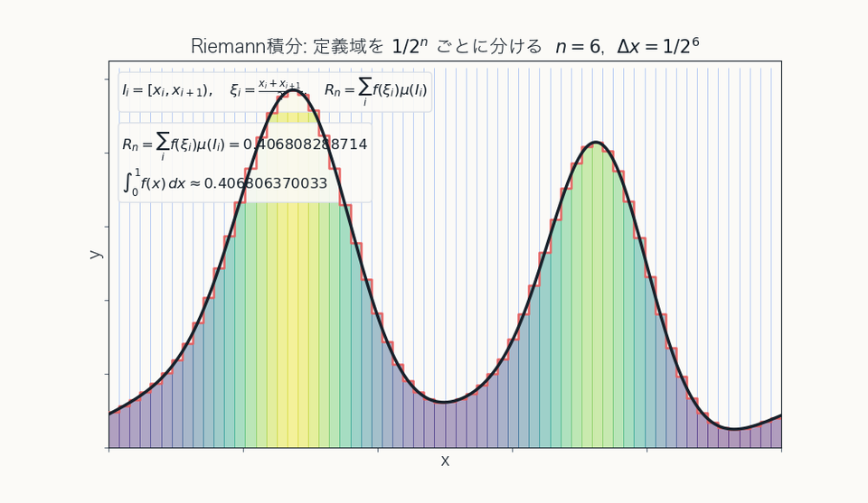
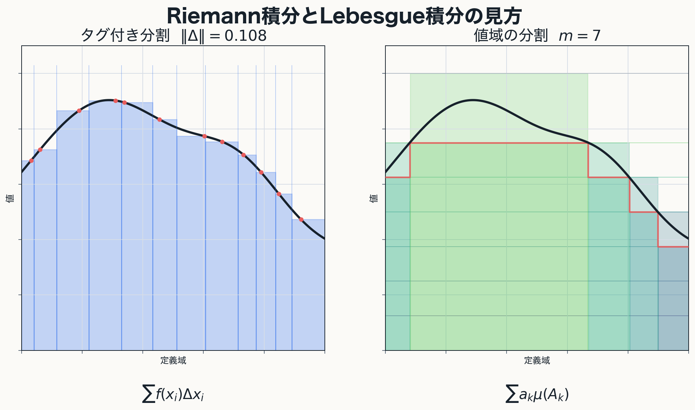
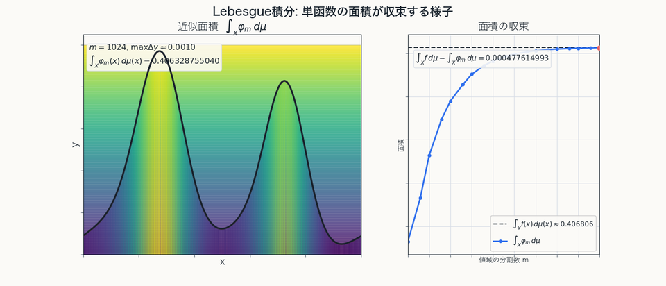
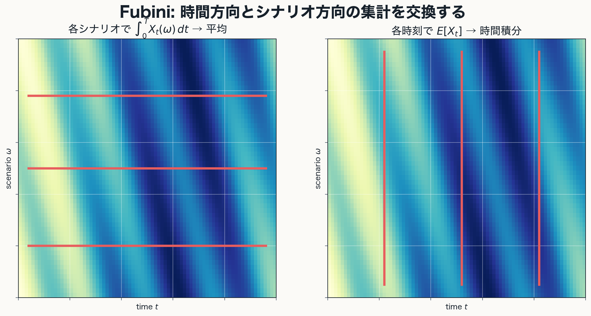

# 測度論・ルベーグ積分

古典的な長さ・面積から, 可測性と極限交換へ

[60-80分想定 / 初版]{class="mt-10 text-sm opacity-70"}

---
layout: two-cols-header
---

# 今日の流れ

::left::

::flow
- 長さ・面積
- Jordan 測度
- 外測度
- 可測集合
- 測度空間
- ルベーグ積分
- 収束定理
::

::right::

::note
到達点は優収束定理.

ラドン＝ニコディムの定理は Appendix で位置づけだけ確認する.
::

---
layout: section
---

# 0. 導入

---
layout: two-cols
---

# 測度論は何を拡張するのか

- 長さ・面積・体積を, より複雑な集合へ拡張したい
- 確率も「集合に重みを与える理論」として同じ枠組みに入れたい
- 関数の総量を, 極限操作と両立する形で定義したい

::note
本発表は公理から始めるのではなく, 古典的な面積概念をどう解析学向けに拡張するか, という順に組み立てる.
::

::right::

---
layout: two-cols
---

# 期待値も積分である

- 確率空間では, 集合の大きさの代わりに確率を測る
- 確率変数 $X$ の期待値は

$$
E[X] = \int_\Omega X(\omega)\, P(d\omega)
$$

- 測度論は幾何だけでなく解析と確率の共通言語になる

::right::

---

# 本発表の中心メッセージ

::example-box{title="主張"}
- Jordan 測度にもすでに極限操作は入っている
- 本質的な移行点は「有限」から「可算」への移行である
- 外測度だけでは足りず, 加法性がよく振る舞う集合を選ぶ必要がある
- ルベーグ積分の強みは, 広い関数を積分できること以上に, 極限と積分を交換しやすいことにある
::

---
layout: section
---

# 1. 古典的面積概念と Jordan 測度

---

# 区間と区間塊

Euclid 空間 $\mathbb{R}^N$ で半開区間

$$
I=[a_1,b_1)\times\cdots\times[a_N,b_N)
$$

を基本図形とし, 有界な区間の体積を

$$
m(I)=\prod_{k=1}^{N}(b_k-a_k)
$$

と定める.

区間の有限個の直和として表される集合を**区間塊**と呼ぶ.

$$
E=I_1+\cdots+I_n
$$

::note
半開区間を使うのは, 分割したときに境界の重複を避けるため.
::

---

# 有限加法性

互いに素な区間塊 $E_1,\ldots,E_n$ に対して

$$
m\left(\bigcup_{k=1}^{n}E_k\right)
=
\sum_{k=1}^{n}m(E_k)
$$

が成り立つ.

::example-box{title="古典的面積の基本"}
有限個に分けて測り, 足し合わせても全体の大きさは変わらない.
::

::note
Lebesgue 測度では, この有限加法性を可算加法性へ拡張することが重要になる.
::

---

# Jordan 内測度と Jordan 外測度

有界集合 $A\subset\mathbb{R}^N$ を区間塊で内外から近似する.

$$
J_*(A)
=
\sup\{m(E)\mid E\subset A,\ E\in\mathfrak{F}_N\}
$$

$$
J^*(A)
=
\inf\{m(F)\mid A\subset F,\ F\in\mathfrak{F}_N\}
$$

$J_*(A)=J^*(A)$ のとき, $A$ は Jordan 可測である.
この共通値を $J(A)$ と書く.

::note
Jordan 測度は「有限個の長方形で正確に表される集合だけ」の理論ではない.各近似段階は有限だが, 近似の極限で面積を定める.
::

---
layout: two-cols
---

# Jordan 可測性の見方

任意の $\varepsilon>0$ に対して区間塊 $E,F$ が存在し

$$
E\subset A\subset F,
\qquad
m(F)-m(E)<\varepsilon
$$

となるとき, $A$ は Jordan 可測である.

- 曲がった境界そのものが問題ではない
- 問題は有限長方形近似で安定に扱えない集合である

::right::

---

# Jordan 可測でない例

平面上の有理点集合

$$
A=\mathbb{Q}^2\cap[0,1]^2
$$

を考える.

- $A$ も $A^c$ も正の面積を持つ長方形を含まない
- 内側近似では正の面積を取れないので $J_*(A)=0$
- 外側近似では $[0,1]^2$ 全体を避けられないので $J^*(A)=1$

したがって $A$ は Jordan 可測ではない.

::note
Lebesgue 測度では, この集合は可算集合なので測度 0 になる.
::

---
layout: two-cols
---

# 第1章の結論

::example-box{title="中心メッセージ"}
Jordan 測度は, 有限個の基本図形による内外近似の極限として自然な面積概念である.

しかし, 可算集合や稠密集合を安定に扱うには不十分である.
::

Lebesgue 測度への移行点は, 有限近似から可算被覆へ移るところにある.

::right::

---
layout: section
---

# 2. 可算操作への移行

---

# 可算被覆

Lebesgue 外測度では, 集合 $A\subset\mathbb{R}^N$ を可算個の区間で覆う.

$$
A\subset \bigcup_{k=1}^{\infty}I_k
$$

Jordan 的外側近似では有限個の区間塊を使った.
Lebesgue 外測度では, 最初から可算個の区間被覆を許す.

::example-box{title="移行点"}
有限個の近似から, 可算個の被覆へ.
::

---

# Lebesgue 外測度の定義

集合 $A\subset\mathbb{R}^N$ に対して

$$
\mu^*(A)
=
\inf\left\{
\sum_{k=1}^{\infty}m(I_k)
\ \middle|\
A\subset\bigcup_{k=1}^{\infty}I_k,\ I_k\in\mathfrak{I}_N
\right\}
$$

と定める. この集合函数を Lebesgue 外測度という.

::note
$\mu^*$ は $\mathbb{R}^N$ の任意の部分集合に対して定義される.
::

---

# 外測度の基本性質

- 任意の集合 $A \subset \mathbb{R}^N$ に定義される
- 単調性を満たす

$$
A \subset B \Longrightarrow \mu^*(A) \le \mu^*(B)
$$

- 可算劣加法性を満たす

$$
\mu^*\left(\bigcup_{k=1}^{\infty} A_k\right)
\le
\sum_{k=1}^{\infty} \mu^*(A_k)
$$

::note
ここで成り立つのは可算加法性ではなく, 可算劣加法性まで.
::

---

# 有限加法族から可算操作へ

有限加法族 $\mathfrak{F}$ は次を満たす.

1. $\emptyset\in\mathfrak{F}$
2. $E\in\mathfrak{F}$ ならば $E^c\in\mathfrak{F}$
3. $E,F\in\mathfrak{F}$ ならば $E\cup F\in\mathfrak{F}$

ここから有限回の和・積・差に閉じることが従う.

しかし, 集合列 $E_1,E_2,\ldots\in\mathfrak{F}$ に対して

$$
\bigcup_{k=1}^{\infty}E_k\in\mathfrak{F}
$$

とは限らない.

::note
第3章で出てくる可算加法族は, 有限和を可算和へ強めたもの.
::

---
layout: two-cols
---

# 可算集合は零集合になる

可算集合

$$
A=\{x_1,x_2,x_3,\ldots\}
$$

に対し, 各点 $x_k$ を体積 $\varepsilon/2^k$ 未満の区間で覆う.

すると被覆全体の体積和は $\varepsilon$ 未満にできるので

$$
\mu^*(A)=0
$$

である.

::note
このように外測度が 0 になる集合を零集合という.
::

::right::

---

# 可測性への動機

Lebesgue 外測度 $\mu^*$ は任意集合に定義されるが, 一般には可算加法性を満たさない.

そこで次に必要になるのは,

::example-box{title="問い"}
どの集合に制限すれば, 外測度は加法的に振る舞うのか.
::

第3章では, 外測度を壊さずに集合を切断できる集合を可測集合として取り出す.

---
layout: section
---

# 3. Carathéodory 可測性と Lebesgue 測度

---

# Carathéodory 可測性

空間 $X$ 上に外測度 $\Gamma$ があるとする.

集合 $E\subset X$ が任意の集合 $A\subset X$ に対して

$$
\Gamma(A)
=
\Gamma(A\cap E)+\Gamma(A\cap E^c)
$$

を満たすとき, $E$ は Carathéodory 可測であるという.

可測集合全体を

$$
\mathfrak{M}_\Gamma
$$

と書く.

---
layout: two-cols
---

# 定義の意味

可測集合 $E$ は, 任意の集合 $A$ を

$$
A\cap E,\qquad A\cap E^c
$$

に切断したとき, 外測度を加法的に分解できる集合である.

::example-box{title="見るべき点"}
$E$ 自身の大きさだけではなく, $E$ が任意集合をうまく切れることを要求している.
::

::right::

---

# 零集合は可測である

外測度 $\Gamma$ について

$$
\Gamma(E)=0
$$

である集合 $E$ は $\Gamma$-可測である.

実際, 任意の $A\subset X$ に対して

$$
\Gamma(A\cap E)\leq \Gamma(E)=0
$$

なので, $E$ 側に切り出された部分は外測度 0 である.

::note
第2章で見た可算集合は, Lebesgue 外測度に関する零集合なので Lebesgue 可測である.
::

---

# Carathéodory の定理

Carathéodory の定理により,

$$
\mathfrak{M}_\Gamma
$$

は可算加法族である.

- $\emptyset\in\mathfrak{M}_\Gamma$
- $E\in\mathfrak{M}_\Gamma$ なら $E^c\in\mathfrak{M}_\Gamma$
- $E_n\in\mathfrak{M}_\Gamma$ なら $\bigcup_{n=1}^\infty E_n\in\mathfrak{M}_\Gamma$

さらに, $\Gamma$ を $\mathfrak{M}_\Gamma$ に制限すると可算加法的になる.

---

# Lebesgue 測度

Lebesgue 外測度 $\mu^*$ に関する可測集合を Lebesgue 可測集合という.

その全体を

$$
\mathfrak{M}_{\mu^*}
$$

と書く.

Lebesgue 測度は

$$
\mu
:=
\mu^*|_{\mathfrak{M}_{\mu^*}}
$$

である.

::note
外測度を任意集合上で見るだけでは測度にならない. 可測集合に制限することで初めて測度になる.
::

---
layout: section
---

# 4. 抽象的測度空間

---

# 測度空間の定義

前章では

$$
(\mathbb{R}^N,\mathfrak{M}_{\mu^*},\mu)
$$

という三つ組が得られた.

この形だけを取り出して

$$
(X,\mathfrak{B},\mu)
$$

を測度空間という.

::note
$X$ は空間, $\mathfrak{B}$ は可算加法族, $\mu$ はその上の測度.
::

---

# 可算加法族と測度

可算加法族 $\mathfrak{B}$ は次を満たす集合族である.

- $\emptyset\in\mathfrak{B}$
- $A\in\mathfrak{B}$ なら $A^c\in\mathfrak{B}$
- $A_n\in\mathfrak{B}$ なら $\bigcup_{n=1}^\infty A_n\in\mathfrak{B}$

測度 $\mu:\mathfrak{B}\to[0,\infty]$ は, 互いに素な集合列に対して

$$
\mu\left(\bigcup_{n=1}^{\infty}A_n\right)
=
\sum_{n=1}^{\infty}\mu(A_n)
$$

を満たす.

::note
可算加法性から有限加法性, 単調性, 可算劣加法性が従う.
::

---

# 測度空間の例

::example-box{title="Lebesgue 測度空間"}
$$
(\mathbb{R}^N,\mathfrak{M}_{\mu^*},\mu)
$$
::

::example-box{title="Borel 測度空間"}
$$
(\mathbb{R}^N,\mathfrak{B}(\mathbb{R}^N),\mu|_{\mathfrak{B}(\mathbb{R}^N)})
$$
::

::example-box{title="確率空間"}
$$
(\Omega,\mathfrak{B},P),
\qquad
P(\Omega)=1
$$
::

---

# 測度の基本性質

測度 $\mu$ は次を満たす.

- 単調性

$$
A\subset B \Longrightarrow \mu(A)\leq \mu(B)
$$

- 可算劣加法性

$$
\mu\left(\bigcup_{n=1}^{\infty}A_n\right)
\leq
\sum_{n=1}^{\infty}\mu(A_n)
$$

- 下からの連続性

$$
A_1\subset A_2\subset\cdots
\Longrightarrow
\mu\left(\bigcup_{n=1}^{\infty}A_n\right)
=
\lim_{n\to\infty}\mu(A_n)
$$

---

# 零集合と a.e.

集合 $N\in\mathfrak{B}$ が

$$
\mu(N)=0
$$

を満たすとき, $N$ を零集合という.

命題 $P(x)$ が零集合を除いて成り立つとき,

$$
P(x)\quad \mu\text{-a.e. }x\in E
$$

と書く.

::note
測度論では, 例外が全くないことよりも, 例外の測度が 0 であることが本質的になる.
::

---
layout: section
---

# 5. リーマン積分からルベーグ積分へ

---
layout: two-cols
---

# リーマン積分の発想

- 定義域 $[a, b]$ を細かく分割する
- 各小区間で関数値を拾って

$$
\sum f(\xi_i)\Delta x_i
$$

を考える

- Darboux 和では上下から

$$
L(f, P), \ U(f, P)
$$

で挟む

::right::

---
layout: two-cols
---

# ルベーグ積分の発想

- 関数値の層を先に見る
- 値 $a_k$ を取る点集合 $A_k$ の測度を調べる
- 単関数

$$
s = \sum_{k=1}^{N} a_k \mathbf{1}_{A_k}
$$

の積分を

$$
\int s\, d\mu = \sum_{k=1}^{N} a_k \mu(A_k)
$$

で定義する

::right::

---

# 典型例: Dirichlet 関数

$$
f(x) = \mathbf{1}_{\mathbb{Q} \cap [0, 1]}(x)
$$

- 任意の小区間で $\sup f = 1, \ \inf f = 0$
- よって Riemann 積分では上和と下和が一致しない
- しかし $\mathbb{Q} \cap [0, 1]$ は可算だから Lebesgue 測度 0

$$
\int_0^1 \mathbf{1}_{\mathbb{Q} \cap [0, 1]}\, dm = 0
$$

::note
ルベーグ積分は「どこで振動するか」より「その集合がどれくらいの大きさか」を見る.
::

---

# 比較から分かること

::example-box{title="対比"}
- Riemann 積分は定義域の分割に基づく
- Lebesgue 積分は可測集合上の単関数を基本単位にする
- Riemann 積分は小区間内の振動に敏感
- Lebesgue 積分は測度 0 の差を無視できる
::

---
layout: section
---

# 6. 可測関数と単関数

---

# 可測関数

測度空間 $(X, \mathcal{F}, \mu)$ 上の関数 $f:X \to \mathbb{R}$ が可測であるとは,
任意の実数 $a$ に対して

$$
\{x \in X : f(x) > a\} \in \mathcal{F}
$$

が成り立つこと.

::note
値域側の区間を引き戻したとき, その逆像が可測集合になることを要求している.
::

---

# 単関数が基本単位

単関数とは

$$
\varphi = \sum_{k=1}^{N} a_k \mathbf{1}_{E_k}
$$

の形の可測関数.

::example-box{title="重要性"}
- 積分が有限和で定義できる
- 一般の非負可測関数を下から近似する足場になる
- Lebesgue 積分の定義は, 単関数から始めると最も自然
::

---
layout: two-cols
---

# 下からの単関数近似

非負可測関数 $f$ に対し

$$
\int f\, d\mu
=
\sup\left\{
\int s\, d\mu : 0 \le s \le f, \ s は単関数
\right\}
$$

と定める.

::note
値域を細かく刻むほど, 単関数 $s_m$ が $f$ を下からよく近似する.
::

::right::

---
layout: section
---

# 7. Lebesgue 積分

---

# 積分の定義の流れ

1. 単関数 $s = \sum a_k \mathbf{1}_{E_k}$ に対し $\int s\, d\mu = \sum a_k \mu(E_k)$
2. 非負可測関数 $f$ に対し, 下からの単関数近似の上限で定義
3. 一般の関数 $f$ は

$$
f = f^+ - f^-
$$

で分解し,

$$
\int |f|\, d\mu < \infty
$$

なら可積分とする

---

# すぐに得られる基本性質

- 線形性
- 単調性
- 零集合上の変更では積分値が変わらない
- 指示関数に対して

$$
\int \mathbf{1}_E\, d\mu = \mu(E)
$$

::note
積分が「集合の大きさ」を含んだ拡張であることがここに現れる.
::

---
layout: section
---

# 8. 極限と積分の交換

---

# まず, 点wise 収束だけでは足りない

$$
f_n(x) = n \mathbf{1}_{(0, 1/n)}(x)
$$

を $[0, 1]$ 上で考える.

- $f_n(x) \to 0$ は a.e. に成り立つ
- しかし

$$
\int_0^1 f_n\, dm = 1
$$

なので

$$
\int \lim f_n\, dm = 0 \ne 1 = \lim \int f_n\, dm
$$

---

# 単調収束定理

$0 \le f_1 \le f_2 \le \cdots$ かつ $f_n \uparrow f$ なら

$$
\int f_n\, d\mu \to \int f\, d\mu
$$

::note
非負関数を単関数で下から積み上げて定義したことと相性がよいので, 最も基本的な収束定理になる.
::

---

# Fatou の補題

非負可測関数列に対して

$$
\int \liminf_{n \to \infty} f_n\, d\mu
\le
\liminf_{n \to \infty} \int f_n\, d\mu
$$

::note
極限の下側に関する不等式.優収束定理の証明でも中核になる.
::

---

# 優収束定理

$f_n \to f$ a.e. かつ, ある $g \in L^1(\mu)$ が存在して

$$
|f_n| \le g \quad \text{a.e.}
$$

ならば

$$
\int f_n\, d\mu \to \int f\, d\mu
$$

::example-box{title="意味"}
極限と積分を交換したいとき, a.e. 収束と可積分な支配関数があれば十分.
::

---
layout: two-cols
---

# Fubini の定理へ

- 収束定理と並んで, Lebesgue 積分の強力さを示すのが積分順序交換
- 2変数の積分では

$$
\int \left(\int f(x, y)\, d\nu(y)\right)d\mu(x)
=
\int \left(\int f(x, y)\, d\mu(x)\right)d\nu(y)
$$

が適切な条件の下で成り立つ

::note
「時間で積分してから平均するか, 平均してから時間積分するか」を入れ替えられる.
::

::right::

---
layout: section
---

# Appendix

---

# ラドン＝ニコディムの定理

測度 $\nu$ が $\mu$ に関して絶対連続なら,
適切な関数 $h$ が存在して

$$
\nu(A) = \int_A h\, d\mu
$$

と書ける.

この $h$ を

$$
h = \frac{d\nu}{d\mu}
$$

と書き, Radon-Nikodym 微分と呼ぶ.

---

# これは何を言っているのか

- 「別の測度」を, 基準測度に対する密度で表せる
- 確率密度関数はその典型例
- 測度変更, 重み付け, 条件付き期待値の基礎になる

::example-box{title="見方"}
新しい大きさ $\nu$ は, 古い大きさ $\mu$ に重み $h$ を掛けて積分したものとして記述できる.
::

---
layout: end
---

# まとめ

- Jordan 測度から Lebesgue 測度への移行点は, 有限から可算への移行
- 外測度だけでは足りず, 可測集合を選ぶ必要がある
- Lebesgue 積分は単関数から構成され, 測度 0 の差に安定
- 優収束定理は「極限と積分が交換しやすい」ことを表す中心定理
