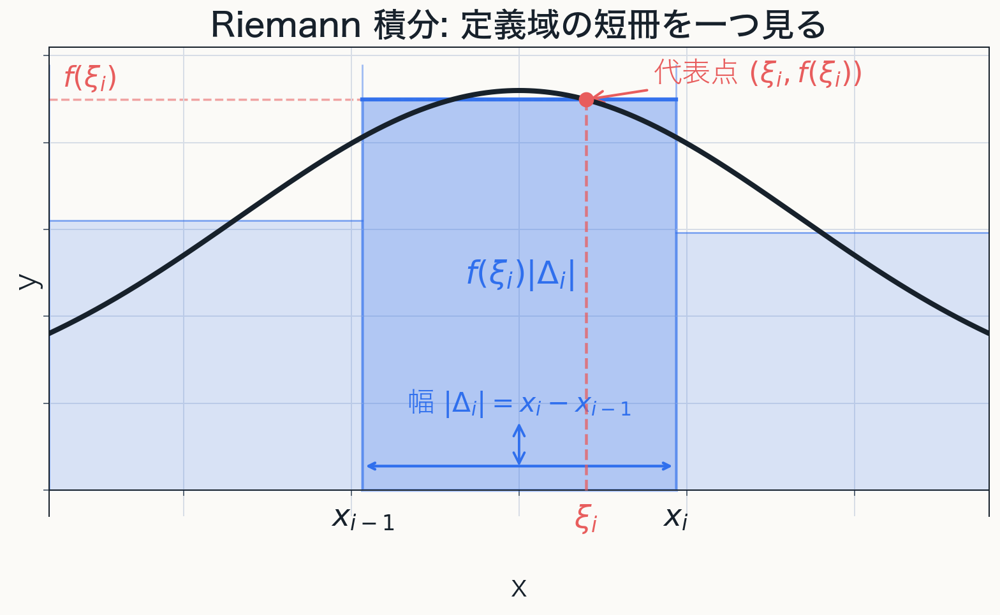
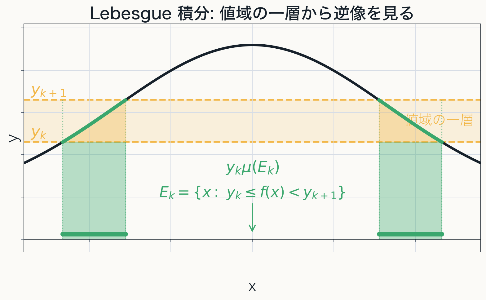

# 第0章 導入：Riemann 積分から Lebesgue 積分へ

Riemann 積分の限界から測度論へ進む動機を見る

---
layout: default
---

# 目的

本発表の流れは, まず集合に"大きさ"を与える理論を整え, そのうえで函数を積分し, 最後に極限操作との整合性を扱うことである.

$$
\text{集合の"大きさ"}
\quad\longrightarrow\quad
\text{函数の積分}
\quad\longrightarrow\quad
\text{極限操作との整合性}
$$

Riemann 積分ではどこに限界があるのかを具体的に確認し, Lebesgue 積分と測度論が必要になる問題意識を明確にする.

---
layout: two-cols
---

# Riemann 積分の考え方

Riemann 積分では, 定義域 $[a,b]$ を

$$
\Delta:a=x_0<x_1<\cdots<x_n=b
$$

のように分割し, 小区間 $\Delta_i=[x_{i-1},x_i]$ の幅と代表値 $f(\xi_i)$ から Riemann 和

$$
R(f,\Delta)=\sum_{i=1}^n f(\xi_i)|\Delta_i|
$$

を作り, その極限として積分を考える.

$$
\int_a^b f(x)\,dx
=
\lim_{\|\Delta\|\to0}R(f,\Delta)
$$

::right::

---
layout: two-cols
---

# Lebesgue 積分の考え方

Lebesgue 積分では, まず値域 $[\alpha,\beta]$ を

$$
\Theta:\alpha=y_1<y_2<\cdots<y_{m+1}=\beta
$$

のように分割する. 値域区間を

$$
\Theta_k=[y_k,y_{k+1})
$$

とおき, その逆像

$$
E_k=f^{-1}(\Theta_k)
=\{x\in[a,b]\mid y_k\le f(x)<y_{k+1}\}
$$

を考え, $y_k\mu(E_k)$ の和分の極限として積分を考える.

$$
\int_a^b f(x)\,dx
=
\lim_{\|\Theta\|\to0}\sum_k y_k\mu(E_k)
$$

::right::

---
layout: two-cols
---

# Riemann 積分と Lebesgue 積分の比較

| 観点 | Riemann | Lebesgue |
| --- | --- | --- |
| 分割対象 | 定義域 | 値域 |
| 各項 | $f(\xi_i)\|\Delta_i\|$ | $y_k\mu(E_k)$ |
| 集める情報 | 小区間の代表値 | 各層に入る点集合の大きさ |
| 極限 | $\|\Delta\|\to0$ | $\|\Theta\|\to0$ |
| 表現 | 「横に切る」 | 「縦に切る」 |

::right::

---
layout: two-cols
---

# Riemann 積分可能性

Riemann 積分可能性は, 上 Darboux 和と下 Darboux 和で記述できる.

$$
M_i=\sup_{x\in[x_{i-1},x_i]}f(x),\qquad
m_i=\inf_{x\in[x_{i-1},x_i]}f(x)
$$

$$
S^+(f,\Delta)=\sum_i M_i|\Delta_i|,
\quad
S^-(f,\Delta)=\sum_i m_i|\Delta_i|
$$

$f$ が Riemann 積分可能であるとは, 任意の $\varepsilon>0$ に対して, ある (十分細かな) 分割 $\Delta$ が存在して

$$
S^+(f,\Delta)-S^-(f,\Delta)<\varepsilon
$$

となることである.

::right::

---
layout: two-cols
---

# Dirichlet 函数が示す限界

Dirichlet 函数

$$
D(x):=\mathbf{1}_{\mathbb{Q}\cap[0,1]}(x)
$$

では, 任意の小区間に有理数と無理数が入る.

したがって各小区間で

$$
\sup D=1,\qquad \inf D=0
$$

であり, どの分割 $\Delta$ を取っても

$$
S^*(D,\Delta)=1,\qquad S_*(D,\Delta)=0
$$

となり, 上和と下和の差は小さくならない.

::right::

---
layout: default
---

# 「ほとんど至る所」0 という見方

Dirichlet 函数は Riemann 積分可能ではないが, 値 $1$ を取るのは

$$
\mathbb{Q}\cap[0,1]
$$

の上だけであり, それ以外のほとんどの領域では $0$ を取る.

この直観は

$$
D(x)=0 \quad (\text{ほとんど至る所で})
$$

という形で表したい.

すなわち, $0$ と異なる値を取る点の集合の"大きさ"が $0$ である, という意味である.

$$
\int_0^1 D(x)\,dx
=
1\cdot(\text{値 }1\text{ を取る部分の"大きさ"})
+
0\cdot(\text{値 }0\text{ を取る部分の"大きさ"})
=0
$$

---
layout: default
---

# 測度論はなぜ必要か

Lebesgue 積分では, 値域ごとの逆像として集合が自然に現れる.

$$
E_k=\{x\in[a,b]\mid f(x)\in\Theta_k\}
$$

そのため, 区間や図形だけでなく, より一般の集合にも破綻なく"大きさ"を与える必要がある.

このような集合の"大きさ"を扱う理論が測度論であり, Lebesgue 積分はその上に構成される.

---
layout: default
---

# 極限と積分の交換

Lebesgue 積分を導入しても, 極限と積分が自動に交換できるわけではない.

考えるべき問題は二つに分かれる.

- どのような函数に積分を定義できるか
- どのような条件で極限と積分を交換できるか

測度論と Lebesgue 積分論は, この二つを同じ枠組みで扱う.

---
layout: two-cols
---

# 函数列の極限として見る

有理数を $q_1,q_2,\ldots$ と並べ,

$$
g_n(x)=
\begin{cases}
1 & x\in\{q_1,\ldots,q_n\},\\
0 & \text{otherwise}
\end{cases}
$$

とおくと, 各 $g_n$ は Riemann 積分可能である.

しかし $g_n$ の単調増加極限は Dirichlet 函数 $D$ になる.

::right::

---
layout: default
---

# Fourier 解析への接続

Fourier 解析では, 例えば

$$
\hat f(\xi)=\int_{\mathbb{R}} f(x)e^{-2\pi i x\xi}\,dx
$$

のような積分が現れる.

函数を点ごとに見るだけではなく, 測度・積分・極限を組み合わせて扱う枠組みが必要になる.

---
layout: end
---

# この章の中心メッセージ

- Riemann 可積分性は, 零集合上の変更に対して安定ではない.
- Riemann 可積分函数全体は, 各点収束や単調増加極限に対して閉じていない.
- Lebesgue 積分論は, 零集合を無視する枠組みと, 極限と積分の関係を保証する収束定理を与える.
