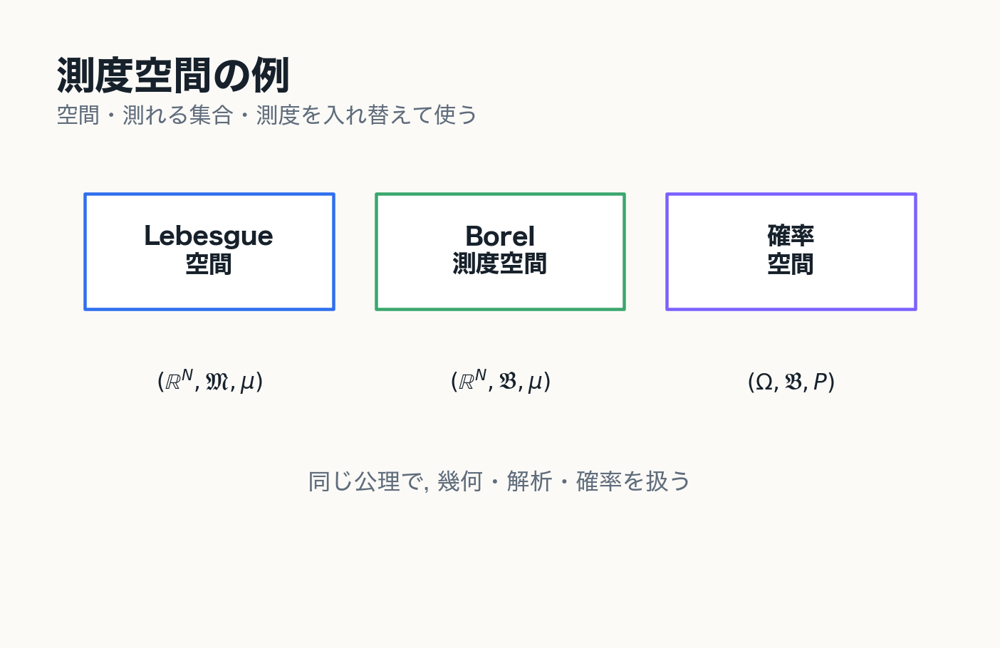

# 0. 導入

Riemann 積分から Lebesgue 積分への動機

---
layout: two-cols
---

# この章の目的

- Riemann 積分ではどこに限界があるかを確認する
- Lebesgue 積分がどんな見方の転換かを先に掴む
- 測度論と収束定理が必要になる理由を見通す

$$
\text{集合の大きさ}
\;\longrightarrow\;
\text{函数の積分}
\;\longrightarrow\;
\text{極限操作との整合性}
$$

::right::

---
layout: two-cols
---

# Riemann と Lebesgue の対比

| 観点 | Riemann 積分 | Lebesgue 積分 |
| --- | --- | --- |
| 分割するもの | 定義域の分割 $\Delta$ | 値域の分割 $\Theta$ |
| 各項 | $f(\xi_i)|\Delta_i|$ | $y_k\mu(E_k)$ |
| 集める情報 | 小区間での代表値 | 値域ごとの逆像の大きさ |
| 極限 | $\|\Delta\|\to0$ | $\|\Theta\|\to0$ |

Lebesgue 積分では, 小区間内の振動そのものよりも,
各値域に入る点全体の集合の大きさを見る.

::right::

---
layout: two-cols
---

# Riemann 積分可能性

Riemann 積分可能性は上 Darboux 和と下 Darboux 和で記述される.

$$
\overline{\mathcal{S}}(f,\Delta)=\sum_i M_i(x_i-x_{i-1}),
\qquad
\underline{\mathcal{S}}(f,\Delta)=\sum_i m_i(x_i-x_{i-1})
$$

分割を細かくしたとき

$$
\overline{\mathcal{S}}(f,\Delta)-\underline{\mathcal{S}}(f,\Delta)\to 0
$$

となることが必要である.

::right::

---
layout: two-cols
---

# Dirichlet 函数が示す限界

$$
D(x)=\mathbf{1}_{\mathbb{Q}\cap[0,1]}(x)
$$

任意の小区間には有理数も無理数も含まれるので

$$
\sup D=1,\qquad \inf D=0
$$

であり, どの分割でも上和と下和は一致しない.

したがって $D$ は Riemann 積分可能ではない.

::right::

---
layout: two-cols
---

# 「ほとんど至る所」0

一方で, 値 1 を取るのは
可算集合 $\mathbb{Q}\cap[0,1]$ の上だけである.

Lebesgue 的には

$$
D(x)=0\quad(\text{ほとんど至る所で})
$$

と見たい.

そのためには, 可算集合のような古典的な図形ではない集合にも
"大きさ"を与える必要がある.

::right::

---
layout: two-cols
---

# 測度論はなぜ要るか

Lebesgue 積分で基本になるのは

$$
E_k=f^{-1}(\Theta_k)
$$

のような逆像集合の大きさである.

この「集合に大きさを割り当てる」理論が測度論であり,
Lebesgue 積分はその上に構成される.

::right::

---
layout: two-cols
---

# 極限と積分の交換

Lebesgue 積分を導入しても,
極限と積分が自動に交換できるわけではない.

$$
\lim_{n\to\infty}\int f_n\,d\mu
\overset{?}{=}
\int \lim_{n\to\infty}f_n\,d\mu
$$

函数列の極限を安定に扱う枠組みが必要になる.

::right::

::example-box{title="次に見る問題"}
Riemann 可積分函数列の単調増加極限が,
Riemann 積分可能とは限らない.
::

---
layout: two-cols
---

# 函数列の極限として見る

$$
G_n=\left\{\frac{j}{n!}\mid j=0,1,\ldots,n!\right\},
\qquad
g_n=\mathbf{1}_{G_n}
$$

各 $g_n$ は Riemann 積分可能で

$$
\int_0^1 g_n(x)\,dx=0
$$

だが, $g_n\nearrow D$ であり, 極限 $D$ は Riemann 積分可能ではない.

::right::

---
layout: two-cols
---

# Fourier 解析への接続

$f\in L^1(\mathbb{R})$ の Fourier 変換は

$$
\widehat{f}(\xi)
=
\int_{\mathbb{R}} f(x)e^{-2\pi i x\xi}\,dx
$$

という Lebesgue 積分で定義される.

さらに $L^1$ 函数の Fourier 変換が連続であることは,
後で見る優収束定理から従う.

::right::

::example-box{title="共通する問題意識"}
函数を点ごとに見るだけではなく,
測度・積分・極限を組み合わせて扱う.
::

---

# この章の結論

::example-box{title="中心メッセージ"}
Riemann 可積分性は, 零集合上の変更に対して安定ではない.

Riemann 可積分函数全体は, 各点収束や単調増加極限に対して閉じていない.

Lebesgue 積分論は, 零集合を無視する枠組みと,
極限と積分の関係を保証する収束定理を与える.
::

---
