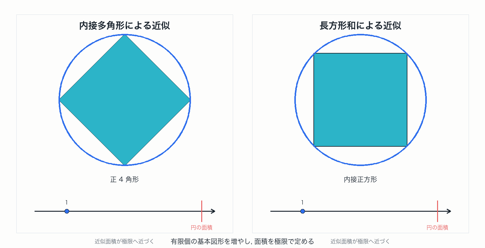

# 第1章 古典的面積概念と Jordan 測度

有限個の基本図形による近似から Jordan 測度を見る

---
layout: default
---

# 目的

この章の目的は, 古典的な面積概念を整理し, それを Jordan 測度として定式化することである.

その過程で, Jordan 測度が有限個の区間塊による内外近似に基づくこと, そして可算集合や稠密集合を扱うには不十分であることを確認する.

---
layout: two-rows
---

# 古典的面積概念

古典的には, 長方形や三角形などの基本図形の面積を出発点にして, 複雑な図形を基本図形で近似する.

内側から詰める近似と外側から覆う近似が一致するなら, その共通値を面積と考える.

::right::

---
layout: two-cols
---

# 区間: 基本図形

$\mathbb{R}^N$ の半開区間 $I$ を

$$
I:=\prod_{j=1}^N [a_j,b_j)
$$

と書き, その体積を次で定める：

$$
m(I):=\prod_{j=1}^N (b_j-a_j)
$$

半開区間全体を次のように表す：

$$
\mathfrak{I}_N:=\left\{I=\prod_{j=1}^N [a_j,b_j):a_j<b_j\right\}
$$

::right::

---
layout: two-cols
---

# 区間塊: 有限個の区間の直和

区間塊とは, 有限個の互いに素な区間の和集合である.

$$
E:=\bigsqcup_{k=1}^n I_k
$$

区間塊 $E$ の体積を次で定める.

$$
m(E):=\sum_{k=1}^n m(I_k)
$$

区間塊全体を次のように表す：

$$
\mathfrak{F}_N:=\left\{E=\bigsqcup_{k=1}^n I_k:I_k\in\mathfrak{I}_N,\ n\in\mathbb{N}\right\}
$$

::right::

---
layout: default
---

# 有限加法族

$X$ の部分集合族 $\mathfrak{F}\subset 2^X$ が有限加法族であるとは, 次を満たすことである.

**空集合に対する閉性**

$$
\emptyset\in\mathfrak{F}
$$

**補集合に対する閉性**

$$
A\in\mathfrak{F}
\quad\Longrightarrow\quad
A^c\in\mathfrak{F}
$$

**有限和に対する閉性**

$$
A_1,\ldots,A_n\in\mathfrak{F}
\quad\Longrightarrow\quad
\bigcup_{k=1}^{n}A_k\in\mathfrak{F}
$$

区間塊全体 $\mathfrak{F}_N$ はこのような集合族である.

---
layout: two-rows
---

# Jordan 内測度と外測度

有界集合 $A\subset\mathbb{R}^N$ の体積の区間塊 $E \in \mathfrak{F}_N$ による内側近似の上限が Jordan 内測度, 外側近似の下限が Jordan 外測度

$$
J_*(A):=\sup\{m(E):E\subset A,\ E \in \mathfrak{F}_N\}
$$

$$
J^*(A):=\inf\{m(E):A\subset E,\ E \in \mathfrak{F}_N\}
$$

::right::

---
layout: two-rows
---

# Jordan 可測性: 定義

有界集合 $A$ が Jordan 可測であるとは Jordan 内測度と Jordan 外測度が一致することをいい, このときの共通値を Jordan 測度と呼ぶ.

$$
J(A):=J_*(A)=J^*(A)
$$

::right::

---
layout: default
---

# ここまでの集合函数と定義域

| 集合函数 | 定義域 | 値域 |
| --- | --- | --- |
| 区間の体積 $m$ | 半開区間全体 $\mathfrak{I}_N$ | $[0,\infty)$ |
| 区間塊の体積 $m$ | 区間塊全体 $\mathfrak{F}_N$ | $[0,\infty)$ |
| Jordan 内測度 $J_*$ | 有界部分集合全体 $\mathcal{P}_{\mathrm{bd}}(\mathbb{R}^N)$ | $[0,\infty)$ |
| Jordan 外測度 $J^*$ | 有界部分集合全体 $\mathcal{P}_{\mathrm{bd}}(\mathbb{R}^N)$ | $[0,\infty)$ |
| Jordan 測度 $J$ | Jordan 可測集合全体 $\mathcal{J}_N$ | $[0,\infty)$ |

$m$ は区間と区間塊に対する体積である. $J_*$ と $J^*$ は有界集合全体に対する内外近似であり, $J$ は $J_*(A)=J^*(A)$ が成り立つ集合だけに定義される.

$$
\mathfrak{I}_N\subset\mathfrak{F}_N\subset \mathcal{J}_N \subset \mathcal{P}_{\mathrm{bd}}(\mathbb{R}^N) \subset 2^{\mathbb{R}^N}
$$

---
layout: two-cols
---

# Jordan 可測でない例: 有理点集合

$$
A:=\mathbb{Q}^2\cap[0,1]^2
$$

を考える.

任意の空でない長方形は有理点も, 非有理点も含む.

したがって, 内側からは正の面積の長方形を入れられない.

一方, 外側から有限個の長方形で覆うと, 稠密性のため $[0,1]^2$ 全体の面積を避けられない.

$$
J_*(A)=0,\qquad J^*(A)=1
$$

よって $A$ は Jordan 可測ではない.

::right::

---
layout: end
---

# この章の中心メッセージ

- 半開区間と区間塊の体積から, 有限加法的な古典的面積概念を作る.
- Jordan 測度は, 区間塊による内外近似が一致する集合に面積を与える.
- 可算かつ稠密な集合を扱うには, 有限近似から可算被覆へ進む必要がある.
