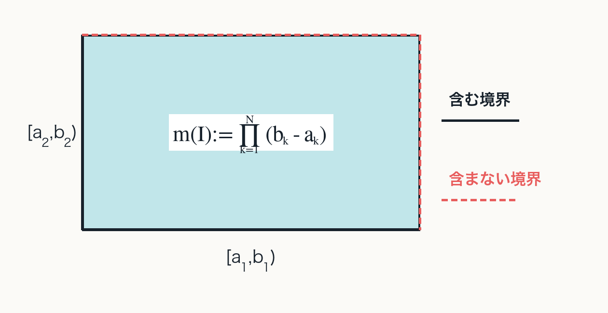
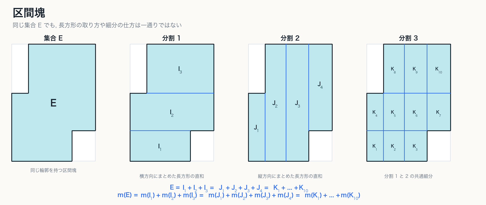
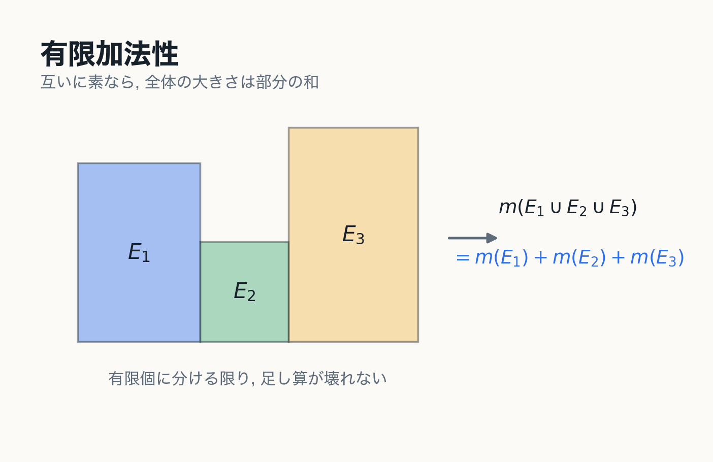
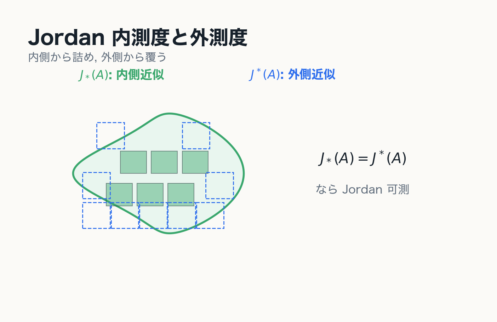
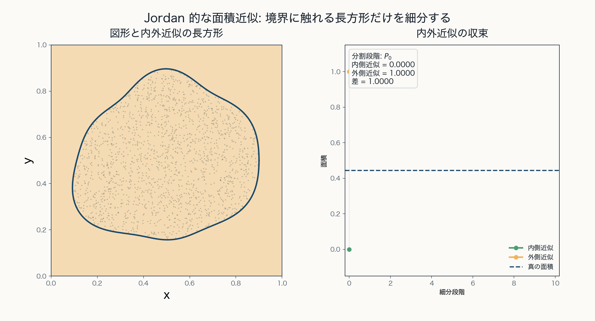
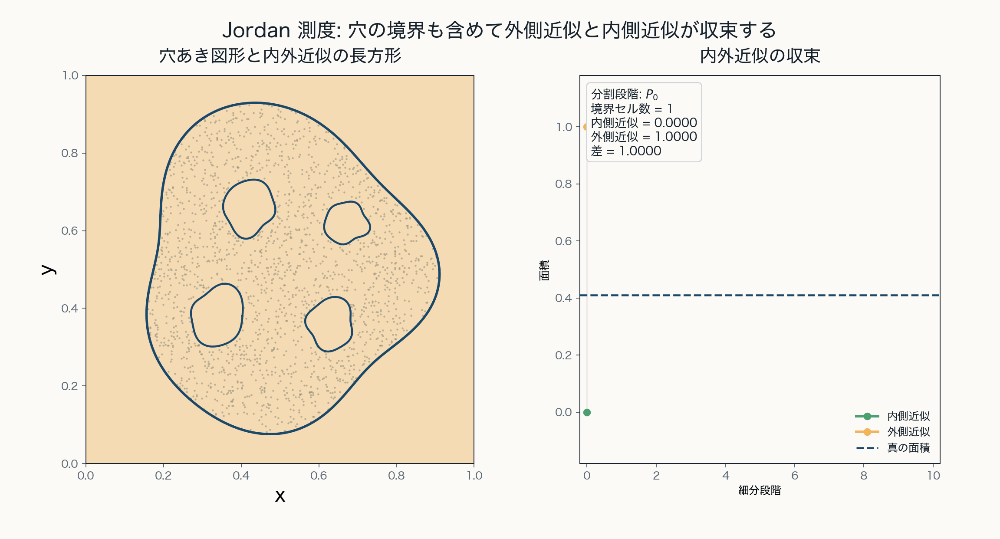
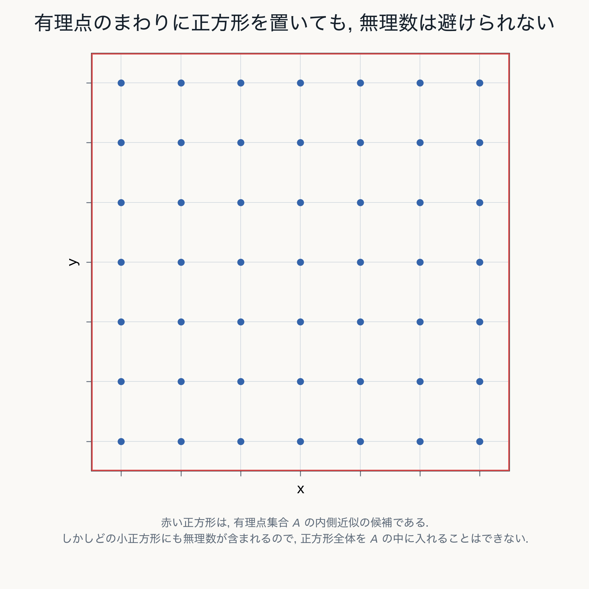
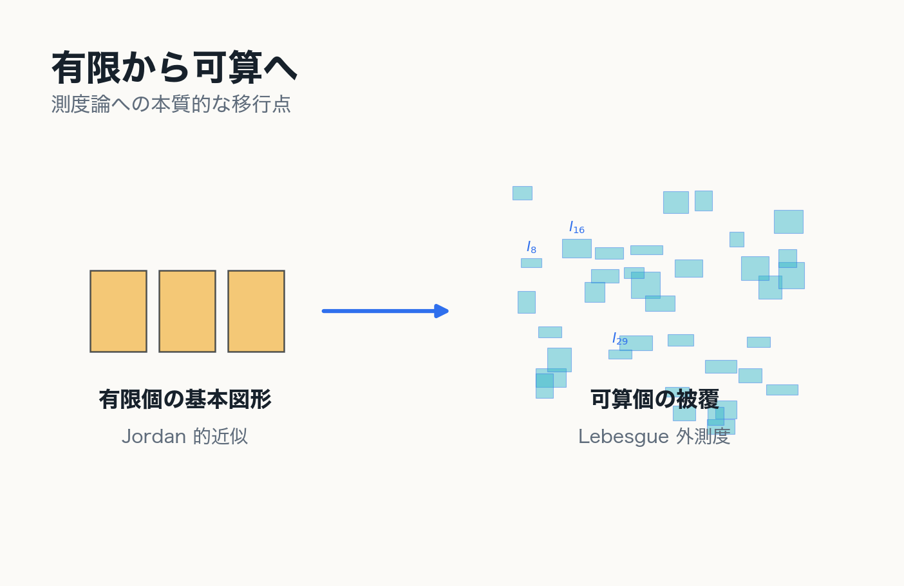

# 1. Jordan 測度

古典的面積概念を測度論へつなぐ

---
layout: two-cols
---

# 古典的面積概念

図形が与えられたとき, その面積を定める古典的な方法は, 図形を有限個の長方形など何らかの基本図形の直和で近似することである. 
すなわち, 図形の内部に含まれる有限個の基本図形の和を内側近似とし, 図形を覆う有限個の基本図形の和を外側近似として, 内側近似と外側近似の差が小さくなるように, 図形を細分していく.
このとき, 内側近似および外側近似がある極限値に収束するならば, その極限値を図形の面積と定める.
以下では, この古典的な面積概念を Jordan 測度の定義に基づいて定式化する.

---

# 基本図形としての半開区間

Euclid 空間 $\mathbb{R}^N$ で半開区間

$$
I=[a_1,b_1)\times\cdots\times[a_N,b_N)
$$

を基本図形とし, 有界な区間の体積を

$$
m(I)=\prod_{k=1}^{N}(b_k-a_k)
$$

と定める.

::example-box{title="区間塊"}
区間の有限個の直和 $E=I_1+\cdots+I_n$ として表される集合を区間塊と呼ぶ.
::

::right::

---
layout: default
---

# 区間塊

同じ区間塊 $E$ でも, 長方形の取り方や細分の仕方には複数の表示がある.

---
layout: two-cols
---

# 有限加法性

互いに素な区間塊 $E_1,\ldots,E_n$ に対して

$$
m\left(\bigcup_{k=1}^{n}E_k\right)
=
\sum_{k=1}^{n}m(E_k)
$$

が成り立つ.

::note
ここで扱っているのは有限加法性である. Lebesgue 測度では, この有限加法性を可算加法性へ拡張することが重要になる.
::

::right::

---
layout: two-cols
---

# Jordan 内測度と外測度

有界集合 $A\subset\mathbb{R}^N$ を区間塊で内外から近似する.

$$
J_*(A)=
\sup\{m(E)\mid E\subset A,\ E\in\mathfrak{F}_N\}
$$

$$
J^*(A)=
\inf\{m(F)\mid A\subset F,\ F\in\mathfrak{F}_N\}
$$

$J_*(A)=J^*(A)$ のとき, $A$ は Jordan 可測である.
この共通値を $J(A)$ と書く.

::right::

---
layout: two-cols
---

# Jordan 可測性の意味

任意の $\varepsilon>0$ に対して区間塊 $E,F$ が存在し

$$
E\subset A\subset F,
\qquad
m(F)-m(E)<\varepsilon
$$

となるとき, $A$ は Jordan 可測である.

::note
$m$ はまず区間塊 $\mathfrak{F}_N$ 上で定義される.
Jordan 内外測度は, その $m$ を sup / inf で拡張したものであり, $J$ はそれらが一致する集合上で定まる.
円盤でも, 内接正 $n$ 角形の面積 $\frac{n}{2}r^2\sin(2\pi/n)$ の極限として面積を定めるのと同じ発想である.
::

::right::

---
layout: two-cols
---

# 補足: 境界と内部近似

穴のある集合では, 内側近似に使う長方形は穴の部分をまたいではいけない.

それでも境界付近だけを細分すれば, 内側近似と外側近似の差は小さくできる.

::example-box{title="中心メッセージ"}
Jordan 測度は, 区間の有限和で表される図形の体積の極限として複雑な図形の面積を定める理論である.
可算個の区間で直接覆って面積を定める理論ではない.
::

::right::

---
layout: two-cols
---

# Jordan 可測でない例

平面上の有理点集合

$$
A=\mathbb{Q}^2\cap[0,1]^2
$$

を考える.

- $A$ も $A^c$ も正の面積を持つ長方形を含まない
- したがって $A$ の内側近似では $J_*(A)=0$
- また $A^c$ にも内部長方形がないので外側近似では $J^*(A)=1$

::right::

---
layout: two-cols
---

# 第1章の結論

::example-box{title="中心メッセージ"}
Jordan 測度は, 有限個の基本図形による内外近似の極限として自然な面積概念である.

しかし, 可算集合や稠密集合を安定に扱うには不十分である.
::

次に必要なのは, 有限近似から可算被覆へ移ることである.

::right::

---
