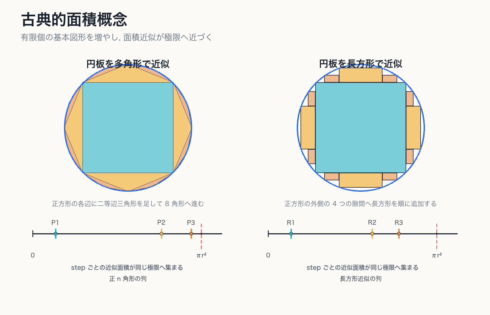
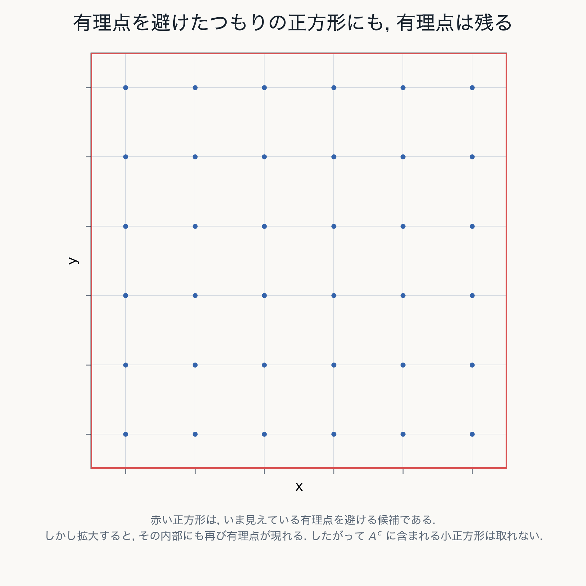

# 1. Jordan 測度

古典的面積概念を有限近似として定式化する

---
layout: two-cols
---

# この章の目的

- 長さ・面積・体積を有限個の基本図形の近似として捉える
- 区間と区間塊の上で体積 $m$ を定義する
- Jordan 内測度・外測度から Jordan 測度を導く
- Jordan 測度の限界を, 有理点集合で確認する

::right::

---
layout: two-cols
---

# 古典的面積概念

図形の面積は, 有限個の長方形などの和で内外から近似し,
その差を小さくしていく極限として捉える.

::example-box{title="Jordan 的な発想"}
各段階で使うのは, あくまで有限個の基本図形である.
曲がった図形の面積も, その有限近似の極限として定める.
::

::right::

---
layout: two-cols
---

# 区間: 基本図形

Euclid 空間 $\mathbb{R}^N$ で半開区間

$$
I=[a_1,b_1)\times\cdots\times[a_N,b_N)
$$

を基本図形とする.

有界な区間には

$$
m(I)=\prod_{k=1}^{N}(b_k-a_k)
$$

で体積を定める.

::right::

---
layout: two-cols
---

# 区間塊: 有限個の区間の直和

区間の有限個 $I_1,\ldots,I_n$ の直和

$$
E=I_1+\cdots+I_n
\qquad
(I_i\cap I_j=\emptyset,\ i\neq j)
$$

を区間塊という.

その体積を

$$
m(E)=\sum_{k=1}^{n}m(I_k)
$$

と定める.

::note
この値は分割の仕方によらない.
共通細分を取れば, 別の表示でも同じ有限和に帰着する.
::

::right::

---
layout: two-cols
---

# 有限加法性

互いに素な区間塊 $E_1,\ldots,E_n$ に対して

$$
m\left(\sum_{k=1}^{n}E_k\right)
=
\sum_{k=1}^{n}m(E_k)
$$

が成り立つ.

::example-box{title="重要点"}
古典的な面積概念の土台は有限加法性である.
ただし, これだけでは可算個の集合の和を安定に扱えない.
::

::right::

---
layout: two-cols
---

# Jordan 内測度と Jordan 外測度

有界集合 $A\subset\mathbb{R}^N$ に対して

$$
J_*(A)=
\sup\{m(E)\mid E\subset A,\ E\in\mathfrak{F}_N\}
$$

$$
J^*(A)=
\inf\{m(F)\mid A\subset F,\ F\in\mathfrak{F}_N\}
$$

と定める.

常に

$$
J_*(A)\leq J^*(A)
$$

である.

::right::

---
layout: two-cols
---

# Jordan 可測性

$$
J_*(A)=J^*(A)
$$

が成り立つとき, $A$ は Jordan 可測であり,
共通値を $J(A)$ と書く.

同値に, 任意の $\varepsilon>0$ に対して

$$
E\subset A\subset F,
\qquad
m(F)-m(E)<\varepsilon
$$

となる区間塊 $E,F$ が取れればよい.

::right::

---
layout: two-cols
---

# 有限近似としての見方

::example-box{title="中心メッセージ"}
$m$ はまず区間塊 $\mathfrak{F}_N$ 上で定義される.
Jordan 内外測度は, その $m$ を sup / inf で拡張したものである.
::

円盤の面積を内接正 $n$ 角形で近似する古典的方法も同じ発想である.

$$
\frac{n}{2}r^2\sin\frac{2\pi}{n}
\longrightarrow
\pi r^2
\qquad
(n\to\infty)
$$

Jordan 測度も, 各段階では有限和の体積を計算し,
その極限として曲がった図形の面積を定める.

::right::

---
layout: two-cols
---

# 境界と内部近似

内側近似と外側近似の差は, 直観的には境界付近に集中する.

- 円板や球は, 境界が体積 0 なので Jordan 可測になる
- 穴のある集合でも, 境界付近だけ細分すれば差を小さくできる

::note
Jordan 測度は「有限個の区間で正確に表せる集合だけ」の理論ではない.
有限近似の極限として面積を与える理論である.
::

::right::

---
layout: two-cols
---

# Jordan 可測でない例: 有理点集合

$$
A=\mathbb{Q}^2\cap[0,1]^2
$$

を考える.

$A$ も $A^c$ も $[0,1]^2$ で稠密なので,
どちらも内部に正の面積を持つ長方形を含まない.

したがって, Jordan 的近似の材料になる
「内部長方形」が現れない.

::right::

---
layout: two-cols
---

# 何が破綻するか

$A$ に含まれる正の面積の区間塊は存在しないので

$$
J_*(A)=0
$$

である.

一方, $A$ を有限個の長方形で外側から覆おうとすると,
稠密性のため $[0,1]^2$ 全体の面積を避けられない.

$$
J^*(A)=1
$$

よって $A$ は Jordan 可測ではない.

::right::

---
layout: two-cols
---

# 第1章の結論

::example-box{title="この章の中心メッセージ"}
Jordan 測度は, 有限個の基本図形による内外近似の極限として自然な面積概念である.

しかし, 可算集合や稠密集合を安定に扱うには不十分である.
::

次章では, 有限近似から可算被覆へ移る.

::right::

---
