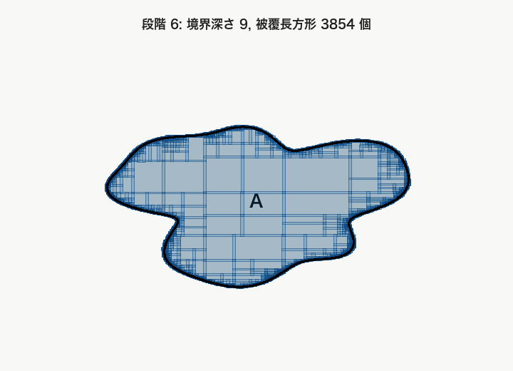

# 第2章 可算操作への移行：Lebesgue 外測度

有限近似から可算被覆へ

---
layout: default
---

# 目的

Jordan 測度の限界を踏まえ, 可算個の $N$ 次元区間による被覆を用いて $\mathbb{R}^N$ 上の Lebesgue 外測度を導入する.

Lebesgue 外測度は任意集合に定義されるが, そのまま測度ではない.

---
layout: two-cols
---

# 可算被覆

集合 $A\subset\mathbb{R}^N$ を区間列 $I_1,I_2,\ldots\in\mathfrak{I}_N$ で覆うとは,

$$
A\subset\bigcup_{k=1}^{\infty}I_k
$$

が成り立つことである.

Jordan 的外側近似では有限個の区間塊で覆った. Lebesgue 外測度では, 最初から可算個の区間による被覆を許す.

この被覆のコストは

$$
\sum_{k=1}^{\infty}m(I_k)
$$

で測る.

::right::

---
layout: two-rows
---

# Lebesgue 外測度 $\mu^*$ の定義

$A\subset\mathbb{R}^N$ に対して, Lebesgue 外測度 $\mu^*(A)$ を次で定める:

$$
\mu^*(A):=
\inf\left\{
\sum_{k=1}^{\infty}m(I_k)
\mid
A\subset\bigcup_{k=1}^{\infty}I_k
\right\}
$$

これはすべての可算被覆にわたる被覆和の下限である.

::right::

---
layout: two-cols
---

# Lebesgue 外測度の基本性質

Lebesgue 外測度 $\mu^*$ は次を満たす.

**非負性と空集合**

$$
0\le\mu^*(A)\le\infty,\qquad \mu^*(\emptyset)=0
$$

**単調性**

$$
A\subset B\quad\Longrightarrow\quad \mu^*(A)\le\mu^*(B)
$$

**可算劣加法性**

$$
\mu^*\left(\bigcup_{n=1}^{\infty}A_n\right)
\le
\sum_{n=1}^{\infty}\mu^*(A_n)
$$

ただし, この段階では可算加法性は得られていない.

::right::

---
layout: default
---

# Jordan 測度 $J$ との違い

| 対象 | Jordan 測度 $J$ | Lebesgue 外測度 $\mu^*$ |
| --- | --- | --- |
| 定義域 | Jordan 可測な有界集合 $\mathcal{J}_N$ | 任意の部分集合 $2^{\mathbb{R}^N}$ |
| 値域 | $[0,\infty)$ | $[0,\infty]$ |
| 段階 | すでに測度である | この段階では外測度である |
| 加法性 | 加法性を持つ | 一般には加法性を持たず, 劣加法性にとどまる |

Jordan 測度は定義域を $\mathcal{J}_N$ に制限する代わりに加法的である.

Lebesgue 外測度は定義域を $2^{\mathbb{R}^N}$ まで広げる代わりに, まだ測度ではない.

このため次に, 可算操作に閉じた可測集合族を取り出す必要がある.

---
layout: default
---

# 補足: 有限和と可算和の違い

有限加法族 $\mathfrak{F}$ では, 有限個の集合については

$$
A_1,\ldots,A_n\in\mathfrak{F}
\quad\Longrightarrow\quad
\bigcup_{k=1}^n A_k\in\mathfrak{F}
$$

が成り立つ. しかし可算個にすると, 自動ではない.

$$
A_1,A_2,\ldots\in\mathfrak{F}
\quad\Longrightarrow\quad
\bigcup_{k=1}^{\infty}A_k
\overset{?}{\in}
\mathfrak{F}
$$

これは, 有理数の有限和は有理数だが, 有理数列の可算和の極限が有理数とは限らないことに似ている.

$$
\sum_{n=0}^{N}\frac{1}{n!}\in\mathbb{Q},
\qquad
\sum_{n=0}^{\infty}\frac{1}{n!}=e\notin\mathbb{Q}
$$

---
layout: default
---

# 補足: 可算劣加法性の意味

外測度では, 互いに素な集合列に対しても一般には

$$
\mu^*\left(\bigcup_{n=1}^{\infty}A_n\right)
\overset{?}{=}
\sum_{n=1}^{\infty}\mu^*(A_n)
$$

とは限らない.

この差が, 外測度と測度の違いである.

---
layout: two-cols
---

# 例: 可算集合の外測度

可算集合 $A:=\{x_1,x_2,\ldots\}$ に対して, 任意の $\varepsilon>0$ を取る.

各点 $x_k$ を含む区間 $I_k$ を

$$
m(I_k)<\frac{\varepsilon}{2^k}
$$

となるように取れば,

$$
A\subset\bigcup_{k=1}^{\infty}I_k,\qquad
\sum_{k=1}^{\infty}m(I_k)
<
\sum_{k=1}^{\infty}\frac{\varepsilon}{2^k}
=\varepsilon
$$

である. よって任意の $\varepsilon>0$ に対して $\mu^*(A)\le\varepsilon$ となり,

$$
\mu^*(A)=0
$$

である.

::right::

---
layout: two-cols
---

# 平面内の可算点集合

同じ考えは次元によらず成立する. 可算点集合を

$$
A:=\{p_1,p_2,\ldots\}\subset\mathbb{R}^2
$$

とする. 各点 $p_k$ を含む正方形 $Q_k$ を

$$
m(Q_k)<\frac{\varepsilon}{2^k}
$$

となるように取れば,

$$
A\subset\bigcup_{k=1}^{\infty}Q_k,\qquad
\sum_{k=1}^{\infty}m(Q_k)<\varepsilon
$$

である. したがって平面内の可算点集合も外測度 $0$ である.

::right::

---
layout: end
---

# この章の中心メッセージ

- Lebesgue 外測度 $\mu^*$ は, 任意集合に対して可算被覆のコストの下限で大きさを与える.
- 可算集合は任意に小さい可算被覆を持つため, 外測度 $0$ になる.
- ただし $\mu^*$ はまだ測度ではないため, 次に加法性を壊さない集合を取り出す.
