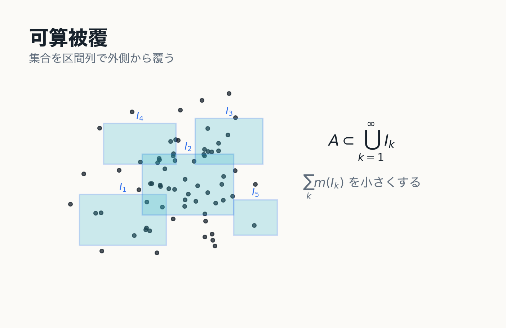
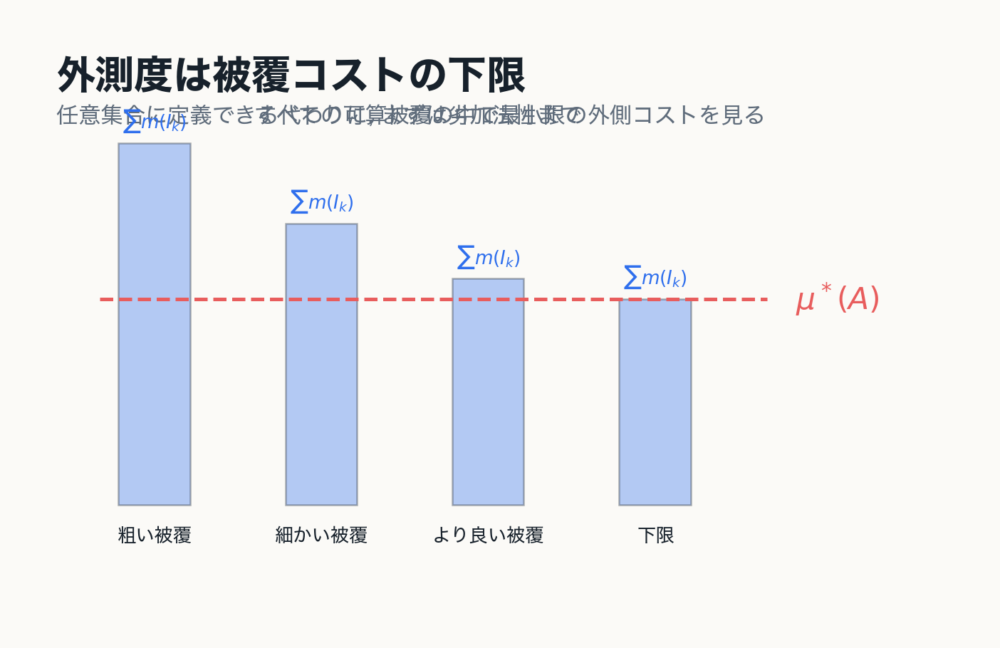
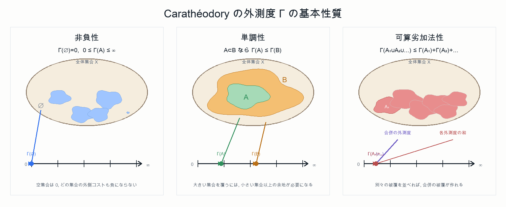
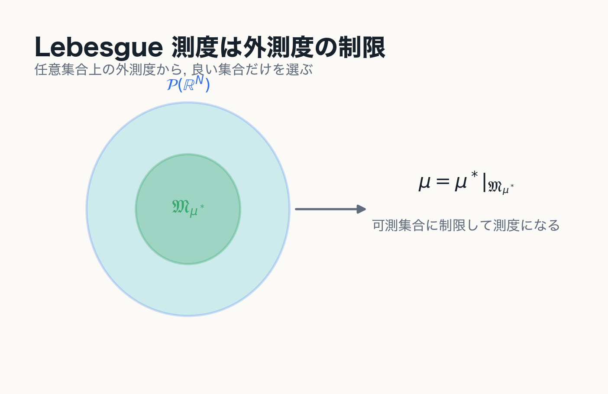
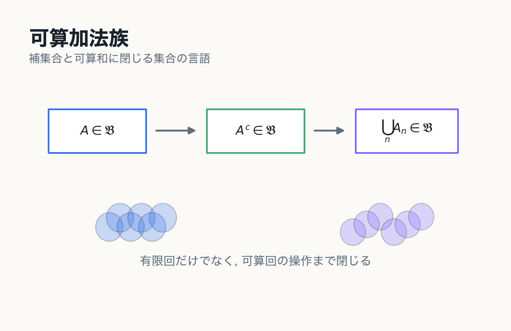
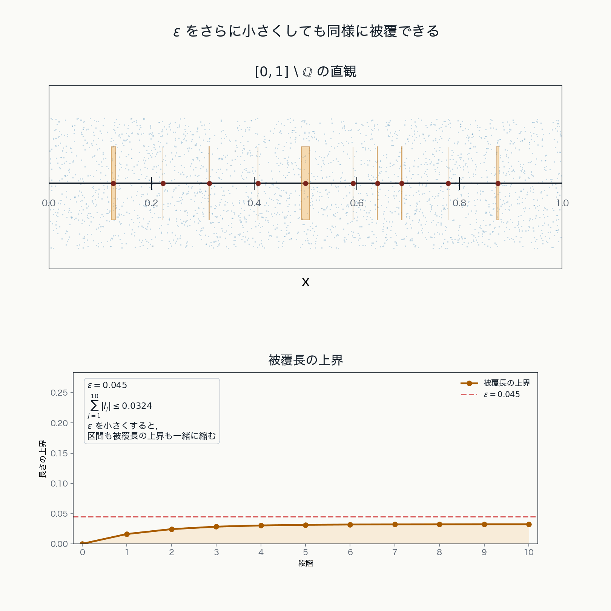
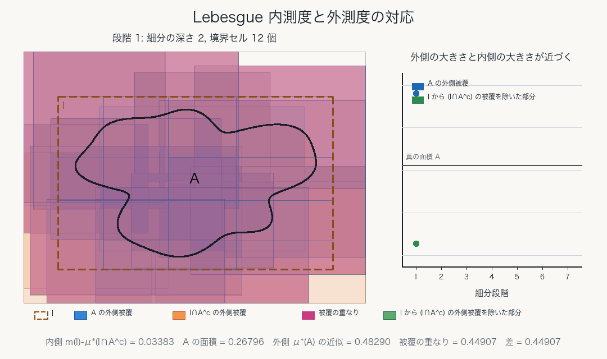

# 第2章 可算操作への移行：Lebesgue 外測度

有限操作から可算操作へ

---
layout: two-cols
---

# 可算被覆

集合 $A\subset\mathbb{R}^N$ を区間列 $I_1,I_2,\ldots$ によって覆うとは,

$$
A\subset\bigcup_{k=1}^{\infty}I_k
$$

が成り立つことをいう.

::example-box{title="Jordan からの移行"}
Jordan 的外側近似では有限個の区間塊を使った.

Lebesgue 外測度では, 最初から可算個の区間被覆を許す.
::

::right::

---
layout: two-cols
---

# Lebesgue 外測度

集合 $A\subset\mathbb{R}^N$ に対して

$$
\mu^*(A)
=
\inf\left\{
\sum_{k=1}^{\infty}m(I_k)
\ \middle|\
A\subset\bigcup_{k=1}^{\infty}I_k,\ I_k\in\mathfrak{I}_N
\right\}
$$

と定める.

::note
$\mu^*$ は $\mathbb{R}^N$ の任意の部分集合に対して定義される. その代わり, この段階では測度ではなく外測度である.
::

::right::

---
layout: two-cols
---

# 外測度としての性質

Lebesgue 外測度は次を満たす.

- 非負性
- 単調性
- 可算劣加法性

$$
\mu^*\left(\bigcup_{n=1}^{\infty}A_n\right)
\le
\sum_{n=1}^{\infty}\mu^*(A_n)
$$

::note
ここで得られるのは等号ではなく不等号である. 可算加法性は次章で可測集合へ制限してから回復する.
::

::right::

---
layout: two-cols
---

# Jordan 測度との違い

::example-box{title="定義域と代償"}
Jordan 測度 $J$ は定義域を Jordan 可測集合に制限する代わりに加法的な面積概念になる.

Lebesgue 外測度 $\mu^*$ は任意の部分集合に定義される代わりに, この段階では可算加法性を持たない.
::

$$
J:\mathcal{J}_N\to[0,\infty),
\qquad
\mu^*:2^{\mathbb{R}^N}\to\mathbb{R}\cup\{\infty\}
$$

::right::

---
layout: two-cols
---

# 有限加法族から可算加法族へ

有限加法族 $\mathfrak{F}$ では, 有限回の和・積・差に閉じる.

しかし集合列

$$
E_1,E_2,E_3,\ldots\in\mathfrak{F}
$$

に対して

$$
\bigcup_{k=1}^{\infty}E_k
\overset{?}{\in}
\mathfrak{F}
$$

が成り立つとは限らない.

::note
可算集合や極限操作を扱うには, 有限加法族だけでは足りない.
::

::right::

---
layout: two-cols
---

# 可算集合の外測度

可算集合

$$
A=\{x_1,x_2,x_3,\ldots\}
$$

に対し, 各点 $x_k$ を体積 $\varepsilon/2^k$ 未満の区間で覆う.

すると

$$
\sum_{k=1}^{\infty}m(I_k)<\varepsilon
$$

となり, 任意の $\varepsilon>0$ で $\mu^*(A)\le\varepsilon$.
したがって $\mu^*(A)=0$.

::right::

---
layout: two-cols
---

# 可測性への動機

Lebesgue 外測度 $\mu^*$ は任意集合に定義されるが, 一般には可算加法性を満たさない.

::example-box{title="次の問い"}
どの集合に制限すれば, 外測度は加法的に振る舞うのか.
::

この問いへの答えが Carathéodory 可測性である.

::right::

---
