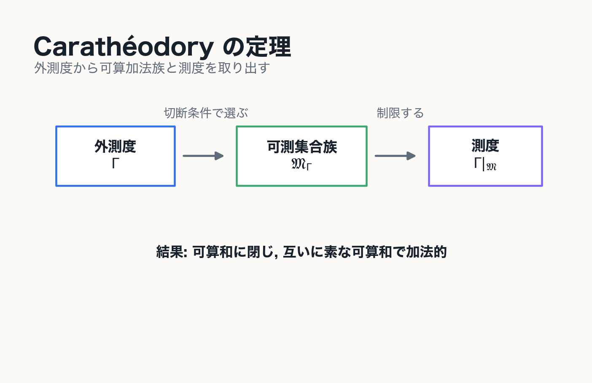
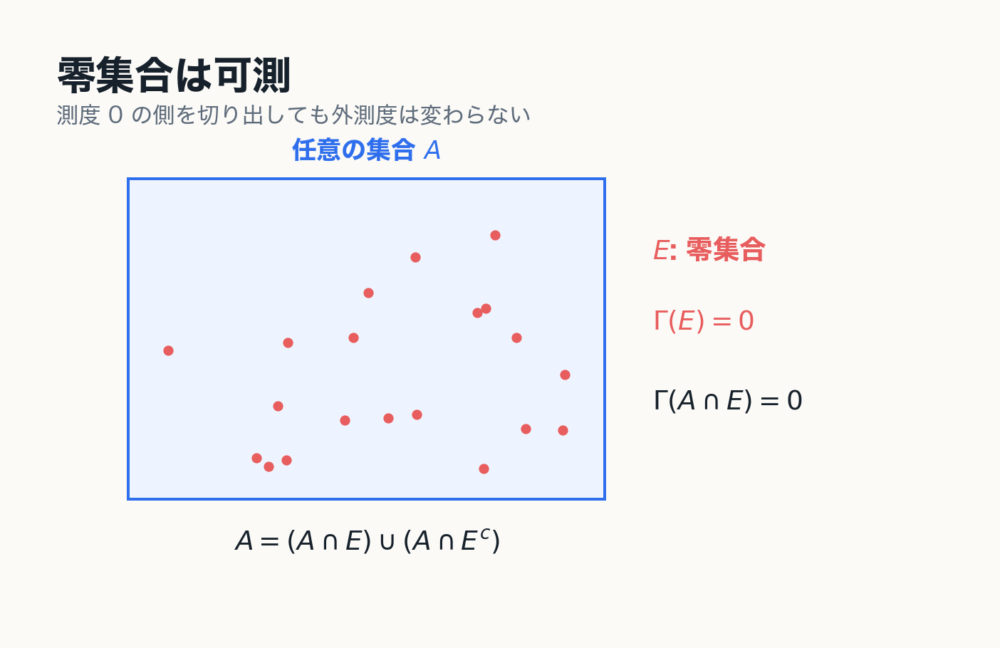

# 3. Carathéodory 可測性

外測度から測度を取り出す

---
layout: two-cols
---

# Carathéodory 可測性

空間 $X$ 上に外測度 $\Gamma$ が定義されているとする.

集合 $E\subset X$ が任意の集合 $A\subset X$ に対して

$$
\Gamma(A)=\Gamma(A\cap E)+\Gamma(A\cap E^c)
$$

を満たすとき, $E$ は Carathéodory 可測であるという.

可測集合全体を $\mathfrak{M}_\Gamma$ と書く.

::right::

---
layout: two-cols
---

# 定義の意味

可測集合 $E$ は, 任意の集合 $A$ を

$$
A\cap E,\qquad A\cap E^c
$$

に切断したとき, 外測度を加法的に分解できる集合である.

::note
$E$ 自身の大きさだけではなく, $E$ が任意集合をうまく切れることを要求している.
::

::right::

---
layout: two-cols
---

# 零集合は可測である

外測度 $\Gamma$ について

$$
\Gamma(E)=0
$$

である集合 $E$ は $\Gamma$-可測である.

実際, 任意の $A\subset X$ に対して

$$
\Gamma(A\cap E)\le \Gamma(E)=0
$$

なので, $E$ 側に切り出された部分は外測度 0 である.

::note
可算集合は Lebesgue 外測度に関する零集合なので, Lebesgue 可測である.
::

::right::

---
layout: two-cols
---

# Carathéodory の定理

Carathéodory の定理により,

$$
\mathfrak{M}_\Gamma
$$

は可算加法族である.

- $\emptyset\in\mathfrak{M}_\Gamma$
- $E\in\mathfrak{M}_\Gamma$ なら $E^c\in\mathfrak{M}_\Gamma$
- $E_n\in\mathfrak{M}_\Gamma$ なら $\bigcup_{n=1}^\infty E_n\in\mathfrak{M}_\Gamma$

さらに, $\Gamma$ を $\mathfrak{M}_\Gamma$ に制限すると可算加法的になる.

::right::

---
layout: two-cols
---

# Lebesgue 測度

Lebesgue 外測度 $\mu^*$ に関する可測集合を Lebesgue 可測集合という.

その全体を

$$
\mathfrak{M}_{\mu^*}
$$

と書く.

Lebesgue 測度は

$$
\mu:=\mu^*|_{\mathfrak{M}_{\mu^*}}
$$

である.

::note
外測度を任意集合上で見るだけでは測度にならない. 可測集合に制限することで初めて測度になる.
::

::right::

---

# 第3章の結論

::example-box{title="中心メッセージ"}
可測集合とは, 外測度が加法的に振る舞う集合である.

Carathéodory の定理により, 可測集合全体は可算加法族になり, 外測度をそこに制限すると測度になる.
::

---
