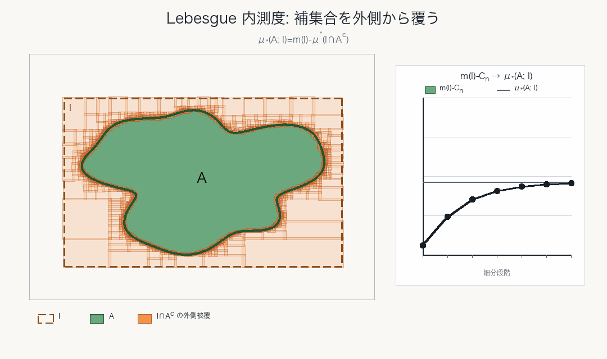
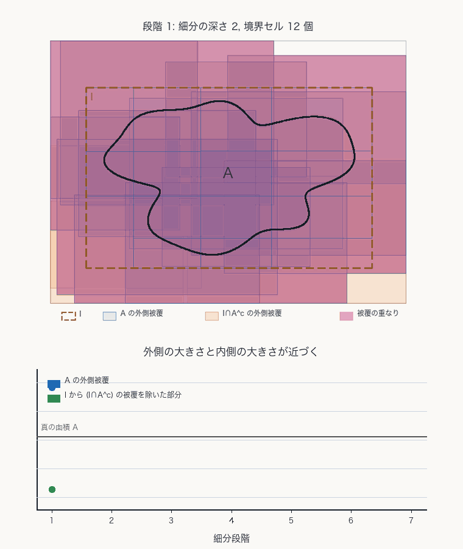
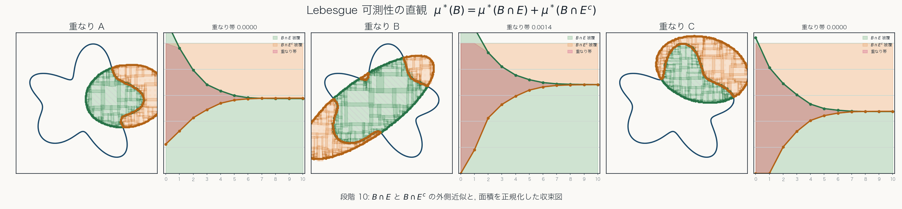
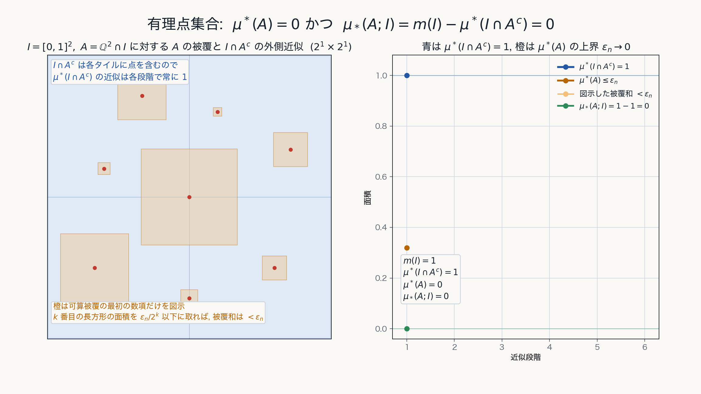

# 第3章 Lebesgue 可測性と Lebesgue 測度

外測度から可測集合を取り出す

---
layout: default
---

# 目的

Lebesgue 外測度 $\mu^*$ から, 可算加法的な測度を得るために, Lebesgue 可測集合を取り出す.

その上で $\mu^*$ を制限したものが Lebesgue 測度である.

---
layout: two-rows
---

# Lebesgue 内測度

有界な区間 $I$ の中で, 集合 $A$ の内側の大きさを

$$
\mu_*(A;I):=m(I)-\mu^*(I\cap A^c)
$$

と見る. すなわち, 外側から $A^c$ を覆って, 残った部分を $A$ の内側の大きさと考える.

::right::

---
layout: two-cols
---

# 可測性への動機

区間 $I$ の中に $A\subset I$ があるとする.

外測度と内測度の差は

$$
\delta(A;I)
:=
\mu^*(A)-\mu_*(A;I)
$$

であり, $A\subset I$ なので

$$
\delta(A;I)
=
\mu^*(I\cap A)+\mu^*(I\cap A^c)-\mu^*(I)
$$

と書ける.

したがって, この差 $\delta(A;I)$ が $0$ であること, すなわち

$$
\mu^*(I)=\mu^*(I\cap A)+\mu^*(I\cap A^c)
$$

なら, $A$ は区間 $I$ による切断に関して外測度 $\mu^*$ を壊さない.

::right::

---
layout: two-rows
---

# Lebesgue 可測集合

集合 $E\in 2^{\mathbb{R}^N}$ が Lebesgue 可測であるとは, 任意の集合 $B\in 2^{\mathbb{R}^N}$ に対して次が成り立つことである:

$$
\mu^*(B)=\mu^*(B\cap E)+\mu^*(B\cap E^c)
$$

Lebesgue 可測集合全体を次のように書く:

$$
\mathfrak{M}_{\mu^*}
:=
\{E\in 2^{\mathbb{R}^N}\mid E\text{ は Lebesgue 可測}\}
$$

::right::

---
layout: default
---

# Lebesgue 可測集合全体は可算加法族

Lebesgue 可測集合全体 $\mathfrak{M}_{\mu^*}$ は**可算加法族**になる.

すなわち,

1. **空集合に対する閉性**

$$
\emptyset\in\mathfrak{M}_{\mu^*}
$$

2. **補集合に対する閉性**

$$
E\in\mathfrak{M}_{\mu^*}
\quad\Longrightarrow\quad
E^c\in\mathfrak{M}_{\mu^*}
$$

3. **可算和に対する閉性**

$$
E_1,E_2,\ldots\in\mathfrak{M}_{\mu^*}
\quad\Longrightarrow\quad
\bigcup_{n=1}^{\infty}E_n\in\mathfrak{M}_{\mu^*}
$$

を満たす.

---
layout: default
---

# Lebesgue 測度

Lebesgue 外測度

$$
\mu^*:2^{\mathbb{R}^N}\to[0,\infty]
$$

を Lebesgue 可測集合族 $\mathfrak{M}_{\mu^*}$ に制限したものを **Lebesgue 測度** と呼ぶ.

$$
\mu:=\mu^*|_{\mathfrak{M}_{\mu^*}},
\qquad
\mu:\mathfrak{M}_{\mu^*}\to[0,\infty]
$$

互いに素な $E_1,E_2,\ldots\in\mathfrak{M}_{\mu^*}$ に対して, **可算加法性**

$$
\mu\left(\bigcup_{n=1}^{\infty}E_n\right)
=
\sum_{n=1}^{\infty}\mu(E_n)
$$

が成り立つ.

---
layout: default
---

# 零集合

Lebesgue 外測度が $0$ である集合 $Z\subset\mathbb{R}^N$ を **零集合** という.

$$
\mu^*(Z)=0
$$

零集合は, 外測度から見て大きさを持たない集合である.

このとき, 任意の集合 $B\subset\mathbb{R}^N$ に対して

$$
\mu^*(B\cap Z)=0
$$

であり, $Z$ は Lebesgue 可測である.

したがって

$$
\mu(Z)=0
$$

となる.

可算集合は零集合の重要な例である.

---
layout: two-rows
---

# 有理点集合との対応

Jordan 測度では有理点集合は可測でなかった.

Lebesgue 測度では, 可算集合として自然に測度 $0$ の可測集合になる.

これが Jordan 測度から Lebesgue 測度へ進む重要な利点である.

::right::

---

# ここまでの主要な測度の比較

| 対象 | 定義域 | 加法性 |
| --- | --- | --- |
| Jordan 測度 $J$ | Jordan 可測集合 $\mathcal{J}_N$ | 有限加法性 $J(\bigsqcup_{k=1}^{n}A_k)=\sum_{k=1}^{n}J(A_k)$ |
| Lebesgue 外測度 $\mu^*$ | 任意集合 $2^{\mathbb{R}^N}$ | 可算劣加法性 $\mu^*(\bigcup_{k=1}^{\infty}A_k)\le\sum_{k=1}^{\infty}\mu^*(A_k)$ |
| Lebesgue 測度 $\mu$ | Lebesgue 可測集合 $\mathfrak{M}_{\mu^*}$ | 可算加法性 $\mu(\bigsqcup_{k=1}^{\infty}E_k)=\sum_{k=1}^{\infty}\mu(E_k)$ |

外測度を任意集合上に定義し, 可測集合へ制限することで測度が得られる.

---
layout: end
---

# この章の中心メッセージ

- Lebesgue 可測集合は, 外測度が切断に対して加法的に振る舞う集合である.
- 零集合, とくに可算集合は Lebesgue 可測であり, 測度 $0$ を持つ.
- $\mu^*$ を可測集合族に制限すると, 可算加法的な Lebesgue 測度 $\mu$ が得られる.
