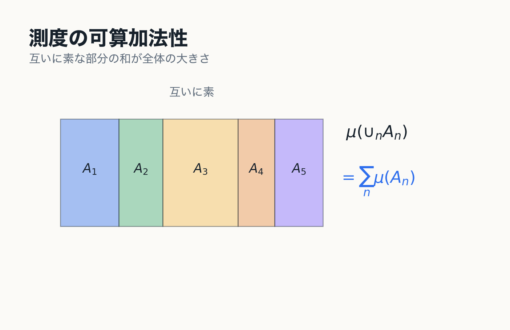
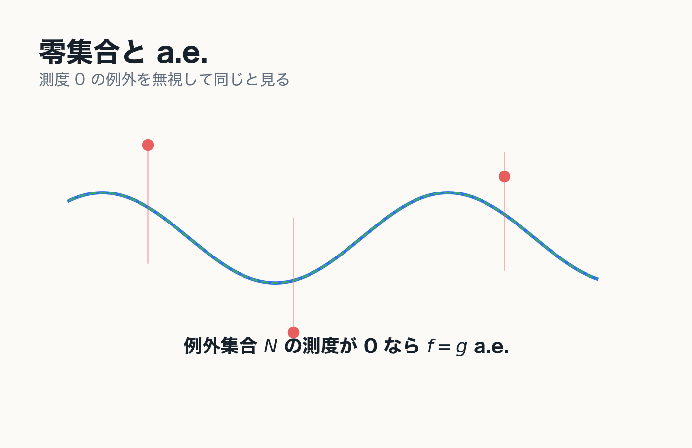

# 4. 測度空間

Lebesgue 測度から抽象的な定義へ

---
layout: two-cols
---

# 可算加法族

集合 $X$ の部分集合族 $\mathfrak{B}$ が可算加法族であるとは,

- $\emptyset\in\mathfrak{B}$
- $A\in\mathfrak{B}$ なら $A^c\in\mathfrak{B}$
- $A_n\in\mathfrak{B}$ なら $\bigcup_{n=1}^{\infty}A_n\in\mathfrak{B}$

を満たすことである.

::note
有限回の集合演算だけでなく, 可算回の和に閉じていることが測度論の基本言語になる.
::

::right::

---
layout: two-cols
---

# 測度

可算加法族 $\mathfrak{B}$ 上の函数

$$
\mu:\mathfrak{B}\to\mathbb{R}\cup\{\infty\}
$$

が測度であるとは, 互いに素な集合列 $A_1,A_2,\ldots$ に対して

$$
\mu\left(\bigcup_{n=1}^{\infty}A_n\right)
=
\sum_{n=1}^{\infty}\mu(A_n)
$$

を満たすことである.

::right::

---
layout: two-cols
---

# 測度空間

測度空間とは, 次の三つの組である.

::diagram
$$
(X,\mathfrak{B},\mu)
$$
::

::example-box{title="記号の読み方"}
$X$ は空間.

$\mathfrak{B}$ は測れる集合の族.

$\mu$ はその集合に大きさを与える測度.
::

::right::

---
layout: two-cols
---

# 測度空間の例

::example-box{title="Lebesgue 測度空間"}
$$
(\mathbb{R}^N,\mathfrak{M}_{\mu^*},\mu)
$$
::

::example-box{title="Borel 測度空間"}
$$
(\mathbb{R}^N,\mathfrak{B}(\mathbb{R}^N),\mu|_{\mathfrak{B}(\mathbb{R}^N)})
$$
::

::example-box{title="確率空間"}
$$
(\Omega,\mathfrak{B},P),
\qquad
P(\Omega)=1
$$
::

::right::

---
layout: two-cols
---

# 測度の基本性質

可算加法性から次が従う.

$$
A\subset B\Longrightarrow \mu(A)\le\mu(B)
$$

$$
\mu\left(\bigcup_{n=1}^{\infty}A_n\right)
\le
\sum_{n=1}^{\infty}\mu(A_n)
$$

$$
A_1\subset A_2\subset\cdots
\Longrightarrow
\mu\left(\bigcup_{n=1}^{\infty}A_n\right)
=
\lim_{n\to\infty}\mu(A_n)
$$

::right::

---
layout: two-cols
---

# 零集合と a.e.

集合 $N\in\mathfrak{B}$ が

$$
\mu(N)=0
$$

を満たすとき, $N$ を零集合という.

命題 $P(x)$ が零集合を除いて成り立つとき,

$$
P(x)\quad \mu\text{-a.e. }x\in E
$$

と書く.

::note
測度論では, 例外が全くないことよりも, 例外の測度が 0 であることが本質的になる.
::

::right::

---
