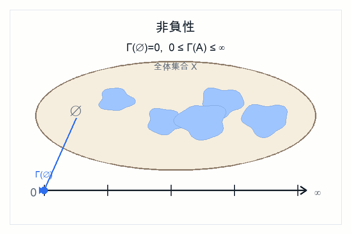
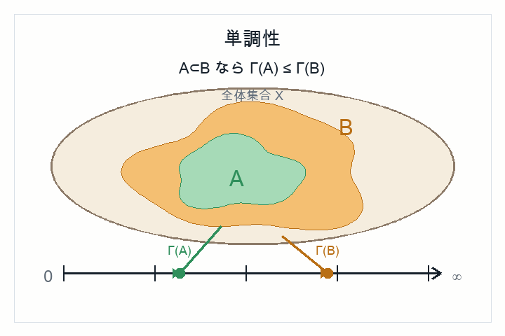
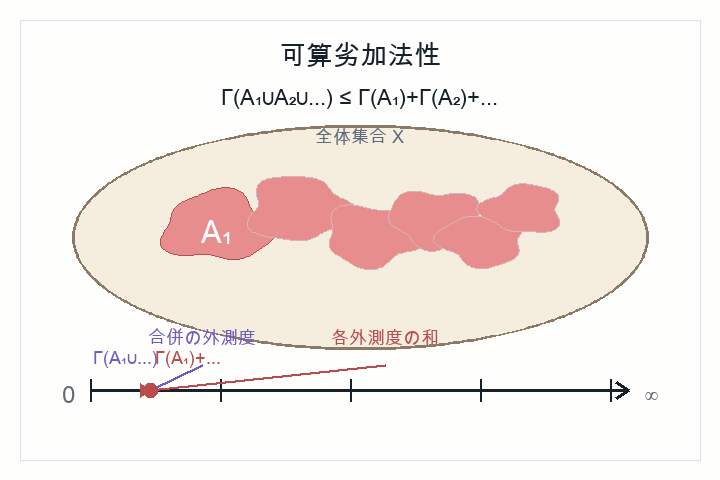

# 第4章 Carathéodory の定理と抽象的測度空間

Lebesgue 測度の構成を抽象化する

---
layout: default
---

# 目的

前章で得た Lebesgue 測度の構成から, 抽象的な外測度, 可測性, 測度空間の定義を取り出す.

一般の集合 $X$ 上で同じ構成を見直し, 測度空間

$$
(X,\mathfrak{B},\mu)
$$

の枠組みに進む.

---
layout: default
---

# 外測度の抽象化

集合 $X$ 上の外測度とは, 集合函数

$$
\Gamma:2^X\to[0,\infty]
$$

であって, 次を満たすものである.

|  | 非負性と空集合 | 単調性 | 可算劣加法性 |
| --- | --- | --- | --- |
| 式 | $\displaystyle 0\le\Gamma(A)\le\infty,\quad \Gamma(\emptyset)=0$ | $\displaystyle A\subset B\Rightarrow \Gamma(A)\le\Gamma(B)$ | $\displaystyle \Gamma(\bigcup_{n=1}^{\infty}A_n)\le\sum_{n=1}^{\infty}\Gamma(A_n)$ |
| 図 |  |  |  |

---
layout: default
---

# Carathéodory 可測性

集合 $E\in 2^X$ が $\Gamma$-可測であるとは, 任意の集合 $B\in 2^X$ に対して

$$
\Gamma(B)=\Gamma(B\cap E)+\Gamma(B\cap E^c)
$$

が成り立つことである.

$\Gamma$-可測集合全体を

$$
\mathfrak{M}_{\Gamma}
:=
\{E\in 2^X\mid E\text{ は }\Gamma\text{-可測}\}
$$

と書く.

第3章の Lebesgue 可測集合は, この定義で $X=\mathbb{R}^N$, $\Gamma=\mu^*$ とした場合である.

---
layout: default
---

# 可算加法族

$X$ の部分集合族 $\mathfrak{B}\subset 2^X$ が可算加法族であるとは, 次を満たすことである.

**空集合に対する閉性**

$$
\emptyset\in\mathfrak{B}
$$

**補集合に対する閉性**

$$
A\in\mathfrak{B}
\quad\Longrightarrow\quad
A^c\in\mathfrak{B}
$$

**可算和に対する閉性**

$$
A_1,A_2,\ldots\in\mathfrak{B}
\quad\Longrightarrow\quad
\bigcup_{n=1}^{\infty}A_n\in\mathfrak{B}
$$

測度はこのような集合族の上で定義される.

---
layout: default
---

# Carathéodory の定理

外測度 $\Gamma$ に対して, $\Gamma$-可測集合全体を $\mathfrak{M}_\Gamma$ と書く.

Carathéodory の定理は次を主張する.

- $\mathfrak{M}_\Gamma$ は可算加法族である.
- $\Gamma$ を $\mathfrak{M}_\Gamma$ に制限すると測度になる.

Lebesgue 測度の構成は, この定理を Lebesgue 外測度に適用したものである.

---
layout: default
---

# 測度

可算加法族 $\mathfrak{B}$ 上の集合函数 $\mu:\mathfrak{B}\to[0,\infty]$ が次を満たすとき, $\mu$ を**測度**という.

**非負性と空集合**

$$
0\le\mu(A)\le\infty,\qquad \mu(\emptyset)=0
$$

**可算加法性**

互いに素な $A_1,A_2,\ldots\in\mathfrak{B}$ に対して

$$
\mu\left(\bigcup_{n=1}^{\infty}A_n\right)
=
\sum_{n=1}^{\infty}\mu(A_n)
$$

---
layout: default
---

# 測度の基本性質: 単調性

$A\subset B$ かつ $A,B\in\mathfrak{B}$ ならば

$$
\mu(A)\le \mu(B)
$$

である.

これは $B=A\sqcup(B-A)$ と分解して可算加法性を使えば得られる.

---
layout: default
---

# 測度の基本性質: 可算劣加法性

測度 $\mu$ は任意の可測集合列 $A_1,A_2,\ldots$ に対して

$$
\mu\left(\bigcup_{n=1}^{\infty}A_n\right)
\le
\sum_{n=1}^{\infty}\mu(A_n)
$$

を満たす.

---
layout: default
---

# 測度の基本性質: 調な集合列の極限と整合

**下からの連続性**

$A_1\subset A_2\subset\cdots$ ならば以下が成り立つ:

$$
\begin{aligned}
\mu\left(\lim_{n\to\infty}A_n\right)
&=
\lim_{n\to\infty}\mu(A_n),\\
\lim_{n\to\infty}A_n
&=
\bigcup_{n=1}^{\infty}A_n
\end{aligned}
$$

**上からの連続性**

$A_1\supset A_2\supset\cdots$ かつ $\mu(A_1)<\infty$ ならば以下が成り立つ:

$$
\begin{aligned}
\mu\left(\lim_{n\to\infty}A_n\right)
&=
\lim_{n\to\infty}\mu(A_n),\\
\lim_{n\to\infty}A_n
&=
\bigcap_{n=1}^{\infty}A_n
\end{aligned}
$$

---
layout: default
---

# 零集合 と ほとんど至る所 (almost everywhere, a.e.)

集合 $N\in\mathfrak{B}$ が次を満たすとき, $N$ を **零集合** という.

$$
\mu(N)=0
$$

集合 $E\in\mathfrak{B}$ 上の命題 $P(x)$ について次が成り立つとき

$$
\mu(\{x\in E\mid \neg P(x)\})=0
$$

すなわち, $P(x)$ が $E$ 上の零集合を除いた点で成り立つとき, $P(x)$ は $E$ 上で **ほとんど至る所** 成り立つといい, 次のように書く.

$$
P(x)\quad \mu\text{-a.e. }x\in E
$$

---
layout: default
---

# 測度空間

空間 $X$, その上の可算加法族 $\mathfrak{B}$, および $\mathfrak{B}$ 上の測度 $\mu$ の組

$$
(X,\mathfrak{B},\mu)
$$

を測度空間という.

前章の構成は, Lebesgue 外測度から一つの測度空間を作る手続きだったと見なせる.

---
layout: default
---

# Lebesgue 測度空間

Lebesgue 測度空間は

$$
(\mathbb{R}^N,\mathfrak{M}_{\mu^*},\mu)
$$

である.

ここで $\mathfrak{M}_{\mu^*}$ は Lebesgue 可測集合全体であり, $\mu$ は Lebesgue 測度である.

---
layout: default
---

# Borel 測度空間

開集合をすべて含む最小の可算加法族を Borel 集合族といい,

$$
\mathfrak{B}(\mathbb{R}^N)
$$

と書く.

Lebesgue 測度 $\mu$ を Borel 集合族に制限すると,

$$
(\mathbb{R}^N,\mathfrak{B}(\mathbb{R}^N),\mu|_{\mathfrak{B}(\mathbb{R}^N)})
$$

も測度空間になる.

---
layout: default
---

# 確率空間

確率空間も測度空間の一種である.

$$
(\Omega,\mathfrak{B},P)
$$

と書き, 全体空間の測度が

$$
P(\Omega)=1
$$

であることを要求する. 事象 $A,B\in\mathfrak{B}$ に対して, $A^c$, $A\cup B$, $A\cap B$, $B-A$ も再び事象である.　測度の基本性質から

$$
P(A^c)=P(\Omega-A)=P(\Omega)-P(A)=1-P(A)
$$

$$
P(A\cup B)=P(A)+P(B)-P(A\cap B)
$$

が成り立つ. 特に $A\cap B=\emptyset$ なら

$$
P(A\cup B)=P(A)+P(B)
$$

---
layout: default
---

# 測度空間としての対応表

| 場面 | 空間 | 可測集合族 | 測度 |
| --- | --- | --- | --- |
| 抽象的な測度空間 | $X$ | $\mathfrak{B}$ | Carathéodory 測度 $\mu$ |
| Euclid空間 | $\mathbb{R}^N$ | $\mathfrak{M}_{\mu^*}$ | Lebesgue 測度 $\mu$ |
| 確率空間 | $\Omega$ | 事象の集合族 $\mathfrak{B}$ | 確率測度 $P$ |

同じ記号の枠組みで, 長さ・面積・体積と確率を統一的に扱う.

---
layout: end
---

# この章の中心メッセージ

- Carathéodory の定理は, 外測度から可測集合族と測度を作る一般原理である.
- 測度空間の本質は, 可算操作に閉じた集合族と可算加法的な測度にある.
- 同じ枠組みで, Lebesgue 測度による体積と確率測度による確率を扱える.
