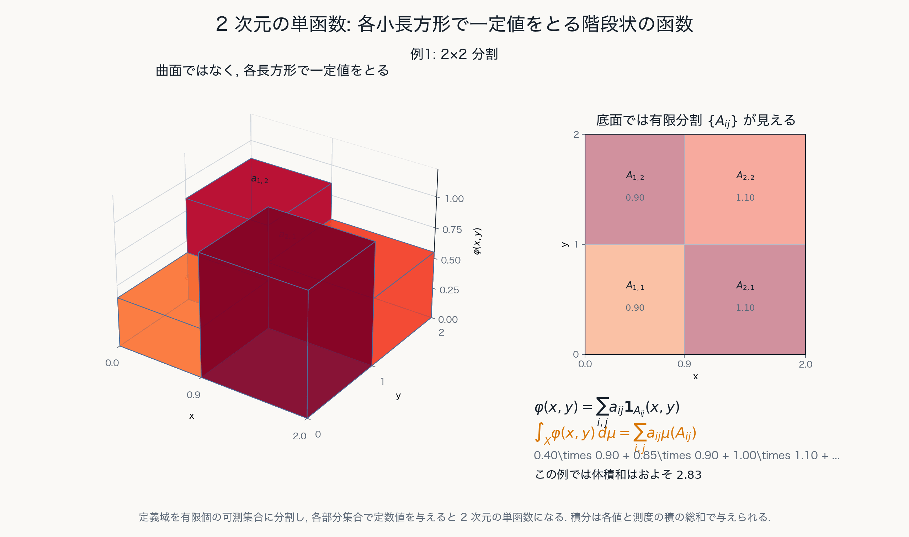
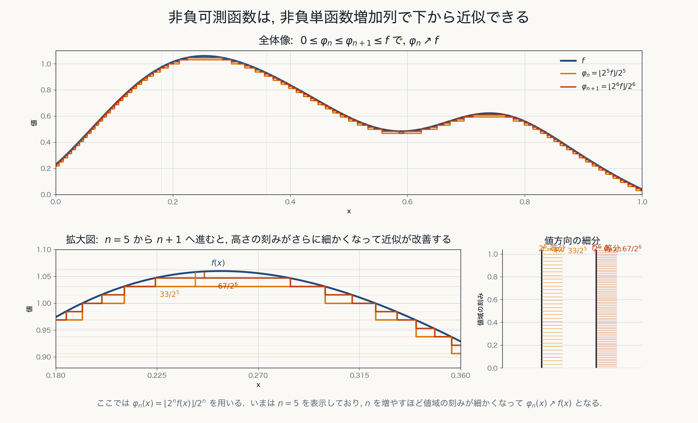
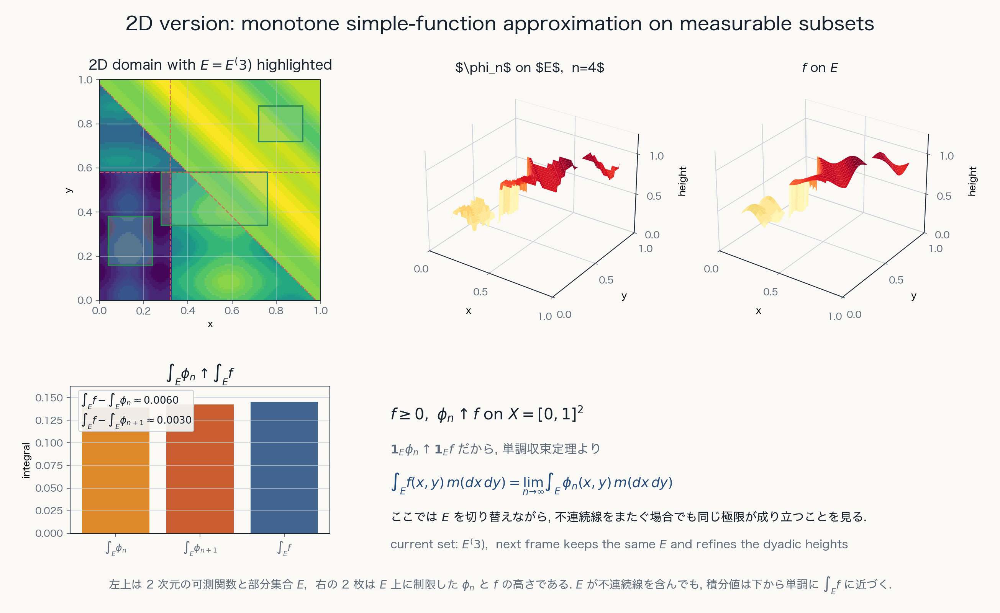

# 第6章 Lebesgue 積分

単函数から一般の可測函数の積分へ

---
layout: default
---

# 目的

可測函数に対して Lebesgue 積分を定義する.

まず非負単函数の積分を定義し, 次に非負可測函数の積分を下からの単函数近似で定義する.

最後に一般の可測函数を正部分と負部分に分けて扱う.

---
layout: two-cols
---

# 非負単函数の積分

非負単函数

$$
\varphi(x)=\sum_{i=1}^n a_i\mathbf{1}_{A_i}(x)
$$

ただし $a_i\ge0$, $A_i\in\mathfrak{B}$ とする. このとき積分を

$$
\int_X\varphi(x)\,d\mu(x)
:=
\sum_{i=1}^n a_i\mu(A_i)
$$

で定める.

::right::

---
layout: default
---

# 非負単函数の基本性質: 線形性

非負単函数 $\varphi,\psi$ と $a,b\ge0$ に対して

$$
\int_X(a\varphi+b\psi)\,d\mu
=
a\int_X\varphi\,d\mu
+
b\int_X\psi\,d\mu
$$

が成り立つ.

---
layout: default
---

# 非負単函数の基本性質: 単調性

$0\le\varphi\le\psi$ ならば

$$
\int_X\varphi\,d\mu
\le
\int_X\psi\,d\mu
$$

である.

単函数の段階で, 積分は面積・体積の有限和として振る舞う.

---
layout: two-cols
---

# 非負可測函数の積分

非負可測函数 $f$ に対して, 下から抑える非負単函数 $\varphi$ 全体を考え,

$$
\int_X f(x)\,d\mu(x)
:=
\underset{0\le\varphi\le f,\ \varphi\text{ は単函数}}{\sup} \int_X\varphi(x)\,d\mu(x)
$$

で定義する.

::right::

---
layout: two-cols
---

# 非負可測函数の積分の意味

Lebesgue 積分は, 値域を細かく分けて得られる単函数近似の積分値の極限として理解できる.

函数 $f$ の下からの近似 $\varphi_m$ が

$$
0\le\varphi_m\le f,\qquad \varphi_m(x)\nearrow f(x)
$$

を満たすとき,

$$
\int_X\varphi_m(x)\,d\mu(x)
\nearrow
\int_X f(x)\,d\mu(x)
$$

と見る.

可測集合 $E$ 上に制限しても, 同じ下からの近似で積分値が極限へ近づく.

::right::

---
layout: default
---

# 可測函数の安定性

可測函数は, 四則演算や極限操作に対して安定に振る舞う.

すなわち $f,g$ が可測で $c\in\mathbb{R}$ なら

$$
f+g,\quad cf,\quad fg,\quad |f|
$$

も可測である.

また可測函数列 $f_n$ について

$$
\limsup_{n\to\infty}f_n,\qquad
\liminf_{n\to\infty}f_n
$$

も可測である.

Lebesgue 積分論では, この可測性の安定性が収束定理の前提になる.

---
layout: default
---

# 一般の可測函数の積分

一般の可測函数 $f$ は正部分と負部分に分ける.

$$
f^+:=\max(f,0),\qquad f^-:=\max(-f,0)
$$

すると

$$
f=f^+-f^-
$$

であり, $f^+,f^-$ は非負可測函数である.

少なくとも一方の積分が有限なら

$$
\int_X f\,d\mu
:=
\int_X f^+\,d\mu-\int_X f^-\,d\mu
$$

と定める.

---
layout: default
---

# 可積分函数

一般の可測函数 $f$ に対して

$$
\int_X f\,d\mu
=
\int_X f^+\,d\mu-\int_X f^-\,d\mu
$$

を考える.

このとき

$$
\int_X |f|\,d\mu<\infty
$$

が成り立つなら, $f$ は **可積分** であるという.

この条件は,  以下とも同値である:

$$
\int_X f^+\,d\mu<\infty\quad\text{かつ}\quad
\int_X f^-\,d\mu<\infty
$$

---
layout: default
---

# 積分の基本性質

Lebesgue 積分は, 適切な可積分性のもとで次を満たす.

$$
\int_X(af+bg)\,d\mu
=
a\int_Xf\,d\mu+b\int_Xg\,d\mu
$$

$$
f\le g\ \mu\text{-a.e.}
\quad\Longrightarrow\quad
\int_Xf\,d\mu\le\int_Xg\,d\mu
$$

$$
\left|\int_X f\,d\mu\right|
\le
\int_X|f|\,d\mu
$$

---
layout: default
---

# Riemann 積分との整合性

有界閉区間上の Riemann 可積分函数は Lebesgue 可積分であり, 積分値は一致する.

$$
\int_a^b f(x)\,dx
=
\int_{[a,b]} f\,d\mu
$$

Lebesgue 積分は Riemann 積分を, より広い函数族と極限操作に適合する形へ拡張するものである.

---
layout: default
---

# 可積分函数全体

可積分な実数値可測函数全体を

$$
V
:=
\left\{
f:X\to\mathbb{R}
\mid
f\text{ は可測},\ \int_X|f|\,d\mu<\infty
\right\}
$$

とおく. このとき $V$ は線形空間をなす.

$$
f,g\in V,\ a,b\in\mathbb{R}
\quad\Longrightarrow\quad
af+bg\in V
$$

---
layout: default
---

# $L^1$ 半ノルムと a.e. 一致

$V$ の各函数 $f$ に対して

$$
\|f\|_1:=\int_X |f|\,d\mu
$$

を考える.

ただし $\|f\|_1=0$ でも, 点ごとに $f=0$ とは限らず, $f=0$ a.e. である.

より一般に

$$
\|f-g\|_1=0
\quad\Longleftrightarrow\quad
f=g\ \mu\text{-a.e.}
$$

---
layout: default
---

# 商空間としての $L^1(\mu)$

a.e. に一致する函数を同一視すると, $\|\cdot\|_1$ はノルムになる.

$$
f\sim g
\quad\Longleftrightarrow\quad
f=g\ \mu\text{-a.e.}
$$

この同値類の空間が

$$
L^1(\mu):=V/{\sim}
$$

である.

測度論では, 零集合上の違いを無視することが自然に組み込まれる.

---
layout: default
---

# $L^p(\mu)$ への一般化

$1\le p<\infty$ に対して

$$
L^p(\mu):=
\left\{
f:\int_X |f|^p\,d\mu<\infty
\right\}
$$

を考える.

$L^1$ は積分可能性, $L^2$ は内積構造と結びつく.

$$
\|f\|_p
:=
\left(\int_X |f|^p\,d\mu\right)^{1/p}
$$

---
layout: end
---

# この章の中心メッセージ

- Lebesgue 積分は, 非負単函数の有限和から始まり, 非負可測函数へ下から拡張される.
- 一般の函数は正部分と負部分に分け, $\int |f|\,d\mu<\infty$ を可積分性の条件とする.
- a.e. 一致を同一視すると $L^1$ や $L^p$ 空間が現れ, 収束定理の舞台になる.
