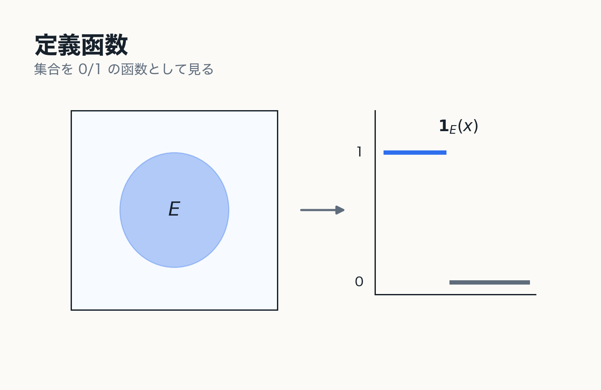

# 6. 可測函数と単函数

Lebesgue 積分の対象と基本単位

---
layout: two-cols
---

# 可測函数

測度空間 $(X,\mathfrak{B},\mu)$ 上の函数 $f:X\to\mathbb{R}$ が可測であるとは, 任意の実数 $a$ に対して

$$
\{x\in X\mid f(x)>a\}\in\mathfrak{B}
$$

が成り立つこと.

::note
函数の値によって定まる集合が測度で扱えることを要求している.
::

::right::

---
layout: two-cols
---

# 逆像として見る

値域側の区間を切り出したとき, その逆像が定義域側で可測集合になる.

$$
f^{-1}([\alpha,\beta))\in\mathfrak{B}
$$

この条件により

$$
\mu\left(\{x\mid \alpha\le f(x)<\beta\}\right)
$$

が定義できる.

::right::

---
layout: two-cols
---

# 定義函数

集合 $E\subset X$ の定義函数は

$$
\mathbf{1}_E(x)=
\begin{cases}
1 & (x\in E),\\
0 & (x\notin E)
\end{cases}
$$

である.

$E\in\mathfrak{B}$ であるとき, $\mathbf{1}_E$ は可測函数である.

::note
集合 $E$ が可測であることと, その定義函数 $\mathbf{1}_E$ が可測であることは同値である.
::

::right::

---
layout: two-cols
---

# 単函数

単函数とは

$$
\varphi=\sum_{k=1}^{n}a_k\mathbf{1}_{E_k}
$$

の形で表される可測函数である.

::example-box{title="基本単位"}
単函数は, 有限個の可測集合上で定数値を取る函数である.
::

::right::

---
layout: two-cols
---

# 単函数による近似

非負可測函数は, 非負単函数列によって下から単調に近似できる.

$$
0\le\varphi_1\le\varphi_2\le\cdots\le f,
\qquad
\varphi_n(x)\uparrow f(x)
$$

::note
この事実が Lebesgue 積分の定義を支えている.
::

::right::

---
layout: two-cols
---

# 第6章の結論

::example-box{title="中心メッセージ"}
可測函数とは, 値によって定まる集合が測度で扱える函数である.

単函数は可測集合の定義函数の有限線形結合であり, Lebesgue 積分を構成する基本単位である.
::

::right::

---
