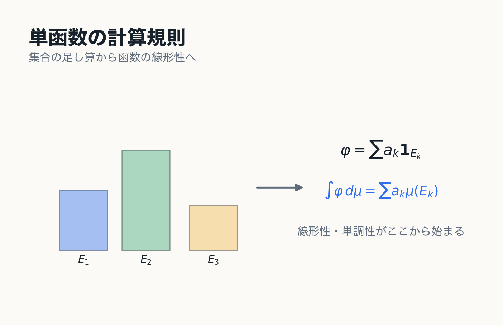
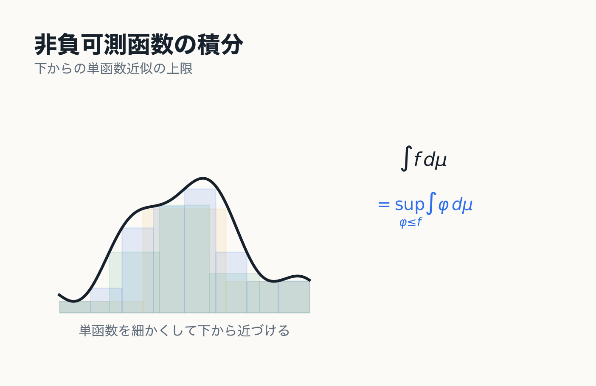
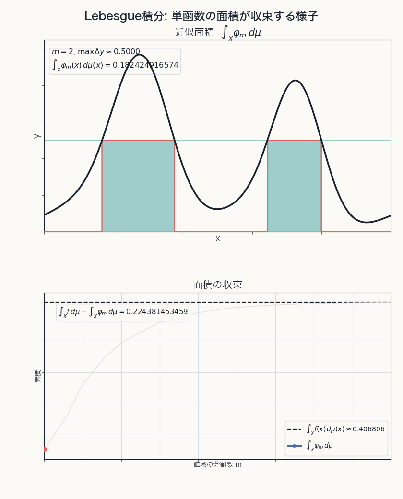
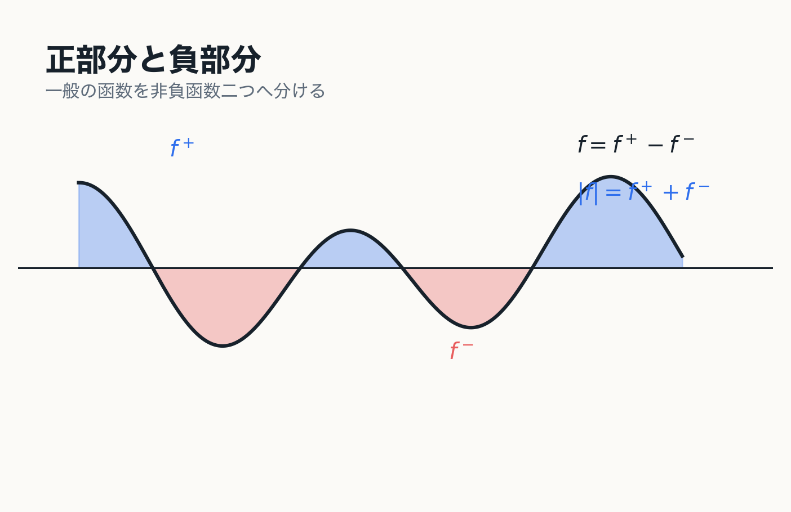
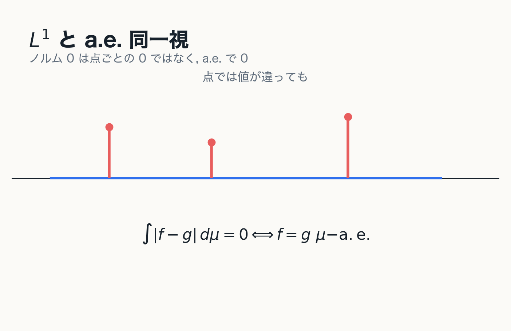

# 7. Lebesgue 積分

単函数から一般の可積分函数へ

---
layout: two-cols
---

# 非負単函数の積分

非負単函数

$$
\varphi(x)=\sum_{k=1}^{n}a_k\mathbf{1}_{E_k}(x)
$$

に対して

$$
\int_X\varphi\,d\mu
:=
\sum_{k=1}^{n}a_k\mu(E_k)
$$

と定める.

::right::

---
layout: two-cols
---

# 単函数の基本性質

非負単函数 $\varphi,\psi$ と $c\ge0$ に対して

$$
\int_X(\varphi+\psi)\,d\mu
=
\int_X\varphi\,d\mu+\int_X\psi\,d\mu
$$

$$
\int_X c\varphi\,d\mu
=
c\int_X\varphi\,d\mu
$$

また

$$
0\le\varphi\le\psi
\quad\Longrightarrow\quad
\int_X\varphi\,d\mu\le\int_X\psi\,d\mu
$$

である.

::right::

---
layout: two-cols
---

# 非負可測函数の積分

非負可測函数 $f:X\to[0,\infty]$ に対して

$$
\int_X f\,d\mu
:=
\sup\left\{
\int_X\varphi\,d\mu
\ \middle|\
0\le\varphi\le f,\ \varphi\text{ は非負単函数}
\right\}
$$

と定める.

::note
非負可測函数の積分では値 $\infty$ を許す. 定義は下側近似の積分の上限である.
::

::right::

---
layout: two-cols
---

# 下から近似する

Lebesgue 積分

$$
\int_X f\,d\mu
$$

は, $0\le\varphi\le f$ を満たす単函数の積分の上限である.

値の分割を細かくすると, 下からの単函数近似の積分は極限として $f$ の積分に近づく.

::right::

---
layout: two-cols
---

# 一般の可測函数の積分

実数値可測函数 $f$ に対して

$$
f^+=\max\{f,0\},
\qquad
f^- =\max\{-f,0\}
$$

と定める.

このとき

$$
f=f^+-f^-,
\qquad
|f|=f^++f^-
$$

である.

::right::

---
layout: two-cols
---

# 可積分性

$$
\int_X |f|\,d\mu<\infty
$$

であるとき, $f$ は可積分であるという.

この場合

$$
\int_X f\,d\mu
=
\int_X f^+\,d\mu-\int_X f^-\,d\mu
$$

は有限の実数として定義される.

::example-box{title="要点"}
一般の函数は, 正部分と負部分に分けて非負可測函数の積分へ戻す.
::

::right::

---
layout: two-cols
---

# $L^1$ と a.e. 一致

可積分函数全体は線形空間になり,

$$
\|f\|_1=\int_X|f|\,d\mu
$$

を考える.

ただし $\|f\|_1=0$ は $f=0$ を点ごとに意味するのではなく,

$$
f=0\quad \mu\text{-a.e.}
$$

を意味する.

::note
測度論では a.e. に一致する函数を同一視して $L^1(\mu)$ を考える.
::

::right::

---
layout: two-cols
---

# 第7章の結論

::example-box{title="中心メッセージ"}
Lebesgue 積分は, 非負単函数の積分を出発点とし, 非負可測函数を下から単函数で近似することで定義される.

一般の函数は正部分と負部分に分けて積分する. 可積分性は $\int |f|\,d\mu<\infty$ によって定義される.
::

::right::

---
