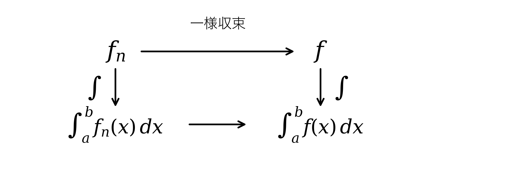
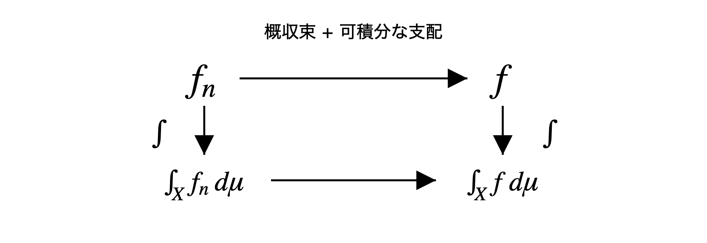

# 第7章 極限と積分の交換

Lebesgue 積分で極限操作を制御する

---
layout: two-rows
---

# 目的

本章では, 函数列の極限と積分を交換できる条件を考える.

問題は, $f_n\to f$ から次が従うかどうかである.

$$
\int_X f_n\,d\mu\longrightarrow \int_X f\,d\mu
$$

答えは一般には否であり, 収束に加えて積分量を制御する条件が必要になる.

::figure::

---
layout: default
---

# 各点収束と a.e. 収束

函数列 $f_n:X\to\mathbb{R}$ が $f:X\to\mathbb{R}$ に **各点収束** するとは, 各 $x\in X$ に対して

$$
\lim_{n\to\infty}f_n(x)=f(x)
$$

が成り立つことである.

Lebesgue 積分では, 零集合上の例外を許した **a.e. 収束** も基本になる.

$$
f_n(x)\to f(x)
\quad
\mu\text{-a.e. }x\in X
$$

これは, ある零集合 $Z$ を除いた $X-Z$ 上で各点収束するという意味である.

各点収束は a.e. 収束を含むが, 逆は一般には成り立たない.

---
layout: two-cols
---

# a.e. 収束だけでは積分値を制御できない

$[0,1]$ 上で

$$
f_n(x):=n\mathbf{1}_{(0,1/n]}(x)
$$

とおく.

このとき

$$
f_n(x)\to0
\qquad(\forall x\in[0,1])
$$

である. したがって a.e. 収束もしている. しかし,

$$
\int_0^1 f_n\,d\mu=1
$$

であり, 積分値は $0$ に収束しない.

::right::

---
layout: two-rows
---

# 一様収束

$f_n\to f$ が一様収束するとは, 任意の $\varepsilon>0$ に対して, ある自然数 $N=N(\varepsilon)$ が存在し,

$$
n\ge N
\quad\Longrightarrow\quad
|f_n(x)-f(x)|<\varepsilon
\qquad(\forall x\in X)
$$

が成り立つことである.

各点収束とは異なり, 同じ $N$ が $X$ のすべての点に対して効く.

函数列全体の誤差を一様に制御する, 強い収束概念である.

::right::

---
layout: two-rows
---

# 一様収束なら Riemann 積分でも安全

$f_n\to f$ が $[a,b]$ 上で一様収束し, 各 $f_n$ が Riemann 可積分なら,

Riemann 積分でも, 一様収束のもとでは極限と積分を交換できる. 
$\forall \varepsilon>0,\ \exists N(\varepsilon)\in\mathbb{N},\ n\ge N$,

$$
\left|\int_a^b f_n(x)\,dx - \int_a^b f(x)\,dx\right|
\le
\int_a^b | f_n(x) - f(x) |\,dx 
\le
(b-a) \varepsilon \longrightarrow 0
$$

問題は, より弱い収束条件のもとで交換を正当化できるかである.

::figure::

---
layout: default
---

# Lebesgue 積分の主要な収束定理

Lebesgue 積分では, 次の三つの収束定理が基本となる.

| 定理 | 主な条件 | 結論 |
| --- | --- | --- |
| 単調収束定理 | 非負単調増加 | 積分と極限を交換できる |
| Fatou の補題 | 非負函数列 | $\liminf$ による評価 |
| 優収束定理 | a.e. 収束と可積分支配 | $L^1$ 収束と積分値の収束 |

これらは, 点ごとの極限と積分の極限を結びつける基本結果である.

---
layout: default
---

# 単調収束定理

非負可測函数列が

$$
0\le f_1\le f_2\le\cdots,
\qquad
f_n\nearrow f
$$

を満たすなら,

$$
\int_X f_n\,d\mu
\nearrow
\int_X f\,d\mu
$$

が成り立つ.

非負可測函数の積分を, 非負単函数による下からの近似として定義したことに対応する.

---
layout: default
---

# Fatou の補題

非負可測函数列 $f_n$ に対して,

$$
\int_X \liminf_{n\to\infty} f_n\,d\mu
\le
\liminf_{n\to\infty}\int_X f_n\,d\mu
$$

が成り立つ.

単調収束定理では単調な函数列について等式が得られた.

Fatou の補題では, 一般の非負函数列に対して, 極限函数の積分を評価できる.

---
layout: two-rows
---

# 優収束定理

$f_n\to f$ a.e. であり, ある可積分函数 $g$ が存在して

$$
|f_n|\le g,
\qquad
g\in L^1
$$

をすべての $n$ で満たすなら,

可積分函数による支配のもとでは, 極限と積分を交換できる.

::figure::

---
layout: default
---

# 優収束定理の帰結

優収束定理は, 積分値の収束だけでなく **$L^1$ 収束** も与える.

$$
\int_X |f_n-f|\,d\mu\to0
$$

これを次のように書く.

$$
f_n\to f\quad\text{in }L^1
$$

$L^1$ 収束すれば,

$$
\begin{aligned}
\left|
\int_X f_n\,d\mu-\int_X f\,d\mu
\right|
&\le
\int_X |f_n-f|\,d\mu
&=
\|f_n-f\|_1
\longrightarrow0.
\end{aligned}
$$

したがって優収束定理は

$$
\boxed{
\text{a.e. 収束}
+
\text{可積分支配}
\Longrightarrow
L^1\text{ 収束}
\Longrightarrow
\text{積分値の収束}
}
$$

という形で, 極限と積分の交換を正当化する.

---
layout: end
---

# この章のまとめ

- 函数列が収束しても, 一般には極限と積分を交換できない.
- Riemann 積分でも, 一様収束のもとでは交換できる.
- Lebesgue 積分では, 単調性や可積分函数による支配など, より柔軟な条件によって交換を正当化できる.
- 単調収束定理, Fatou の補題, 優収束定理は, 極限操作に対する積分の振る舞いを段階的に制御する.

$$
\boxed{
\text{極限と積分の交換を, 条件ごとに見極める}
}
$$
