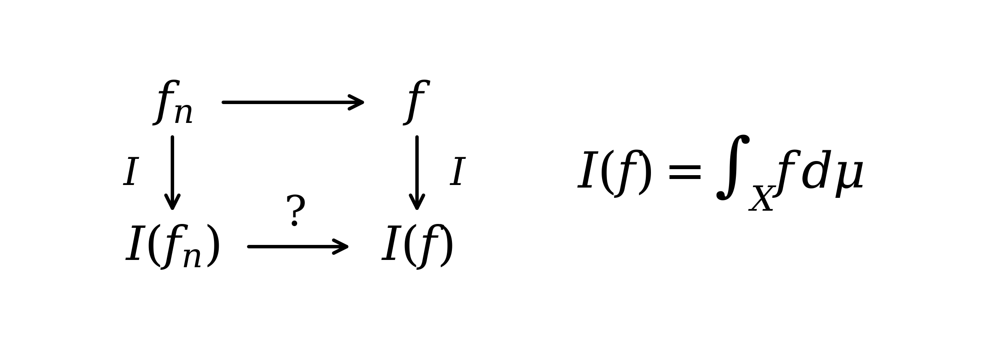
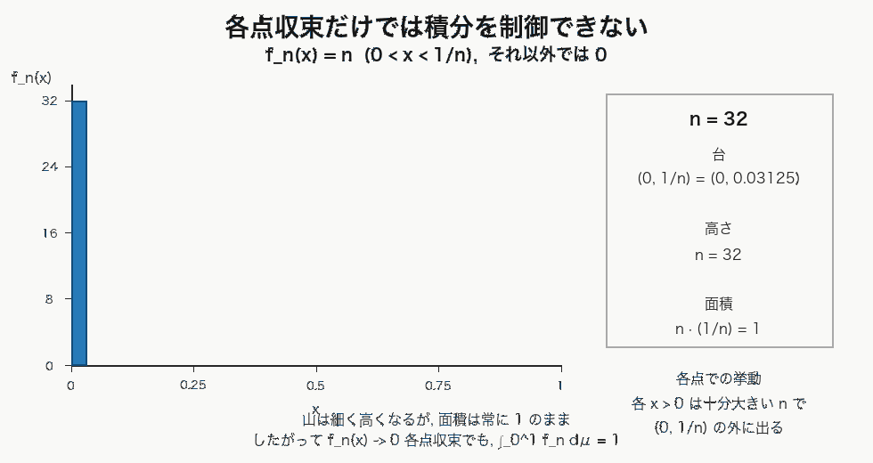
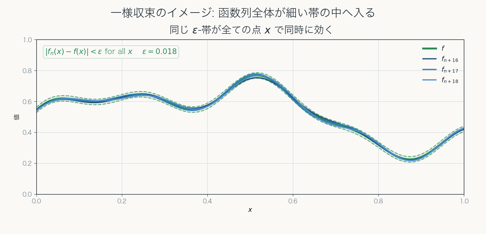

# 第8章 極限と積分の交換

Lebesgue 積分で極限操作を制御する

---
layout: two-rows
---

# 目的

この章では, 函数列 $f_n$ の極限と積分の交換

$$
\lim_{n\to\infty}\int_X f_n\,d\mu
\overset{?}{=}
\int_X \lim_{n\to\infty} f_n\,d\mu
$$

が, どのような条件のもとで正当化されるかを考える.

Lebesgue 積分の強みは, 積分できる函数の範囲が広いだけでなく, 一様収束より柔軟な条件で極限操作を制御できる点にある.

::figure::

::

---
layout: default
---

# この章で考える問題

函数列 $f_n$ が $f$ に収束しているとする.

問題は, 点ごとの収束だけで

$$
\int_X f_n\,d\mu
\longrightarrow
\int_X f\,d\mu
$$

が成り立つかである.

答えは一般には否である.
各点収束に加えて, 函数列の積分量を制御する条件が必要になる.

ただし, Riemann 積分よりも柔軟な条件で, 積分値の収束を保証できる.

---
layout: default
---

# 各点収束とは

函数列 $f_n:X\to\mathbb{R}$ が $f:X\to\mathbb{R}$ に各点収束するとは, 各 $x\in X$ に対して

$$
\lim_{n\to\infty}f_n(x)=f(x)
$$

が成り立つことである.

すなわち任意の $\varepsilon>0$ と各 $x\in X$ に対して, ある $N=N(x,\varepsilon)$ が存在し,

$$
n\ge N
\quad\Longrightarrow\quad
|f_n(x)-f(x)|<\varepsilon
$$

となる.

この $N$ は点 $x$ に依存してよい.

---
layout: two-cols
---

# 各点収束だけでは積分値を制御できない

$[0,1]$ 上で

$$
f_n(x):=n\mathbf{1}_{(0,1/n]}(x)
$$

とおく.

このとき

$$
f_n(x)\to0
\qquad \text{a.e.}
$$

であるが,

$$
\int_0^1 f_n\,d\mu=1
$$

であり, 積分値は $0$ に収束しない.

::right::

---
layout: two-rows
---

# 一様収束

$f_n\to f$ が一様収束するとは, 任意の $\varepsilon>0$ に対して, ある自然数 $N=N(\varepsilon)$ が存在し,

$$
n\ge N
\quad\Longrightarrow\quad
|f_n(x)-f(x)|<\varepsilon
\qquad(\forall x\in X)
$$

が成り立つことである.

各点収束とは異なり, 同じ $N$ が $X$ のすべての点に対して効く.

函数列全体の誤差を一様に制御する, 強い収束概念である.

::right::

---
layout: default
---

# 一様収束なら Riemann 積分でも安全

$f_n\to f$ が $[a,b]$ 上で一様収束し, 各 $f_n$ が Riemann 可積分なら,

$$
\begin{aligned}
\left|\int_a^b f_n(x)\,dx-\int_a^b f(x)\,dx\right|
&\le
\int_a^b |f_n(x)-f(x)|\,dx
&\le
(b-a)\epsilon
\longrightarrow0.
\end{aligned}
$$

したがって, 一様収束のもとでは極限と積分を交換できる.

Lebesgue 積分では, 一様収束より柔軟な条件を用いる.

---
layout: default
---

# Lebesgue 積分の主要な収束定理

Lebesgue 積分では, 次の三つの収束定理が基本となる.

| 定理 | 主な条件 | 結論 |
| --- | --- | --- |
| 単調収束定理 | 非負単調増加 | 積分と極限を交換できる |
| Fatou の補題 | 非負函数列 | $\liminf$ による評価 |
| 優収束定理 | a.e. 収束と可積分支配 | $L^1$ 収束と積分値の収束 |

これらは, 点ごとの極限と積分の極限を結びつける基本結果である.

---
layout: default
---

# 単調収束定理

非負可測函数列が

$$
0\le f_1\le f_2\le\cdots,
\qquad
f_n\nearrow f
$$

を満たすなら,

$$
\int_X f_n\,d\mu
\nearrow
\int_X f\,d\mu
$$

が成り立つ.

非負可測函数の積分を, 非負単函数による下からの近似として定義したことに対応する.

---
layout: default
---

# Fatou の補題

非負可測函数列 $f_n$ に対して,

$$
\int_X \liminf_{n\to\infty} f_n\,d\mu
\le
\liminf_{n\to\infty}\int_X f_n\,d\mu
$$

が成り立つ.

単調収束定理では単調な函数列について等式が得られた.

Fatou の補題では, 一般の非負函数列に対して, 極限函数の積分を評価できる.

---
layout: default
---

# 優収束定理

$f_n\to f$ a.e. であり, ある可積分函数 $g$ が存在して

$$
|f_n|\le g,
\qquad
g\in L^1
$$

をすべての $n$ で満たすなら,

$$
\lim_{n\to\infty}\int_X f_n\,d\mu
=
\int_X f\,d\mu
$$

が成り立つ.

可積分函数 $g$ が, 函数列全体の積分量を共通に制御する.

---
layout: default
---

# 優収束定理と $L^1$ 収束

優収束定理からは,

$$
\int_X |f_n-f|\,d\mu\to0
$$

が得られる.

これを

$$
f_n\to f
\qquad\text{in }L^1
$$

と書く.

$L^1$ 収束は, 函数間の差を積分された総量として測る収束である.

---
layout: default
---

# $L^1$ 収束と積分値の収束

$f_n\to f$ in $L^1$ なら,

$$
\begin{aligned}
\left|
\int_X f_n\,d\mu-\int_X f\,d\mu
\right|
&\le
\int_X |f_n-f|\,d\mu\\
&=
\|f_n-f\|_1
\longrightarrow0.
\end{aligned}
$$

したがって,

$$
\boxed{
\text{a.e. 収束}
+
\text{可積分支配}
\Longrightarrow
L^1\text{ 収束}
\Longrightarrow
\text{積分値の収束}
}
$$

となる.

---
layout: default
---

# 一様収束との関係

有限測度空間では,

$$
\|f_n-f\|_1
\le
\mu(X)\|f_n-f\|_\infty
$$

であるから,

$$
f_n\to f\text{ 一様}
\quad\Longrightarrow\quad
f_n\to f\text{ in }L^1.
$$

一方, 優収束定理は, 一様収束を仮定せず,

$$
f_n\to f\text{ a.e.},
\qquad
|f_n|\le g\in L^1
$$

から $L^1$ 収束を導く.

---
layout: end
---

# この章のまとめ

- 各点収束や a.e. 収束だけでは, 積分値の収束は保証されない.
- 単調収束定理は, 非負単調増加する函数列の極限を扱う.
- Fatou の補題は, 一般の非負函数列に対して $\liminf$ による評価を与える.
- 優収束定理は, a.e. 収束と可積分支配から $L^1$ 収束を導く.
- $L^1$ 収束は, 積分値の収束を直接保証する.

$$
\boxed{
\text{Lebesgue 積分では, 一様収束より柔軟な条件で極限と積分を交換できる}
}
$$
