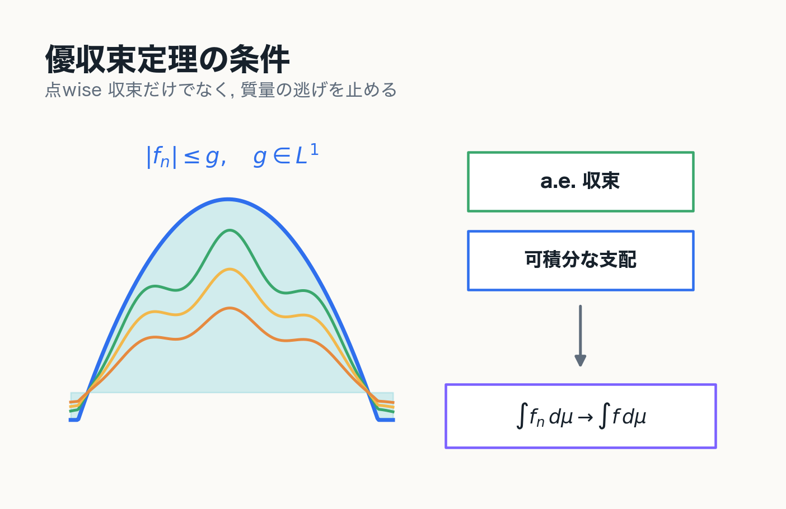
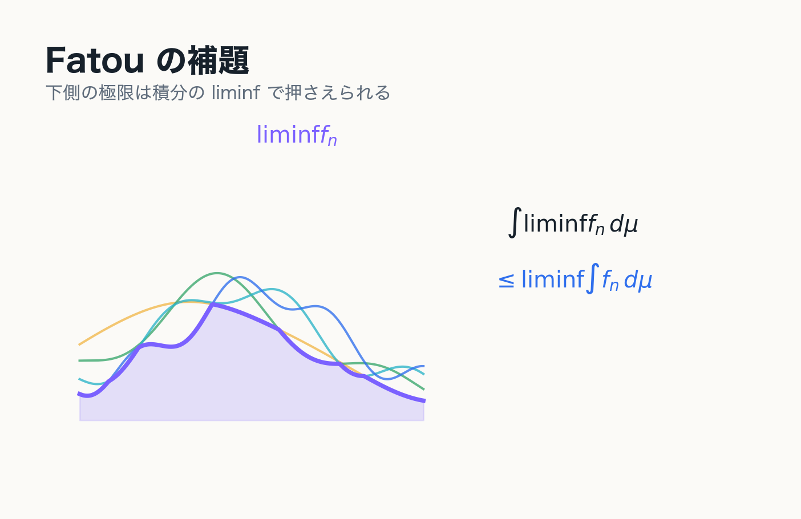

# 第8章 極限と積分の交換

優収束定理へ

---
layout: two-cols
---

# 点wise 収束だけでは足りない

$$
f_n(x)=n\mathbf{1}_{(0,1/n)}(x)
$$

を $[0,1]$ 上で考える.

点ごとには

$$
f_n(x)\to0
$$

だが

$$
\int_0^1 f_n\,d\mu=1
$$

である.

::right::

---
layout: two-cols
---

# 何が失敗しているのか

函数の質量が $0$ の近くに集中し, 高さが大きくなっている.

点ごとの極限だけを見ると, この集中を捉えられない.

$$
\int \lim_{n\to\infty}f_n\,d\mu
=0
\ne
1
=
\lim_{n\to\infty}\int f_n\,d\mu
$$

::note
極限と積分を交換するには, 単調性, 非負性, 支配函数の存在などの追加条件が必要である.
::

::right::

---
layout: two-cols
---

# 単調収束定理

非負可測函数列 $f_n$ が

$$
0\le f_1\le f_2\le\cdots
$$

を満たし, $f_n\uparrow f$ ならば

$$
\int_X f\,d\mu
=
\lim_{n\to\infty}\int_X f_n\,d\mu
$$

が成り立つ.

::right::

---
layout: two-cols
---

# Fatou の補題

非負可測函数列 $f_n$ に対して

$$
\int_X \liminf_{n\to\infty}f_n\,d\mu
\le
\liminf_{n\to\infty}\int_X f_n\,d\mu
$$

が成り立つ.

::example-box{title="見方"}
Fatou の補題は, 非負可測函数列について常に成り立つ下半連続性の主張である.
::

証明の基本方針は

$$
g_n=\inf_{k\ge n}f_k
$$

とおき, $g_n\uparrow\liminf f_n$ に単調収束定理を使うことである.

::right::

---
layout: two-cols
---

# 優収束定理

可測函数列 $f_n$ が

$$
f_n\to f\quad \mu\text{-a.e.}
$$

を満たし, ある $g\in L^1(\mu)$ が存在して

$$
|f_n|\le g\quad \mu\text{-a.e.}
$$

ならば

$$
\int_X f_n\,d\mu\to\int_X f\,d\mu
$$

が成り立つ.

::right::

---
layout: two-cols
---

# 優収束定理の意味

優収束定理の条件は二つに分けられる.

::example-box{title="a.e. 収束"}
$$
f_n\to f\quad \mu\text{-a.e.}
$$
::

::example-box{title="可積分な支配函数"}
$$
|f_n|\le g,\qquad g\in L^1(\mu)
$$
::

支配函数 $g$ の存在により, 函数列の質量が狭い領域に集中したり, 高さだけが大きくなったりすることを防ぐ.

::right::

---
layout: two-cols
---

# $L^1$ 収束として見る

可測函数列 $f_n$ が $f$ に $L^1$ 収束するとは

$$
\int_X |f_n-f|\,d\mu\to0
$$

であること.

優収束定理は

$$
\text{a.e. 収束}
\quad+\quad
\text{可積分支配}
\quad\Longrightarrow\quad
L^1\text{ 収束}
$$

を主張している.

::right::

---
layout: two-cols
---

# 第8章の結論

::example-box{title="中心メッセージ"}
Lebesgue 積分では, 非負性と単調性による単調収束定理, 非負函数列に対する Fatou の補題, 可積分な支配函数による優収束定理によって, 極限と積分の関係を体系的に扱うことができる.
::

優収束定理は, 本発表の到達点である.

::right::

---
