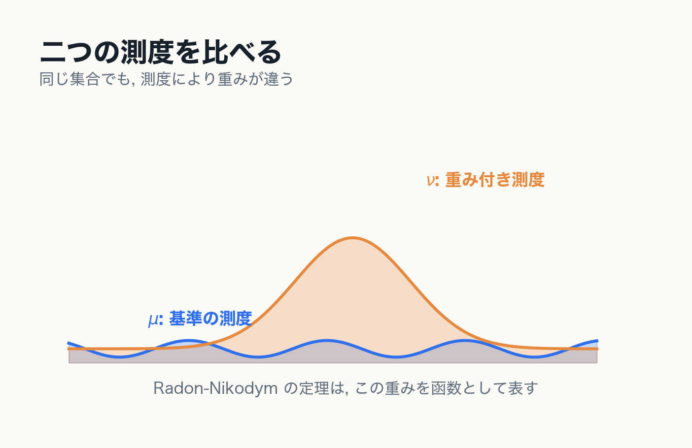
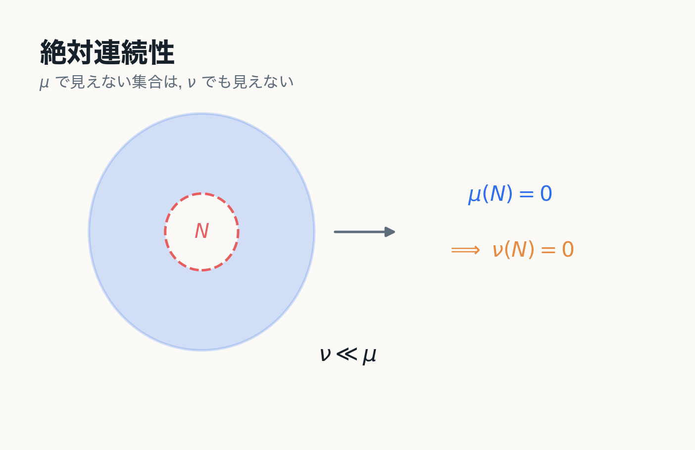
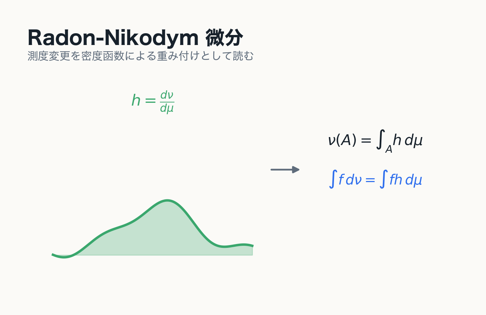

# Appendix Radon-Nikodym の定理

---
layout: two-cols
---

# 二つの測度を比べる

同じ可測空間 $(X,\mathfrak{B})$ 上に二つの測度

$$
\mu,\qquad \nu
$$

が定義されているとする.

Radon-Nikodym の定理は, $\nu$ が $\mu$ に関して絶対連続であるとき, $\nu$ を $\mu$ に対する密度函数で表せることを述べる.

::right::

---
layout: two-cols
---

# 絶対連続性

$$
\nu\ll\mu
$$

とは

$$
\mu(A)=0\Longrightarrow \nu(A)=0
$$

がすべての $A\in\mathfrak{B}$ について成り立つこと.

::note
$\mu$ で見えない零集合は, $\nu$ でも見えない. これが測度間の絶対連続性である.
::

::right::

---
layout: two-cols
---

# Radon-Nikodym の定理

適切な $\sigma$-有限性の仮定の下で, $\nu\ll\mu$ ならば非負可測函数 $h$ が存在して

$$
\nu(A)=\int_A h\,d\mu
$$

がすべての $A\in\mathfrak{B}$ について成り立つ.

この $h$ を

$$
h=\frac{d\nu}{d\mu}
$$

と書く.

::right::

---
layout: two-cols
---

# 本編との関係

Radon-Nikodym の定理は, 別の測度 $\nu$ に関する積分を, 基準測度 $\mu$ に関する積分へ変換する.

$$
\int_X f\,d\nu
=
\int_X f\frac{d\nu}{d\mu}\,d\mu
$$

::example-box{title="見方"}
測度を変える操作を, 積分の中の重み付けとして扱うことができる.
::

::right::

---
layout: end
---

# まとめ

- Jordan 測度から Lebesgue 測度への移行点は, 有限操作から可算操作への移行である
- 外測度だけでは足りず, 加法性がよく振る舞う可測集合を選ぶ必要がある
- Lebesgue 積分は単函数から構成され, 測度 0 の差に安定である
- 優収束定理は, Lebesgue 積分が極限操作と相性のよい積分であることを表す
